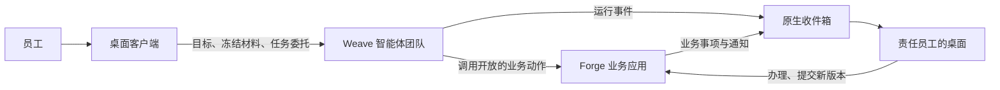

# Weave Workbench

[](https://github.com/jinyitao123/weave-workbench/actions/workflows/project-check.yml)
[](LICENSE)

**让员工在桌面上把日常工作交给智能体团队，业务结果仍由企业系统负责。**

员工在桌面端整理材料、提交工作、办理待办；智能体团队按已发布的流程协作执行；业务数据、权限、审批和最终状态始终留在业务系统里，可被独立读回和审计。

> **English summary.** Weave Workbench is the product monorepo that combines a desktop client (an Electron app adapted from [GooeyPi](https://github.com/am-will/gooey-pi)), [Weave](https://github.com/jinyitao123/weave-next) (agent-team orchestration, execution and recovery) and [Forge](https://github.com/jinyitao123/inoForge) (business apps on ObjectStack: objects, actions, permissions, approvals). Employees hand work to agent teams from the desktop; teams act only through business actions that Forge explicitly exposes; the outcome is written back to Forge and can be verified there independently. The project is a pilot: the first end-to-end scenario (sales contract hand-off between employees) is only partly verified, see [Status](#项目状态--status). Documentation is mostly in Chinese.

## 它解决什么问题

- **员工不必懂智能体。** 打开桌面即可在“我的工作”里放材料、看成果；也可以选择任意本地文件夹作为工作空间，明确允许助手读取和修改的范围。
- **工作能交给团队，关掉窗口也不丢。** 需要多人或多角色协作时，桌面把目标、冻结的材料版本和授权范围递交给 Weave；Weave 持久保存任务、调度执行、重试、取消和恢复。
- **智能体只能做被允许的业务动作。** Forge 只把挑选过的业务动作开放给团队，权限判断仍在 Forge；不暴露通用的数据写入能力。
- **接力到真人时不靠猜。** 下一步由 Forge 根据正式业务状态确定岗位和具体账号，待办进入该员工的原生收件箱；对方离线也不丢，登录后在自己的桌面办理。
- **“完成”可以被核对。** 桌面显示的完成状态必须能追溯到 Forge 或 Weave 的权威记录，模型自述、健康检查和单次工具调用都不算业务通过。

## 工作方式



| 组件 | 负责 | 权威状态 |
| --- | --- | --- |
| 桌面（`desktop/`） | 本地工作空间、材料递交、进度与待办呈现、团队开发入口、安全会话 | 个人草稿与本地交互 |
| Weave（`platform/weave/`） | 团队与流程、协作调度、重试、额度、取消、恢复 | 企业任务的执行状态 |
| Forge（`platform/forge/`） | 账号、业务对象、流程、权限、审批、业务待办 | 登录身份与正式业务结果 |

桌面不另建调度器，Weave 不复制业务流程和权限，Forge 不重做智能体执行循环。完整设计见[系统架构设计](docs/architecture/系统架构设计.md)，身份与权限见[接入与权限边界](docs/architecture/接入与权限边界.md)。

## 项目状态 / Status

**试点阶段（MVP1），尚未达到通用可用。** 请不要把它当作成熟的生产系统。

已经在真实环境中走通并由 Forge 页面独立读回：

- 销售在桌面交接合同材料，团队触发 Forge 正式审批，交付负责人在自己的桌面退回；
- 线索转商机、报价调整两个场景的主路径。

合同修订材料已重新进入第二轮审批；双方正式意见、最终状态与成果读回仍未完成，回执丢失后的重复调用、并发旧版本等边界路径仍待验证。逐项结论与证据见[项目状态](docs/项目状态.md)、[MVP1 阶段说明](docs/plans/MVP1阶段说明.md)和[问题清单](docs/plans/问题清单.md)。

## 仓库结构

| 路径 | 内容 |
| --- | --- |
| `desktop/` | Electron 桌面客户端，基于 GooeyPi 改造，支持 macOS 与 Windows |
| `platform/weave/` | Weave 的锁定版本集成副本，源码主仓为 [weave-next](https://github.com/jinyitao123/weave-next) |
| `platform/forge/` | Forge 的锁定版本集成副本，源码主仓为 [inoForge](https://github.com/jinyitao123/inoForge) |
| `contracts/` | 跨组件契约：身份、材料、任务、动作、结果、审计，见[契约索引](contracts/README.md) |
| `scenarios/` | 跨组件的真人业务验收场景，见[场景索引](scenarios/README.md) |
| `docs/` | 架构、计划、环境、决策与验收记录，入口见[文档索引](docs/README.md) |
| `tools/` | 版本锁定、状态核对、文档与布局检查 |
| `components.lock.json` | 三个组件的来源仓库与锁定提交 |

两个平台组件保持独立源码主仓与发布节奏，本仓按确定版本组合交付；同步方式见[开发与发布方式](docs/architecture/开发与发布方式.md)。

## 快速开始

只运行仓库检查（需要 Node.js 24）：

```sh
make check      # 文档、布局、版本锁与状态页
make status     # 当前分支、提交与组件版本偏差
```

运行桌面客户端（需要 Node.js 24.15+、npm 12+）：

```sh
cd desktop
npm run toolchain:bootstrap
npm install
npm run dev
```

桌面默认连接本机 Forge（`http://127.0.0.1:3000`）与 Weave（`http://127.0.0.1:8080`），不会自动连接维护者的联调主机。连接组织部署时，由部署人员在启动环境中用环境变量 `WORKBENCH_FORGE_URL`、`WORKBENCH_WEAVE_URL` 指定地址。构建与测试说明见[桌面文档](desktop/README.md)，Weave 与 Forge 的启动方式见各自目录下的 README。

组件检查：`make desktop-check`、`make weave-check`、`make forge-check`。

## 参与和反馈

- 提交 Issue 或 Pull Request 前请阅读[贡献指南](CONTRIBUTING.md)。
- 发现安全问题请按[安全政策](SECURITY.md)私下报告，不要公开提交。
- 仓库规则、文档管理与验收要求见 [AGENTS.md](AGENTS.md)；接手进行中的工作从[项目状态](docs/项目状态.md)开始。

## 许可证与致谢

本仓以 [Apache-2.0](LICENSE) 授权，`desktop/` 与 `platform/weave/` 保留各自的 MIT 许可证，详见 [NOTICE](NOTICE)。

桌面客户端基于 [GooeyPi](https://github.com/am-will/gooey-pi)，并使用 [Pi](https://pi.dev/) 与 [Prime Agent](https://github.com/PrimeIntellect-ai/prime-agent)；业务平台构建在 ObjectStack 之上。
