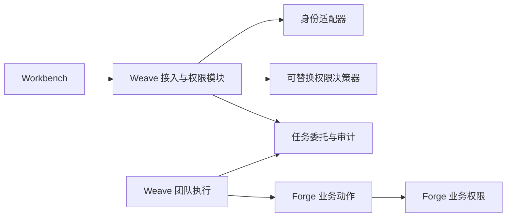

# 接入与权限边界

状态：2026-09-20 收敛，MVP1 实施依据。

## 决定

Workbench 和 Weave 面向稳定的接入与权限接口，不依赖 ObjectStack 的角色字段和令牌形态。第一版由 Weave 服务端承接产品能力判断与任务委托，接口采用 `subject / action / resource / context` 结构；内部决策器保持可替换，先复用现有账号、角色和 scope，Cerbos 作为后续验证对象。

权限分为四层：

| 层次 | 权威来源 | 第一版责任 |
| --- | --- | --- |
| 登录身份 | 可替换的身份适配器 | 验证用户并映射组织环境；当前可接 Forge，后续可接客户 OIDC/SSO |
| 产品能力 | Weave 接入与权限模块 | 判断团队查看、运行查看、模拟、沙箱写入和发布 |
| 任务委托 | Weave 接入与权限模块 | 把用户授予的动作、资源和有效期绑定到一次任务，并支持撤销与审计 |
| 业务权限 | Forge | 对每次业务动作再次检查用户、业务对象、流程和审批规则 |

产品允许与业务允许必须同时成立才能产生业务写入。中间层不能用服务管理员身份代替用户，也不能把登录成功解释成业务授权。

用户只登录一次。当前 Forge OAuth 或未来客户 OIDC 都通过 Weave 服务端的身份适配器完成验证和组织绑定，再换取 Weave 可识别的产品会话；桌面不要求用户再登录一套 Weave 账号，也不按邮箱自行合并账号。绑定键使用受信任的身份来源、主体标识和组织标识，角色到能力的映射留在接入与权限模块。

## MVP1 能力

第一版只定义五项产品能力：

- `team.read`：查看授权团队及已发布定义。
- `run.read`：查看授权运行、步骤和失败原因。
- `debug.simulate`：使用授权数据做不回写模拟。
- `debug.sandbox_write`：只向明确的沙箱环境写入。
- `release.publish`：发布团队或应用版本。

桌面只展示服务端返回的能力与原因，不从邮箱、角色名称或 Forge 通用数据自行推断。权限服务未接入或不可用时，能力状态为 `unavailable`，不能视为允许。

## 组件关系

对外判断契约保持稳定；引入 Cerbos、OpenFGA 或其他决策器时，不改变桌面和团队执行接口。Cerbos 适合无状态的产品能力和条件判断；当团队、任务、材料和业务对象之间出现大量持久关系时，再验证 OpenFGA。MVP1 不以完整 AuthZEN 兼容或权限引擎选型为验收前提。

## 实施顺序

1. 固定身份投影、产品能力判断和任务委托契约。
2. 补身份适配与产品会话交换，用员工与开发者账号返回五项能力，并在开发中心显示允许、拒绝、不可用及原因。
3. 为一次真实团队任务签发可过期、可撤销的委托，Weave 在敏感调用前检查。
4. 接入一个 Forge 合同交接动作，验证“产品能力与委托允许、Forge 业务权限仍可拒绝”。
5. 真实场景证明现有判断不足后，再接 Cerbos；关系复杂度达到需要统一关系图时，再评估 OpenFGA。
