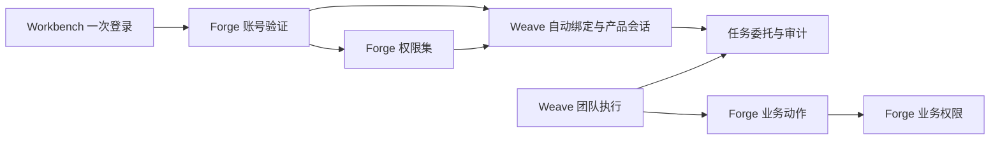

# 接入与权限边界

状态：2026-09-22 三次收敛，MVP1 实施依据。

## 决定

MVP1 使用 Forge 账号和权限集作为唯一身份与产品授权来源。用户在 Forge 注册；管理员在 Forge 的标准权限集页面授予“智能体团队开发”。首次通过 Workbench 登录时，Weave 根据 Forge 签发的稳定主体自动建立本地用户绑定，并读取 Forge 的有效权限；不复制密码，不按邮箱猜测或合并用户，也不要求用户再注册 Weave 账号。

权限分为四层：

| 层次 | 权威来源 | 第一版责任 |
| --- | --- | --- |
| 登录身份 | Forge | 注册账号、验证账号密码、停用登录身份并签发受信任会话 |
| 账号绑定 | Weave | 用 `issuer + subject + organization` 自动建立并保存对应用户；维护绑定状态 |
| 产品能力 | Forge | 用权限集判断团队使用、配置、调试、发布和平台管理；Weave 只验证并执行 |
| 任务委托 | Weave 接入与权限模块 | 把用户授予的动作、资源和有效期绑定到一次任务，并支持撤销与审计 |
| 业务权限 | Forge | 对每次业务动作再次检查用户、业务对象、流程和审批规则 |

产品允许与业务允许必须同时成立才能产生业务写入。中间层不能用服务管理员身份代替用户，也不能把登录成功解释成业务授权。

用户只登录一次。Workbench 把账号密码提交给 Forge 登录接口；密码只用于本次请求，不落入渲染状态、日志或 Weave。Forge 与 Weave 会话均由 Workbench Host 使用系统安全存储保管，渲染界面只能读取账号投影。团队调用使用 Weave 会话；MVP1 的 Forge 业务动作由 Host 使用当前员工会话执行，Weave 只返回受任务委托约束的待执行动作，不能接收员工长期凭据或退化成共享管理员密钥。

自动绑定必须满足：相同绑定键重复登录返回同一 Weave 用户；Forge 权限变化在重新登录后形成新的会话权限；Weave 本地用户字段不能扩大或覆盖 Forge 授权；Forge 账号停用或绑定停用后不能换取新会话；不同组织或不同身份来源不能因为邮箱相同而合并。

## MVP1 能力

第一版界面只根据验证后的权限显示相应入口，不展示内部角色。普通员工可使用已发布团队并查看自己的运行；持有“智能体团队开发”权限集的账号增加团队配置、调试和发布；Forge 平台管理员增加共享运行环境等平台管理能力。团队开发权限不附带任何 Forge 业务数据权限。权限拒绝由具体接口返回并显示原因。

## 组件关系

MVP1 不接 Cerbos、OpenFGA 或 AuthZEN。若后续真实租户出现 Forge 权限集无法表达的资源关系，再在保持桌面接口稳定的前提下评估替换，不提前建设。

## 实施顺序

1. 固定账号绑定契约，实现 Forge 登录后 Weave 首次自动建档和重复登录读回。
2. 登录交换时读取 Forge 当前账号的有效权限集，由 Weave 会话保护具体接口；桌面只显示允许进入的功能和拒绝原因。
3. 为一次真实团队任务建立可过期、可撤销的委托，Weave 在产出业务动作前检查能力和资源范围。
4. Workbench Host 校验成员已分配能力与员工本次提交意图后，以当前员工会话调用 Forge；验证 Forge 业务权限仍可拒绝。
5. 用两个 Forge 账号验证隔离、停用、角色调整和再次登录；通过后转入 OBS-01。
