# OTC 业务主流程

状态：2026-09-21 产品基线。本页保存从线索到回款的完整业务流程，用于确定 Forge 业务对象、员工接力节点和 Weave 团队介入位置。具体实现进度见[项目状态](../project-status.md)，首个三人验收场景见[销售合同跨员工闭环](../../scenarios/sales-contract-handoff/README.md)。

## 产品协作原则

- Forge 保存线索、商机、报价、合同、订单、项目、验收、应收与回款等正式业务状态，并依据负责人、组织、业务单元、岗位和任职关系确定下一位处理员工。
- 每位员工在桌面中处理分配给自己的业务事项；Pi 读取该事项授权范围内的材料，协助整理、检查和拟稿，员工确认后再提交正式结果。
- Weave 按需组织智能体团队完成一段有明确输入和交付要求的工作。团队可以等待员工补充信息，但不负责猜测业务处理人，也不从线索一直常驻到回款。
- 通知负责提醒，待办负责留存和办理。桌面离线不影响 Forge 中的业务事项与处理归属。

## 完整流程

```mermaid
flowchart TB

    subgraph P1["阶段一　线索与项目立项"]
        direction LR
        A1["销售<br/>获取并登记线索"] --> A2["销售<br/>客户沟通与线索培育"]
        A2 --> A3["销售＋解决方案<br/>需求调研、现场初勘"]
        A3 --> A4["销售＋解决方案<br/>形成初步方案和项目预算"]
        A4 --> A5["销售主导<br/>编写立项申请表、项目预算表"]
        A5 --> A6["PMO<br/>检查材料完整性"]
        A6 --> A7{"KP1立项评审<br/>是否通过"}
        A7 -- "否" --> A8{"继续培育？"}
        A8 -- "是" --> A2
        A8 -- "否" --> AX["关闭线索"]
        A7 -- "是" --> A9["线索转商机<br/>建立项目群"]
    end

    subgraph P2["阶段二　方案、报价与招投标"]
        direction LR
        B1["解决方案<br/>深化客户需求"] --> B2["解决方案<br/>形成最终技术方案"]
        B2 --> B3["项目团队<br/>拆解供货范围与清单"]
        B3 --> B4["研发、交付、采购<br/>评估工时和成本"]
        B4 --> B5["销售<br/>汇总报价与利润测算"]
        B5 --> B6{"是否需要招投标"}
        B6 -- "否" --> B7["销售<br/>报价与商务谈判"]
        B6 -- "是" --> B8["销售<br/>标前适配与投标准备"]
        B8 --> B9["SR＋FR<br/>编写技术标"]
        B8 --> B10["招投标商务<br/>编写商务标"]
        B8 --> B11["销售<br/>编写价格标"]
        B9 --> B12["提交投标文件"]
        B10 --> B12
        B11 --> B12
        B12 --> B13{"是否中标"}
        B13 -- "否" --> B14{"继续跟进？"}
        B14 -- "是" --> A2
        B14 -- "否" --> BX["商机关闭"]
        B13 -- "是" --> B15["确定成交范围"]
        B7 --> B16{"报价是否通过"}
        B16 -- "否" --> B2
        B16 -- "是" --> B15
    end

    subgraph P3["阶段三　SOW、合同与订单"]
        direction LR
        C1["SR／解决方案<br/>编写SOW或技术协议"] --> C2["销售<br/>编写合同"]
        C2 --> C3["项目团队<br/>核对交付范围、验收标准和付款条件"]
        C3 --> C4{"是否使用标准合同"}
        C4 -- "是" --> C5["群内评审<br/>重点审查改动条款"]
        C4 -- "否" --> C6["商法财等专业角色<br/>会议评审非标合同"]
        C5 --> C7{"合同和SOW评审通过？"}
        C6 --> C7
        C7 -- "否" --> C1
        C7 -- "是" --> C8["COMS正式审批"]
        C8 --> C9{"COMS是否通过"}
        C9 -- "否" --> C1
        C9 -- "是" --> C10["商务<br/>合同盖章、回传、归档"]
        C10 --> C11{"合同是否约定预付款"}
        C11 -- "是" --> C12["销售跟进付款<br/>财务确认到账"]
        C11 -- "否" --> C13["满足合同下单条件"]
        C12 --> C13
        C13 --> C14["产品／交付／商务<br/>确认或新建物料编码"]
        C14 --> C15["商务<br/>ERP创建销售订单"]
    end

    subgraph P4["阶段四　KP2项目交接"]
        direction LR
        D1["销售＋解决方案<br/>移交合同、方案和客户背景"] --> D2["交付＋解决方案<br/>确认交付边界和验收依据"]
        D2 --> D3["交付<br/>细化项目预算和里程碑"]
        D3 --> D4["项目经理<br/>编写项目跟踪表、项目预算表"]
        D4 --> D5["项目经理<br/>组建团队、申请并锁定资源"]
        D5 --> D6["PMO<br/>组织KP2评审"]
        D6 --> D7{"KP2是否通过"}
        D7 -- "否" --> D2
        D7 -- "是" --> D8["交付项目经理正式接管"]
        D8 --> D9["召开内部项目启动会"]
    end

    subgraph P5["阶段五　详细计划与并行准备"]
        direction LR
        E1["计划统筹<br/>拆分销售订单"] --> E2{"供货或服务类型"}
        E2 -- "自产硬件" --> E3["供应链<br/>排产、生产、质检、入库"]
        E2 -- "外采／委外" --> E4["采购<br/>询价、采购合同、跟催交货"]
        E2 -- "定制软件" --> E5["产品＋研发<br/>详细设计、开发和测试"]
        E2 -- "交付服务" --> E6["交付<br/>施工与实施准备"]

        E7["交付＋解决方案<br/>按需进行现场详勘"] --> E8["确认安装位置、现场工况、窗口期和风险"]
        E8 --> E9["交付／施工方<br/>编写施工方案"]
        E9 --> E10["项目经理<br/>形成项目主计划"]
        E5 --> E11["研发<br/>形成开发计划"]
        E10 --> E12["PMO<br/>组织KP3计划评审"]
        E11 --> E12
        E12 --> E13{"KP3是否通过"}
        E13 -- "否" --> E8
        E13 -- "是" --> E14["按批准计划执行"]
    end

    subgraph P6["阶段六　到货、施工与调试"]
        direction LR
        F1["供应链／供应商<br/>发货或直发客户现场"] --> F2["仓库／客户／交付<br/>到货登记与签收"]
        F2 --> F3["交付＋施工方<br/>核对设备、主材和辅材"]
        F3 --> F4{"物料是否齐套合格"}
        F4 -- "否" --> F5["补货、换货或处理不符合项"]
        F5 --> F3
        F4 -- "是" --> F6["施工方＋交付<br/>安装施工"]
        F6 --> F7["交付<br/>施工自查"]
        F7 --> F8["客户＋交付＋施工方<br/>施工预验收"]
        F8 --> F9["交付／研发<br/>服务器部署、软件安装"]
        F9 --> F10["交付＋客户<br/>数据采集和单点调试"]
        F10 --> F11["交付＋客户<br/>联调、控制测试和安全确认"]
        F11 --> F12{"是否满足上线条件"}
        F12 -- "否" --> F13["整改、补充开发或重新调试"]
        F13 --> F10
        F12 -- "是" --> F14["项目经理<br/>向客户申请上线"]
        F14 --> F15["客户签署上线确认单<br/>记录遗留事项"]
        F15 --> F16["KP4通过"]
    end

    subgraph P7["阶段七　试运行、验收与结项"]
        direction LR
        G1["交付<br/>试运行与陪产"] --> G2["项目团队<br/>关闭上线遗留事项"]
        G2 --> G3["交付<br/>客户培训与操作指导"]
        G3 --> G4["项目团队<br/>整理并移交过程资料"]
        G4 --> G5["项目经理<br/>提出验收申请"]
        G5 --> G6{"客户验收是否通过"}
        G6 -- "否" --> G7["整改并补齐验收材料"]
        G7 --> G5
        G6 -- "是" --> G8["客户签署验收单"]
        G8 --> G9["KP5通过"]
        G9 --> G10["销售＋财务<br/>跟进应收款和回款"]
        G10 --> G11["交付／服务团队<br/>进入质保和运维"]
        G11 --> G12["项目经理＋PMO<br/>资料归档、复盘和经验总结"]
        G12 --> G13["KP6／项目结项<br/>待确认正式定义"]
    end

    A9 --> B1
    B15 --> C1
    C15 --> D1
    C15 --> E1
    D9 --> E7
    E3 --> F1
    E4 --> F1
    E5 --> F9
    E6 --> E7
    E14 --> F1
    F16 --> G1
```

## MVP1 截取范围

MVP1 不尝试一次实现整条 OTC。第一条闭环从阶段三截取“销售拟定合同”开始，验证三名员工并行复核、退回修改、重新提交和正式结果读回。闭环通过后，再沿同一业务主线接入签署、订单、项目交接、验收和回款。
