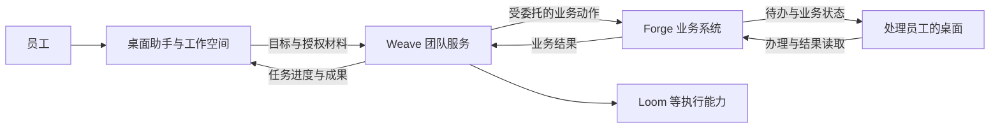

# 产品架构基线

状态：2026-09-20 收敛。本文确定目标边界；已实现范围见[项目状态](../project-status.md)。

## 产品与工作路径

一套桌面产品服务普通员工和开发者。员工打开即可在“我的工作”的材料与成果目录中开始办公，也可选择其他本地文件夹作为工作空间，随后提交工作和处理待办；开发者按账号权限增加团队与业务应用的开发、模拟和测试入口。模型、运行时和代码项目不成为普通员工的使用前提。

个人文件整理可以在本地直接完成。需要企业团队承接时，桌面递交目标、授权材料与允许范围，服务端接单并持续管理执行。关闭会话不等于取消已递交的工作。

## 四个确定的边界

| 归属 | 负责什么 | 权威状态 |
| --- | --- | --- |
| 桌面 | 本地工作空间、对话、材料递交、进度与待办呈现、开发入口、安全会话 | 个人草稿与本地交互 |
| Weave | 已发布团队、开发者定义的角色和执行关系、协作调度、恢复、额度与取消；Loom 等为内部执行能力 | 企业任务的执行状态 |
| Forge | 账号注册与验证；业务对象、业务动作、流程、权限、审批和业务待办 | 登录身份与正式业务结果 |
| Weave 账号绑定 | 首次登录自动建档，维护 `member / developer / admin` 与任务委托 | 团队产品权限与任务授权 |

桌面不建立第二套企业调度器，Weave 不复制业务权限和业务流程，Forge 不重做智能体执行循环。桌面展示的“完成”必须能追溯至相应的权威状态。

## 接入与部署

- 普通调用方只需知道可用能力、输入输出、任务进度与结果；团队定义、执行图和运行时配置由服务端管理，授权开发者可以修改并发布版本。
- 工作模式使用已发布能力；开发模式区分授权数据的不回写模拟与沙箱写入测试。模式可见性不能代替服务端权限检查。
- Forge 注册并验证唯一登录账号；首次从 Workbench 登录时 Weave 自动绑定为本地用户，后续由 Weave 三类角色控制团队能力。具体边界见[接入与权限边界](access-control-boundary.md)。Forge 的业务接口继续负责每次动作的真实权限判断。
- 云端或私有化使用同一服务边界。Forge 与 Weave 可以同机部署，也可以分开部署；桌面通过组织环境配置获知服务地址，普通员工不选择运行时或填写两个服务地址。组织配置下发尚待实现，当前连接方式见[环境说明](../environments/development.md)。
- 业务写入经 Forge 的明确业务动作完成。Weave 管执行重试、期限、额度与取消；Forge 决定业务动作是否成功、是否可撤销。结果未知时先核对，再决定是否重试。

## 仓库与实施范围

2026-09-21 明确：MVP1 桌面使用本仓 `desktop/` 的 GooeyPi 产品改造，来源版本见 `components.lock.json`。独立仓库历史主线中的 DSH/Host（`apps/desktop`）不作为本方案桌面基线；已有登录实现仅可供接口适配参考，不能直接替换 GooeyPi，也不能沿用其桌面验收结论。

总仓负责桌面、跨组件契约、版本组合、发布协调与真实场景验收。Weave 和 inoForge 保留独立源码主仓，总仓通过 subtree 集成确定提交，详见[开发和发布方式](delivery-model.md)。

第一条闭环采用[销售合同跨员工交接](../../scenarios/sales-contract-handoff/README.md)。先证明材料递交、团队执行、业务写回、待办交接和独立读回，再扩展其他业务。

主架构不预先铺开接口字段、数据库表、全部页面和执行算法。实施哪个跨组件功能，就在 [contracts](../../contracts/README.md) 补齐其身份、输入输出、错误、幂等、取消与审计约定。改变本页的职责、权威状态或部署边界时，才需要修订主架构并说明影响。
