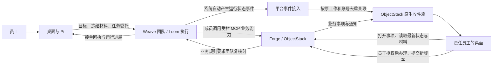

# 产品架构基线

状态：2026-09-22 更新员工反馈、业务能力与续办边界。本文确定目标边界；已实现范围见[项目状态](../project-status.md)。

## 产品与工作路径

一套桌面产品服务普通员工和开发者。员工打开即可在“我的工作”的材料与成果目录中开始办公，也可选择其他本地文件夹作为工作空间，随后提交工作和处理待办；开发者按账号权限增加团队与业务应用的开发、模拟和测试入口。模型、运行时和代码项目不成为普通员工的使用前提。

个人文件整理可以在本地直接完成。需要企业团队承接时，桌面递交目标、授权材料与允许范围，服务端接单并持续管理执行。关闭会话不等于取消已递交的工作。

## 四个确定的边界

| 归属 | 负责什么 | 权威状态 |
| --- | --- | --- |
| 桌面 | 本地工作空间、对话、材料递交、进度与待办呈现、开发入口、安全会话 | 个人草稿与本地交互 |
| Weave | 已发布团队、开发者定义的角色和执行关系、协作调度、恢复、额度与取消；Loom 等为内部执行能力 | 企业任务的执行状态 |
| Forge | 账号注册与验证；业务对象、业务动作、流程、权限、审批和业务待办 | 登录身份与正式业务结果 |
| Weave 账号绑定 | 首次登录自动建档，维护 Forge 账号与 Weave 用户映射及任务委托 | 账号映射与任务授权 |

桌面不建立第二套企业调度器，Weave 不复制业务权限和业务流程，Forge 不重做智能体执行循环。桌面展示的“完成”必须能追溯至相应的权威状态。

## 运行反馈、业务动作与员工续办

本节是统一产品规则；具体交付范围见[MVP1](../plans/mvp1.md)，合同只是首个验收场景。

### 自动反馈与主动业务动作

团队接单后 Pi 可以结束当前轮次，Weave 独立推进运行。完成、失败和取消等运行事件由系统自动产生，通过平台事件接入关联原工作与发起账号，并复用 ObjectStack 原生收件箱。该接入只做事件转换、去重与恢复，不拥有业务状态，不要求每个团队配置通知节点或模型调用通知工具。运行成功仅说明团队执行完成，不能替代业务动作成功或人工审批通过。

需要员工补材料、修改或复核属于业务动作。Forge 将明确允许的动作通过 MCP 暴露，Weave 成员通过既有能力桥调用；桌面 Pi 办理员工事项时使用同一套 Forge 权限与动作边界。Forge 校验受信任的员工身份、组织、任务授权、材料版本和当前业务状态，解析责任人并形成可办理事项。模型提交原因、依据和改动要求；不得靠提示词猜测处理账号或任意指定返回流程。

部署管理员一次接入 Forge；开发者在桌面给成员选择可读的业务能力或能力包，并写清何时请求员工介入。MVP1 只需可用能力选择和真实绑定，不要求能力包管理界面。地址、认证和回调不重复配置到每个团队。普通员工会话凭据不进入模型输入；远端调用所需的受限委托必须由 Forge 接受和校验。委托未接通时标记能力不可用，不用共享管理员凭据或长期在线的桌面代替。

### 员工如何接回工作

通知是入口，业务事项是办理依据。桌面按当前账号显示本人事项；员工打开后，从 Forge 读取最新状态、原因、相关意见和明确的材料版本，再交给 Pi。原会话可恢复时关联原会话，否则新建关联同一事项的会话；消息正文不能代替事项最新数据。员工未打开事项时不自动唤醒 Pi，桌面离线不影响事项留存。

团队发现问题和人工复核发现问题都经 Forge 的业务动作退给实际修改责任人。默认修改后返回发起退回的复核位置；团队退回则回到团队检查，人工退回则回到原人工复核。是否需要补充其他复核由 Forge 业务规则决定，不能把每次退回都强制经过整团队，也不能把旧版本的通过意见自动视为对新版本有效。

新提交形成新材料版本，保留原工作、父事项、原因和历史意见。MVP1 可整团队重跑一段检查；局部重跑是后续优化，不是员工续办的前置条件。重复提交须返回原业务回执；同一幂等键更换内容应报冲突，过期事项或并发旧版本不得覆盖最新结果。工具调用结果未知时先核对 Forge 回执，不能盲目重放写入。已发生的业务动作按 Forge 撤销规则处理，不能通过取消 Weave 运行声称回滚。

### 复用原生能力

先验证 ObjectStack 的原生任务、审批、消息、组织与权限能否承载以上行为，再补最小连接能力。通知不自动升级为待办；展示投影不规定新增持久化对象。已有 `forge_employee_work_item` 与 webhook 试验尚未证明原生能力存在缺口，不作为目标架构或部署前提。无需新建平行待办、通知或组织体系。

## 接入与部署

- 普通调用方只需知道可用能力、输入输出、任务进度与结果；团队定义、执行图和运行时配置由服务端管理，授权开发者可以修改并发布版本。
- 工作模式使用已发布能力；开发模式区分授权数据的不回写模拟与沙箱写入测试。模式可见性不能代替服务端权限检查。
- Forge 注册并验证唯一登录账号，并通过标准权限集授予团队开发能力；首次从 Workbench 登录时 Weave 自动绑定为本地用户，并按 Forge 验证结果签发产品会话。具体边界见[接入与权限边界](access-control-boundary.md)。Forge 的业务接口继续负责每次动作的真实权限判断。
- 云端或私有化使用同一服务边界。Forge 与 Weave 可以同机部署，也可以分开部署；桌面通过组织环境配置获知服务地址，普通员工不选择运行时或填写两个服务地址。组织配置下发尚待实现，当前连接方式见[环境说明](../environments/development.md)。
- 业务写入经 Forge 的明确业务动作完成。Weave 管执行重试、期限、额度与取消；Forge 决定业务动作是否成功、是否可撤销。结果未知时先核对，再决定是否重试。

## 仓库与实施范围

2026-09-21 明确：MVP1 桌面使用本仓 `desktop/` 的 GooeyPi 产品改造，来源版本见 `components.lock.json`。独立仓库历史主线中的 DSH/Host（`apps/desktop`）不作为本方案桌面基线；已有登录实现仅可供接口适配参考，不能直接替换 GooeyPi，也不能沿用其桌面验收结论。

总仓负责桌面、跨组件契约、版本组合、发布协调与真实场景验收。Weave 和 inoForge 保留独立源码主仓，总仓通过 subtree 集成确定提交，详见[开发和发布方式](delivery-model.md)。

业务主线以[OTC 业务主流程](otc-business-flow.md)为准。第一条闭环采用[销售合同跨员工交接](../../scenarios/sales-contract-handoff/README.md)，先证明销售发起、交付与商务两名员工复核、退回修改、正式结果写回和独立读回，再沿同一笔业务扩展订单、交付、验收和回款。

主架构不预先铺开接口字段、数据库表、全部页面和执行算法。实施哪个跨组件功能，就在 [contracts](../../contracts/README.md) 补齐其身份、输入输出、错误、幂等、取消与审计约定。改变本页的职责、权威状态或部署边界时，才需要修订主架构并说明影响。
