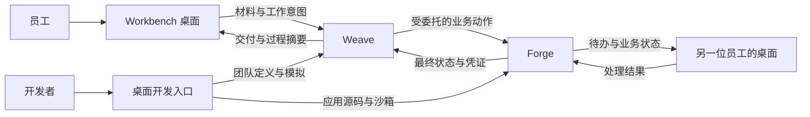

# 产品结构与职责

## 用户看到的产品

普通员工只需要四个入口：

1. **开始工作**：和桌面助手交谈、编辑材料、使用本地文件与浏览器。
2. **我的待办**：接收 Forge 流程和 Weave 团队分配给当前用户的工作。
3. **工作记录**：查看进行中、等待确认、已完成和失败的工作及交付物。
4. **设置**：账号、组织、通知、环境和个人偏好。

开发者增加一个独立入口：

1. 查看当前账号获准开发的 Weave 团队和 Forge 应用。
2. 使用授权线上数据做不回写模拟。
3. 在沙箱中运行会写入的完整测试。
4. 从本地项目修改 Forge 或团队定义，并形成可发布版本。

## 运行关系

## 分层

| 层 | 拥有的内容 | 不拥有的内容 |
| --- | --- | --- |
| 桌面产品 | 本地工作区、材料选择、对话、待办呈现、开发入口、安全会话 | 业务流程真相、团队调度真相 |
| Weave 产品服务 | 团队、角色、任务图、执行尝试、恢复、额度、取消、交付核验 | 客户、合同、库存、生产等业务记录 |
| Forge 业务平台 | 业务对象、业务动作、权限、审批、待办、业务审计 | 模型选择、团队协作、运行时重试 |
| ObjectStack 账号体系 | 注册、登录、组织、成员、角色和标准身份令牌 | Weave 的任务级委托和执行额度 |
| Pi/Loom/Codex 等运行时 | 单次推理与工具执行 | 跨运行时终态、业务权限和产品待办 |

## 关键契约

桌面向 Weave 递交的是“工作请求”，包括用户身份、组织、材料引用、目标和允许范围。Weave 向 Forge 发起的是“业务动作请求”，包括原始用户身份、团队身份、任务委托、幂等键和所需权限。Forge 返回业务结果、待办或拒绝原因。所有跨层结果都有统一关联标识，供桌面呈现和审计。

## 控制责任

- **重试**：Weave 只重试明确可重试且具有幂等键的执行尝试；运行时内部重试不跨业务动作边界。
- **超时**：运行时控制单次调用时间，Weave 控制任务和工作总期限，恢复后继续累计。
- **额度**：运行时报告真实用量，Weave 汇总到工作与用户，桌面只呈现和请求调整。
- **取消**：桌面发出用户意图，Weave 负责停止调度并等待执行环境确认，Forge 决定已提交业务动作是否可撤销。

