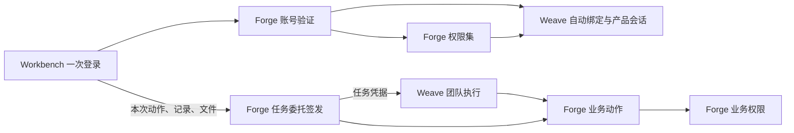

# 接入与权限边界

状态：2026-10-01 按决策 002 修订任务委托、身份来源与团队使用授权，MVP1 实施依据；2026-10-06 按决策 003 增加 Weave 管理端登录。

## 决定

MVP1 使用 Forge 账号和权限集作为唯一身份与产品授权来源。用户在 Forge 注册；管理员在 Forge 的标准权限集页面授予“智能体团队开发”。首次通过 Workbench 登录时，Weave 根据 Forge 签发的稳定主体自动建立本地用户绑定，并读取 Forge 的有效权限；不复制密码，不按邮箱猜测或合并用户，也不要求用户再注册 Weave 账号。

权限分为五层：

| 层次 | 权威来源 | 第一版责任 |
| --- | --- | --- |
| 登录身份 | Forge | 注册账号、验证账号密码、停用登录身份并签发受信任会话；返回部署级稳定身份来源标识 |
| 账号绑定 | Weave | 用 `issuer + subject + organization` 自动建立并保存对应用户，`issuer` 取 Forge 返回的稳定标识而非访问地址；维护绑定状态 |
| 产品能力 | Forge | 用权限集判断团队开发、发布和平台管理，以及能使用哪些团队（团队声明的可用权限集，为空即全组织）；Weave 只验证并执行 |
| 任务委托 | Forge 签发，Weave 保管与收窄 | Forge 按员工本次动作、记录和文件签发独立任务凭据并在执行入口强制范围；期限跟随运行，终态、取消或停用时撤销；Weave 加密保存并在调用前收窄 |
| 业务权限 | Forge | 对每次业务动作再次检查用户、业务对象、流程和审批规则 |

产品允许与业务允许必须同时成立才能产生业务写入。中间层不能用服务管理员身份代替用户，也不能把登录成功解释成业务授权。

用户只登录一次。Workbench 把账号密码提交给 Forge 登录接口；密码只用于本次请求，不落入渲染状态、日志或 Weave。Forge 与 Weave 的桌面会话只由 Workbench Host 保存在当前进程内，不调用系统钥匙串、不落盘，渲染界面只能读取账号投影；重开桌面后重新登录，退出登录时 Host 同时注销 Forge 桌面会话。团队调用使用 Weave 会话。团队成员调用 Forge 业务动作只使用 Forge 签发的任务委托，Weave 不接收员工桌面会话或长期凭据，也不能退化成共享管理员密钥。员工退出桌面不撤销已递交工作的任务委托。

自动绑定必须满足：相同绑定键重复登录返回同一 Weave 用户；更换 Forge 访问地址不改变绑定键；Forge 权限变化在重新登录后形成新的会话权限；Weave 本地用户字段不能扩大或覆盖 Forge 授权；Forge 账号停用或绑定停用后不能换取新会话；不同组织或不同身份来源不能因为邮箱相同而合并。

## MVP1 能力

第一版界面只根据验证后的权限显示相应入口，不展示内部角色。普通员工可使用对其开放的已发布团队并查看自己的运行；持有“智能体团队开发”权限集的账号增加团队配置、调试和发布；Forge 平台管理员增加共享运行环境等平台管理能力。团队开发权限不附带任何 Forge 业务数据权限。权限拒绝由具体接口返回并显示原因。

## 组件关系

MVP1 不接 Cerbos、OpenFGA 或 AuthZEN。若后续真实租户出现 Forge 权限集无法表达的资源关系，再在保持桌面接口稳定的前提下评估替换，不提前建设。

## Weave 管理端登录

依据[决策 003](../decisions/003-Weave独立管理端与身份接入.md)，管理端不另建权限体系：正常使用走同一外部身份交换（Forge 是第一个验证器，以后的产品实现同一验证接口，返回稳定身份来源、用户、组织与角色）；未接 Forge 或运维时使用 `weave bootstrap` 签发的 API Key。角色沿用 member、developer、admin 三档，本地密码登录与首用户注册保持关闭。页面与流程见[Weave管理端设计](Weave管理端设计.md#身份与权限)。

## 实施顺序

1. 账号绑定：Forge 返回稳定身份来源，Weave 以它首次自动建档并在重复登录及更换访问地址后读回同一用户。
2. 登录交换时读取 Forge 当前账号的有效权限集，由 Weave 会话保护具体接口并按团队可用权限集过滤；桌面只显示允许进入的功能和拒绝原因。
3. 验证 ObjectStack 原生签名与严格受限任务连接能力，结论补入[决策 002](../decisions/002-任务委托身份来源与员工入口收敛.md)。
4. Forge 签发、强制与撤销任务委托；Weave 改为只保存任务凭据、按运行期限使用并在终态撤销；验证 Forge 业务权限仍可拒绝。
5. 用两个 Forge 账号验证隔离、停用、角色调整、团队可用范围和再次登录；通过后转入 OBS-01。
