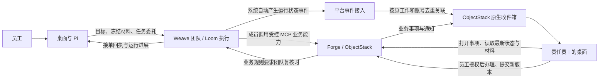

# 产品架构基线

状态：2026-09-22 更新员工反馈、业务能力与续办边界。本文确定目标边界；已实现范围见[项目状态](../项目状态.md)。

## 产品与工作路径

一套桌面产品服务普通员工和开发者。员工打开即可在“我的工作”的材料与成果目录中开始办公，也可选择其他本地文件夹作为工作空间，随后提交工作和处理待办；开发者按账号权限增加团队与业务应用的开发、模拟和测试入口。模型、运行时和代码项目不成为普通员工的使用前提。

个人文件整理可以在本地直接完成。需要企业团队承接时，桌面递交目标、授权材料与允许范围，服务端接单并持续管理执行。关闭会话不等于取消已递交的工作。

## 四个确定的边界

| 归属 | 负责什么 | 权威状态 |
| --- | --- | --- |
| 桌面 | 本地工作空间、对话、材料递交、进度与待办呈现、Pi 右侧的团队分工与工作流配置、安全会话 | 个人草稿与本地交互 |
| Weave | 已发布团队、开发者定义的角色和执行关系、协作调度、恢复、额度与取消；Loom 等为内部执行能力 | 企业任务的执行状态 |
| Forge | 账号注册与验证；业务对象、业务动作、流程、权限、审批和业务待办 | 登录身份与正式业务结果 |
| Weave 账号绑定 | 首次登录自动建档，维护 Forge 账号与 Weave 用户映射及任务委托 | 账号映射与任务授权 |

桌面不建立第二套企业调度器，Weave 不复制业务权限和业务流程，Forge 不重做智能体执行循环。桌面展示的“完成”必须能追溯至相应的权威状态。

## 运行反馈、业务动作与员工续办

本节是统一产品规则；具体交付范围见[MVP1](../plans/MVP1阶段说明.md)，合同只是首个验收场景。

### 自动反馈与主动业务动作

团队接单后 Pi 可以结束当前轮次，Weave 独立推进运行。完成、失败和取消等运行事件由系统自动产生，通过平台事件接入关联原工作与发起账号，并复用 ObjectStack 原生收件箱。该接入只做事件转换、去重与恢复，不拥有业务状态，不要求每个团队配置通知节点或模型调用通知工具。运行成功仅说明团队执行完成，不能替代业务动作成功或人工审批通过。

团队在尚未写入正式业务状态前发现材料缺失或内容问题，属于本次运行的检查结果。Weave 将结果标记为“需要补充”并由系统事件接入自动通知原员工；员工从消息打开后，桌面把原工作、固定材料版本和检查意见交给 Pi 继续。这个过程不要求团队调用 Forge，也不创建一套平行业务待办。

已经进入正式业务流程后的提交、退回、补件或复核才属于业务动作。Forge 将明确允许的动作通过 MCP 暴露，Weave 成员通过既有能力桥调用；桌面 Pi 办理员工事项时使用同一套 Forge 权限与动作边界。Forge 校验受信任的员工身份、组织、任务授权、材料版本和当前业务状态，解析责任人并形成可办理事项。模型提交原因、依据和改动要求；不得靠提示词猜测处理账号或任意指定返回流程。

部署管理员一次接入 Forge；开发者在桌面从 Forge 的 AI 能力元数据目录给成员选择业务能力或能力包，并写清何时请求员工介入。查看和绑定能力定义不要求开发者本人拥有该业务动作的执行权限，也不授予其业务数据权限；真正运行时仍以发起员工身份重新读取可调用目录并由 Forge 执行校验。MVP1 只需可用能力选择和真实绑定，不要求能力包管理界面。地址、认证和回调不重复配置到每个团队。普通员工会话凭据不进入模型输入；远端调用所需的受限委托必须由 Forge 接受和校验。委托未接通时标记能力不可用，不用共享管理员凭据或长期在线的桌面代替。

任务委托分两层收窄。团队发布版本声明成员最多能调用哪些业务能力；它不是每项工作的默认授权。Workbench 根据当前员工轮次把本次允许动作固定为该发布范围的子集，纯查看、分析或建议传空范围。Weave 在固定输入登记时验证账号、输入版本、发布版本与动作子集，把 Forge 会话加密为任务引用；运行中每名成员只看到“本次允许范围”与“该成员发布能力”的交集。动作名和业务对象由服务端固定，不能靠参数切换成另一个动作，Forge 仍负责最终员工权限、记录范围和业务状态。

运行开始时，Weave 还要以这份任务委托读取当前员工可见的 Forge 动作目录，将动作说明、是否需要业务记录和声明参数冻结为成员实际看到的工具定义。目录中不存在、当前员工不可调用或参数定义不合法的动作必须停止运行，不能退回到自由填写 `params`。这一步只收窄成员的调用面，不替代 Forge 在真正执行时再次校验权限和业务状态。

Workbench 在任何材料网络上传前先把员工、会话、目标、动作范围、准确材料字节和发布版本保存为当前账号的本地固定记录（目录权限 0700、文件权限 0600，不含会话令牌或密码）；上传或接单失败后只能从该意图恢复，不能重读已变化的文件。上传完成后保存 Forge 文件引用，Weave 再用同一员工委托重新读取并校验长度和摘要。Forge 的合同提交动作把该文件引用、名称和摘要绑定到准确合同记录，并以每份合同唯一的提交记录串行化首次提交；同材料重试返回原结果，竞争提交另一份材料必须失败。上传入口仍需服务端幂等键才能消除“服务已收文件但桌面未保存回执”产生的孤立重复文件；在此之前不得宣称文件上传具备严格一次语义。

### 员工如何接回工作

通知是入口，业务事项是办理依据。桌面按当前账号显示本人事项；员工打开后，从 Forge 读取最新状态、原因、相关意见和明确的材料版本，再交给 Pi。原会话可恢复时关联原会话，否则新建关联同一事项的会话；消息正文不能代替事项最新数据。员工未打开事项时不自动唤醒 Pi，桌面离线不影响事项留存。

团队检查发现问题时，员工从运行结果消息继续原工作；新材料可作为原工作的下一次团队运行输入。人工复核发现问题时，Forge 按正式业务规则退给实际修改责任人，修改后返回原人工复核位置。是否需要补充团队检查或其他复核由当前业务状态决定，不能把每次退回都强制经过整团队，也不能把旧版本的通过意见自动视为对新版本有效。

新提交形成新材料版本，保留原工作、父事项、原因和历史意见。MVP1 可整团队重跑一段检查；局部重跑是后续优化，不是员工续办的前置条件。重复提交须返回原业务回执；同一幂等键更换内容应报冲突，过期事项或并发旧版本不得覆盖最新结果。工具调用结果未知时先核对 Forge 回执，不能盲目重放写入。已发生的业务动作按 Forge 撤销规则处理，不能通过取消 Weave 运行声称回滚。

按人员流转优先采用业务记录已有负责人；按岗位流转通过 ObjectStack 的组织、业务单元与有效任职解析真实账号。多人时使用明确负责人或认领规则，无人时进入待分配；Forge 自建员工档案的部门、岗位文本不能单独决定路由。

### 复用原生能力

先验证 ObjectStack 的原生任务、审批、消息、组织与权限能否承载以上行为，再补最小连接能力。通知不自动升级为待办；展示投影不规定新增持久化对象。已有 `forge_employee_work_item` 与 webhook 试验尚未证明原生能力存在缺口，不作为目标架构或部署前提。无需新建平行待办、通知或组织体系。

## 桌面助手与团队接入

员工与 Pi 在本地整理材料；员工明确要求提交后，助手只在当前账号可使用的团队中匹配能力。唯一明确时建议该团队，多个候选时由员工选择。按团队接单要求从当前会话、成果及授权文件整理材料，只询问缺项；已有明确提交授权不重复确认。接单后 Pi 结束等待，Weave 独立推进。交接未能确认时，员工只需要求“核对这次交接”；桌面内部关联原请求并校验账号、原意图、固定材料和幂等标识，不向员工增加检查阶段、恢复凭据或重新附文件步骤。明确拒绝显示“未接单”，结果不确定显示“结果待核对”；继续核对始终沿原请求进行。

团队检查缺项属于运行反馈，正式业务退回属于 Forge 业务事项，二者按上文“运行反馈、业务动作与员工续办”办理。团队内部智能体默认由 Weave 调度 Loom；桌面 Pi 只在员工主动工作时参与。后续 CLI 复用相同接入协议，仅增加桌面适配。

### 团队发布什么

每个团队发布一份简明的“团队能力卡”，至少包含：

- 能处理什么；
- 需要哪些信息和文件，哪些是必需项；
- 会返回什么成果；
- 哪些账号或业务角色可以使用；
- 哪些情况需要回到员工补充或确认。

MVP1 先复用现有团队目标和流程说明，由开发者写清接什么、需要什么、交付什么，不强制新增结构化表单。只有实际调试证明现有说明不足，再增加必要的最小字段；复杂判断继续放在团队指令、技能和 Forge 业务规则中。

### 团队如何找到

账号权限先限定可触达范围，桌面助手只在该范围内做语义匹配。Weave 在接单时再次校验团队使用权限，Forge 在每次业务动作时再次校验业务权限。

Forge 权限集决定账号能否开发或管理团队；具体能调用哪些业务团队，由组织、岗位或业务授权决定。Weave 只使用 Forge 已验证的结果保护接口。内部团队编号、流程版本和成员结构不暴露给普通员工。

### 桌面需要的固定接入层

GooeyPi 内增加统一的企业工作接入层，供 Pi 和后续其他 CLI 调用。它不创建新的智能体循环，只负责：

- 查询当前账号可用的团队能力与接单要求；
- 将当前会话、员工确认的材料和成果版本组成交接包；
- 提交工作、补充材料、回复确认；
- 将真实进度、待办和成果关联回原会话与工作卡片。

助手判断员工意图并决定何时建议交接；接入层负责可靠执行、身份、材料边界、幂等和状态同步。Forge 与 Weave 的桌面会话令牌由 Workbench Host 仅在当前进程内保管，不调用系统钥匙串、不落盘，也不进入模型、团队定义或交接包；重开桌面后重新登录。远端成员调用 Forge MCP 使用服务端认可的受限任务委托；此委托与桌面当前登录会话分开，具体机制在实施前经契约和真实权限验证确定。

## 接入与部署

- 普通调用方只需知道可用能力、输入输出、任务进度与结果；团队定义、执行图和运行时配置由服务端管理，授权开发者可以修改并发布版本。
- 工作模式使用已发布能力；开发模式区分授权数据的不回写模拟与沙箱写入测试。模式可见性不能代替服务端权限检查。
- 开发者在桌面 Pi 主会话提出团队修改与调试要求；Pi 通过受范围约束的工具读取、修改和显式保存同一份 Weave 草稿，发起隔离试跑并解释实际轨迹，仅在开发者明确要求且同修订试跑成功后更新团队。右侧“团队分工”和“工作流”面板用于查看、手工调整和核对，不要求开发者为完成一次对话式修改逐个点击底层步骤。手工编辑与 Pi 修改共用远端修订及并发校验，不能互相覆盖未保存的内容。原独立开发中心入口关闭，不在团队页面再创建第二套 Pi 对话。
- Forge 注册并验证唯一登录账号，并通过标准权限集授予团队开发能力；首次从 Workbench 登录时 Weave 自动绑定为本地用户，并按 Forge 验证结果签发产品会话。具体边界见[接入与权限边界](接入与权限边界.md)。Forge 的业务接口继续负责每次动作的真实权限判断。
- 云端或私有化使用同一服务边界。Forge 与 Weave 可以同机部署，也可以分开部署；桌面通过组织环境配置获知服务地址，普通员工不选择运行时或填写两个服务地址。组织配置下发尚待实现，当前连接方式见[环境说明](../environments/开发联调环境.md)。
- 业务写入经 Forge 的明确业务动作完成。Weave 管执行重试、期限、额度与取消；Forge 决定业务动作是否成功、是否可撤销。结果未知时先核对，再决定是否重试。

## 仓库与实施范围

产品总仓的设立是为了让跨桌面、团队执行与业务系统的同一改动在一处审查身份、材料、任务状态、取消和最终交付。总仓负责完整体验、共享契约、确定版本的组合、联调打包与跨员工验收，避免三个组件各自通过却无法完成同一业务。组件职责保持独立，销售流程不进入 Weave 内核，智能体调度不进入 Forge。

2026-09-21 明确：MVP1 桌面使用本仓 `desktop/` 的 GooeyPi 产品改造，来源版本见 `components.lock.json`。独立仓库历史主线中的 DSH/Host（`apps/desktop`）不作为本方案桌面基线；已有登录实现仅可供接口适配参考，不能直接替换 GooeyPi，也不能沿用其桌面验收结论。

总仓负责桌面、跨组件契约、版本组合、发布协调与真实场景验收。Weave 和 inoForge 保留独立源码主仓，总仓通过 subtree 集成确定提交，详见[开发和发布方式](开发与发布方式.md)。

业务主线以[OTC 业务主流程](订单到回款业务流程.md)为准。第一条闭环采用[销售合同跨员工交接](../../scenarios/sales-contract-handoff/合同场景设计.md)，先证明销售发起、交付与商务两名员工复核、退回修改、正式结果写回和独立读回，再沿同一笔业务扩展订单、交付、验收和回款。

主架构不预先铺开接口字段、数据库表、全部页面和执行算法。实施哪个跨组件功能，就在 [contracts](../../contracts/README.md) 补齐其身份、输入输出、错误、幂等、取消与审计约定。改变本页的职责、权威状态或部署边界时，才需要修订主架构并说明影响。
