# OTC 业务主流程

状态：2026-09-28 流程参考更新。本页维护用户提供的通用项目流程（包含公辅能源）和数字教育项目流程，用于确定 Forge 业务对象、员工接力节点和 Weave 团队介入位置。两图是业务设计的主要参考，具体岗位任职、审批权限和生效条件仍须按实际业务核定。实现进度见[项目状态](../项目状态.md)，首个三人验收场景见[销售合同跨员工闭环](../../scenarios/sales-contract-handoff/合同场景设计.md)。

## 产品协作原则

- Forge 保存线索、商机、报价、合同、订单、项目、验收、应收与回款等正式业务状态，并依据负责人、组织、业务单元、岗位和任职关系确定下一位处理员工。
- 每位员工在桌面中处理分配给自己的业务事项；Pi 读取该事项授权范围内的材料，协助整理、检查和拟稿，员工确认后再提交正式结果。
- Weave 按需组织智能体团队完成一段有明确输入和交付要求的工作。团队可以等待员工补充信息，但不负责猜测业务处理人，也不从线索一直常驻到回款。
- 通知负责提醒，待办负责留存和办理。桌面离线不影响 Forge 中的业务事项与处理归属。

## 汇川材料中的三条交付路径

下面的两份七阶段流程图由用户提供，是通用项目与数字教育项目的主要参考；它们不自动成为汇川或任一客户已实施的岗位与审批制度。另有[交付定义原图](../../platform/forge/docs/references/delivery-definitions-p07.jpg)和[分叉流程原图](../../platform/forge/docs/references/delivery-flows-p08.jpg)，只明确共同前端、订单转换后的三条路径及主要交付活动；原图没有给出完整的组织编制、岗位名称、审批阈值或逐步责任矩阵。

| 路径 | 管理主线 | 原图明确的主要活动 | 对岗位配置的影响 |
| --- | --- | --- | --- |
| 一次产品 | 销售订单 | 选型与产品配置、采购或制造、发运签收、开票回款与服务 | 不因订单存在就强制设项目经理或走项目阶段门。 |
| 一次柜机 | 交付项目 | 建立项目、交付配置与工程设计、采购制造、集成调试、移交验收、回款与服务 | 需要项目责任人与设计、调试和验收的实际承办人；是否由同一人兼岗按项目确定。 |
| 二次项目，含数字化交付 | 工程项目 | 工程设计与变更、一次制造及二次采购、二次制造与调试、现场验收和项目移交 | 数字化交付以软件为主，可有配合数据源的硬件；产品、研发、数据集成和现场实施职责不能被生产、仓库岗位代替。具体岗位和审批人须按真实企业任职确认。 |

数字化交付项目在原图中包含设计、施工、安装、调试、功能与性能实现、数据展示及验收。上述是交付内容，不足以推定“数字化产品经理”“软件工程师”等为汇川已正式设置的岗位。会议记录还提到另一套“数字化转型七步法”；那是企业变革方法，与本节的客户项目交付路径分别建模。完整材料与来源边界见[三类业务定义与流程](../../platform/forge/docs/business-model.md)。

## 通用项目流程（包含公辅能源）

此图保留用户提供的通用项目办理顺序。KP1 至 KP6、COMS、报价、合同、订单及回款各节点是场景设计输入；具体审批人和条件以正式业务规则与单据为准。公辅能源场景所需的专业交付内容，应在项目范围和交付物中确认，不由这张通用图推定统一岗位。

```mermaid
flowchart TB

    subgraph P1["阶段一　线索与项目立项"]
        direction LR
        A1["销售<br/>获取并登记线索"] --> A2["销售<br/>客户沟通与线索培育"]
        A2 --> A3["销售＋解决方案<br/>需求调研、现场初勘"]
        A3 --> A4["销售＋解决方案<br/>形成初步方案和项目预算"]
        A4 --> A5["销售主导<br/>编写立项申请表、项目预算表"]
        A5 --> A6["PMO<br/>检查材料完整性"]
        A6 --> A7{"KP1立项评审<br/>是否通过"}
        A7 -- "否" --> A8{"继续培育？"}
        A8 -- "是" --> A2
        A8 -- "否" --> AX["关闭线索"]
        A7 -- "是" --> A9["线索转商机<br/>建立项目群"]
    end

    subgraph P2["阶段二　方案、报价与招投标"]
        direction LR
        B1["解决方案<br/>深化客户需求"] --> B2["解决方案<br/>形成最终技术方案"]
        B2 --> B3["项目团队<br/>拆解供货范围与清单"]
        B3 --> B4["研发、交付、采购<br/>评估工时和成本"]
        B4 --> B5["销售<br/>汇总报价与利润测算"]
        B5 --> B6{"是否需要招投标"}
        B6 -- "否" --> B7["销售<br/>报价与商务谈判"]
        B6 -- "是" --> B8["销售<br/>标前适配与投标准备"]
        B8 --> B9["SR＋FR<br/>编写技术标"]
        B8 --> B10["招投标商务<br/>编写商务标"]
        B8 --> B11["销售<br/>编写价格标"]
        B9 --> B12["提交投标文件"]
        B10 --> B12
        B11 --> B12
        B12 --> B13{"是否中标"}
        B13 -- "否" --> B14{"继续跟进？"}
        B14 -- "是" --> A2
        B14 -- "否" --> BX["商机关闭"]
        B13 -- "是" --> B15["确定成交范围"]
        B7 --> B16{"报价是否通过"}
        B16 -- "否" --> B2
        B16 -- "是" --> B15
    end

    subgraph P3["阶段三　SOW、合同与订单"]
        direction LR
        C1["SR／解决方案<br/>编写SOW或技术协议"] --> C2["销售<br/>编写合同"]
        C2 --> C3["项目团队<br/>核对交付范围、验收标准和付款条件"]
        C3 --> C4{"是否使用标准合同"}
        C4 -- "是" --> C5["群内评审<br/>重点审查改动条款"]
        C4 -- "否" --> C6["商法财等专业角色<br/>会议评审非标合同"]
        C5 --> C7{"合同和SOW评审通过？"}
        C6 --> C7
        C7 -- "否" --> C1
        C7 -- "是" --> C8["COMS正式审批"]
        C8 --> C9{"COMS是否通过"}
        C9 -- "否" --> C1
        C9 -- "是" --> C10["商务<br/>合同盖章、回传、归档"]
        C10 --> C11{"合同是否约定预付款"}
        C11 -- "是" --> C12["销售跟进付款<br/>财务确认到账"]
        C11 -- "否" --> C13["满足合同下单条件"]
        C12 --> C13
        C13 --> C14["产品／交付／商务<br/>确认或新建物料编码"]
        C14 --> C15["商务<br/>ERP创建销售订单"]
    end

    subgraph P4["阶段四　KP2项目交接"]
        direction LR
        D1["销售＋解决方案<br/>移交合同、方案和客户背景"] --> D2["交付＋解决方案<br/>确认交付边界和验收依据"]
        D2 --> D3["交付<br/>细化项目预算和里程碑"]
        D3 --> D4["项目经理<br/>编写项目跟踪表、项目预算表"]
        D4 --> D5["项目经理<br/>组建团队、申请并锁定资源"]
        D5 --> D6["PMO<br/>组织KP2评审"]
        D6 --> D7{"KP2是否通过"}
        D7 -- "否" --> D2
        D7 -- "是" --> D8["交付项目经理正式接管"]
        D8 --> D9["召开内部项目启动会"]
    end

    subgraph P5["阶段五　详细计划与并行准备"]
        direction LR
        E1["计划统筹<br/>拆分销售订单"] --> E2{"供货或服务类型"}
        E2 -- "自产硬件" --> E3["供应链<br/>排产、生产、质检、入库"]
        E2 -- "外采／委外" --> E4["采购<br/>询价、采购合同、跟催交货"]
        E2 -- "定制软件" --> E5["产品＋研发<br/>详细设计、开发和测试"]
        E2 -- "交付服务" --> E6["交付<br/>施工与实施准备"]

        E7["交付＋解决方案<br/>按需进行现场详勘"] --> E8["确认安装位置、现场工况、窗口期和风险"]
        E8 --> E9["交付／施工方<br/>编写施工方案"]
        E9 --> E10["项目经理<br/>形成项目主计划"]
        E5 --> E11["研发<br/>形成开发计划"]
        E10 --> E12["PMO<br/>组织KP3计划评审"]
        E11 --> E12
        E12 --> E13{"KP3是否通过"}
        E13 -- "否" --> E8
        E13 -- "是" --> E14["按批准计划执行"]
    end

    subgraph P6["阶段六　到货、施工与调试"]
        direction LR
        F1["供应链／供应商<br/>发货或直发客户现场"] --> F2["仓库／客户／交付<br/>到货登记与签收"]
        F2 --> F3["交付＋施工方<br/>核对设备、主材和辅材"]
        F3 --> F4{"物料是否齐套合格"}
        F4 -- "否" --> F5["补货、换货或处理不符合项"]
        F5 --> F3
        F4 -- "是" --> F6["施工方＋交付<br/>安装施工"]
        F6 --> F7["交付<br/>施工自查"]
        F7 --> F8["客户＋交付＋施工方<br/>施工预验收"]
        F8 --> F9["交付／研发<br/>服务器部署、软件安装"]
        F9 --> F10["交付＋客户<br/>数据采集和单点调试"]
        F10 --> F11["交付＋客户<br/>联调、控制测试和安全确认"]
        F11 --> F12{"是否满足上线条件"}
        F12 -- "否" --> F13["整改、补充开发或重新调试"]
        F13 --> F10
        F12 -- "是" --> F14["项目经理<br/>向客户申请上线"]
        F14 --> F15["客户签署上线确认单<br/>记录遗留事项"]
        F15 --> F16["KP4通过"]
    end

    subgraph P7["阶段七　试运行、验收与结项"]
        direction LR
        G1["交付<br/>试运行与陪产"] --> G2["项目团队<br/>关闭上线遗留事项"]
        G2 --> G3["交付<br/>客户培训与操作指导"]
        G3 --> G4["项目团队<br/>整理并移交过程资料"]
        G4 --> G5["项目经理<br/>提出验收申请"]
        G5 --> G6{"客户验收是否通过"}
        G6 -- "否" --> G7["整改并补齐验收材料"]
        G7 --> G5
        G6 -- "是" --> G8["客户签署验收单"]
        G8 --> G9["KP5通过"]
        G9 --> G10["销售＋财务<br/>跟进应收款和回款"]
        G10 --> G11["交付／服务团队<br/>进入质保和运维"]
        G11 --> G12["项目经理＋PMO<br/>资料归档、复盘和经验总结"]
        G12 --> G13["KP6／项目结项<br/>待确认正式定义"]
    end

    A9 --> B1
    B15 --> C1
    C15 --> D1
    C15 --> E1
    D9 --> E7
    E3 --> F1
    E4 --> F1
    E5 --> F9
    E6 --> E7
    E14 --> F1
    F16 --> G1
```

## 数字教育项目流程

此图保留用户提供的学校项目路径。它在通用流程上明确了学校预算和招标、渠道签约、提前备货、硬件与软件及课程并行准备、学校使用部门与资产部门的分层验收、培训考证以及驻场和售后。学校、渠道、施工方和专家是流程参与方，不能直接建成我方员工岗位；战区、教育交付、课程和培训等内部称呼仍须按实际组织确认。KPR/KP2、KP4、KP5 等关口在图中保留原文，正式定义与审批人待业务确认。

```mermaid
flowchart TB

    subgraph P1["阶段一　学校线索、预算与项目立项"]
        direction LR
        A1{"线索来源"}
        A1 -- "渠道引入" --> A2["渠道／销售<br/>建立学校联系"]
        A1 -- "销售历史关系" --> A2
        A1 -- "学校主动需求" --> A2
        A2 --> A3["销售／战区<br/>识别实验室、自动化教学或课程建设诉求"]
        A3 --> A4{"学校是否已有项目预算"}
        A4 -- "有预算" --> A6["获取预算范围、建设目标和计划时间"]
        A4 -- "尚无预算" --> A5["战区＋解决方案＋渠道<br/>配合课题申报、预算申报和项目建议"]
        A5 --> A6
        A6 --> A7["解决方案／交付<br/>现场初勘"]
        A7 --> A8["确认教室布局、装修、布线、设备摆放和文化墙需求"]
        A8 --> A9["战区＋解决方案<br/>形成初步方案、设备明细和概算"]
        A9 --> A10["销售主导<br/>编写项目概况和预算材料"]
        A10 --> A11["PMO<br/>检查立项材料"]
        A11 --> A12{"KP1立项评审<br/>是否通过"}
        A12 -- "否" --> A13{"继续培育？"}
        A13 -- "是" --> A3
        A13 -- "否" --> AX["关闭线索"]
        A12 -- "是" --> A14["线索转商机<br/>建立项目群"]
    end

    subgraph P2["阶段二　方案深化与招投标"]
        direction LR
        B1["解决方案＋学校＋渠道<br/>深化建设方案和技术要求"] --> B2["明确硬件、软件、模型、课程、培训和环境建设范围"]
        B2 --> B3{"是否需要公开招标"}
        B3 -- "否／小额项目" --> B4["销售<br/>报价和商务谈判"]
        B4 --> B5{"学校或渠道是否确认"}
        B5 -- "否" --> B1
        B5 -- "是" --> B16["确定成交范围"]

        B3 -- "是" --> B6["销售＋解决方案<br/>配合学校形成招标技术内容"]
        B6 --> B7["学校<br/>发布招标公告／挂网"]
        B7 --> B8["项目团队<br/>按招标文件锁定供货范围和验收要求"]
        B8 --> B9["解决方案／产品／交付<br/>编写技术响应和偏离表"]
        B8 --> B10["商务<br/>准备资质和商务标材料"]
        B8 --> B11["销售<br/>准备价格标和报价"]
        B9 --> B12["汇总投标文件和佐证材料"]
        B10 --> B12
        B11 --> B12
        B12 --> B13["提交投标并参加评标"]
        B13 --> B14{"是否中标"}
        B14 -- "否" --> B15{"是否继续跟进后续项目"}
        B15 -- "是" --> A3
        B15 -- "否" --> BX["商机关闭"]
        B14 -- "是" --> B16
        B16 --> B17["取得中标公告<br/>项目确定性显著提高"]
    end

    subgraph P3["阶段三　中标后移交、合同与提前备货"]
        direction LR
        C1["教育交付负责人<br/>发起项目移交"] --> C2["编写供货范围交接清单"]
        C2 --> C3["明确料号、数量、责任部门、计划接口人和交期"]
        C3 --> C4["以招标文件、技术要求或合同作为交付依据"]
        C4 --> C5["销售＋商务<br/>准备合同和公司审批材料"]
        C5 --> C6["项目团队<br/>确认付款、发货、验收、培训和质保条款"]
        C6 --> C7["COMS／公司合同审批"]
        C7 --> C8{"审批是否通过"}
        C8 -- "否" --> C5
        C8 -- "是" --> C9["商务<br/>合同签署、回传和归档"]

        C3 --> C10{"物料是否适合提前准备"}
        C10 -- "公司标准物料／可退库" --> C11["销售邮件申请提前备货<br/>抄送相关负责人"]
        C10 -- "外协／定制／低复用物料" --> C12["等待正式订单或更高确定性"]
        C11 --> C13["交付＋计划<br/>评估提前一至两个月的备货窗口"]
        C13 --> C14{"提前备货是否获批"}
        C14 -- "否" --> C12
        C14 -- "是" --> C15["计划接口人<br/>启动标准料或通用料准备"]
        C12 --> C16["合同及订单条件满足后启动"]
        C9 --> C16

        C4 --> C17["交付主导<br/>细化预算、里程碑和项目风险"]
        C17 --> C18["组建项目团队并锁定资源"]
        C18 --> C19["PMO／项目团队<br/>组织KPR或KP2评审"]
        C19 --> C20{"评审是否通过"}
        C20 -- "否" --> C4
        C20 -- "是" --> C21["教育交付负责人正式接管项目"]
    end

    subgraph P4["阶段四　物料、软件、课程与实施计划并行准备"]
        direction LR
        D1["商务<br/>创建销售订单"] --> D2["按供货项和物料编码拆分任务"]
        D2 --> D3{"供货类型"}

        D3 -- "已有编码标准硬件" --> D4["计划／生产<br/>直接下料、排产和生产"]
        D3 -- "首次生产硬件" --> D5["产品／研发<br/>完成新制设计"]
        D5 --> D6["计划／生产<br/>下料和生产"]
        D3 -- "外协或定制硬件" --> D7["供应商<br/>按正式PR订单生产"]
        D3 -- "标准软件或模型" --> D8["产品团队<br/>准备标准版本"]
        D3 -- "定制软件或模型" --> D9["产品＋研发<br/>需求确认、开发和测试"]
        D3 -- "标准课程" --> D10["课程负责人<br/>匹配现有课件"]
        D3 -- "定制课程" --> D11["课程团队<br/>二次开发课程和课件"]
        D3 -- "培训／考证" --> D12["战略生态部／汇川书院<br/>制定培训和考试计划"]
        D3 -- "装修／布线／文化建设" --> D13["渠道或施工方<br/>深化现场实施方案"]

        D4 --> D14["质检并入公司库"]
        D6 --> D14
        D7 --> D15{"是否需要回公司入库"}
        D15 -- "是" --> D14
        D15 -- "否" --> D16["虚拟入库<br/>准备直发学校现场"]

        C21 --> D17["交付＋各责任部门<br/>召开项目计划会"]
        D17 --> D18["编制硬件、软件、课程、培训和现场实施主计划"]
        D18 --> D19["明确交付时间、责任人、依赖和风险"]
        D19 --> D20["PMO／项目团队<br/>组织KP3计划评审"]
        D20 --> D21{"KP3是否通过"}
        D21 -- "否" --> D18
        D21 -- "是" --> D22["按批准计划执行并人工跟催"]

        D8 --> D22
        D9 --> D22
        D10 --> D22
        D11 --> D22
        D12 --> D22
        D13 --> D22
    end

    subgraph P5["阶段五　发货与学校现场实施"]
        direction LR
        E1{"合同是否约定预付款"}
        E1 -- "是" --> E2["销售跟进预付款到账"]
        E2 --> E3["财务／商务确认到账"]
        E1 -- "否或学校无预付款" --> E4["销售邮件申请提前发货<br/>抄送总监审批"]
        E4 --> E5{"提前发货是否获批"}
        E5 -- "否" --> E2
        E5 -- "是" --> E6["满足发货条件"]
        E3 --> E6
        E6 --> E7["商务／仓库／供应商<br/>安排发货或直发学校"]
        E7 --> E8["交付负责人<br/>获取物流单号并人工跟催"]
        E8 --> E9["学校／渠道／交付<br/>到货签收和清点"]
        E9 --> E10{"现场是否需要装修改造"}
        E10 -- "是" --> E11["渠道／施工方<br/>教室装修、布线和文化墙施工"]
        E11 --> E12["交付＋学校<br/>检查装修、供电和安装条件"]
        E10 -- "否" --> E13["确认教室供电和设备摆放条件"]
        E12 --> E14["交付／渠道<br/>设备安装、接线和上电"]
        E13 --> E14
        E14 --> E15["交付／研发／产品<br/>硬件、软件和模型调试"]
        E15 --> E16["交付＋学校<br/>功能检查和问题整改"]
        E16 --> E17{"是否满足交付或上线条件"}
        E17 -- "否" --> E18["补货、修改课程／软件或重新调试"]
        E18 --> E15
        E17 -- "是" --> E19["学校确认设备可用<br/>KP4口径待确认"]
    end

    subgraph P6["阶段六　培训与学校多层验收"]
        direction LR
        F1{"学校要求何时培训"}
        F1 -- "验收前" --> F2["交付／培训团队<br/>教师操作和课程使用培训"]
        F2 --> F3["必要时组织考试或能力确认"]
        F3 --> F5["准备验收材料"]
        F1 -- "验收后" --> F4["先进入学校验收流程"]
        F4 --> F5

        F5 --> F6["学校使用部门<br/>技术验收"]
        F6 --> F7{"技术验收是否通过"}
        F7 -- "否" --> F8["整改、补充资料或再次培训"]
        F8 --> F6
        F7 -- "是" --> F9["学校资产部门<br/>固定资产验收和入库"]
        F9 --> F10{"是否需要专家验收"}
        F10 -- "是" --> F11["校内或外部专家<br/>组织专家验收"]
        F10 -- "否" --> F12["学校完成内部验收"]
        F11 --> F13{"专家验收是否通过"}
        F13 -- "否" --> F8
        F13 -- "是" --> F12

        F12 --> F14{"签约模式"}
        F14 -- "学校直签" --> F15["学校向公司签署验收单"]
        F14 -- "渠道签约" --> F16["学校向渠道签署验收文件"]
        F16 --> F17["渠道向公司签署验收单"]
        F15 --> F18["公司取得正式验收依据"]
        F17 --> F18
        F18 --> F19["KP5／项目验收通过<br/>正式口径待确认"]

        F19 --> F20{"是否仍有验收后培训"}
        F20 -- "是" --> F21["安排线上培训、录屏回放或线下培训"]
        F20 -- "否" --> F22["进入结项和回款"]
        F21 --> F22
    end

    subgraph P7["阶段七　回款、驻场与售后"]
        direction LR
        G1["销售／商务<br/>提交验收单和回款材料"] --> G2["学校或渠道<br/>按合同办理付款"]
        G2 --> G3["财务<br/>确认回款"]
        G3 --> G4["项目经理<br/>资料归档、成本核对和项目结项"]
        G4 --> G5{"合同是否包含驻场导师"}
        G5 -- "是" --> G6["公司或渠道安排导师<br/>按合同驻校授课"]
        G5 -- "否" --> G7["进入质保和常规支持"]
        G6 --> G7
        G7 --> G8["优先提供线上支持<br/>必要时协调线下服务"]
        G8 --> G9{"学校是否提出新增需求"}
        G9 -- "工作量较小" --> G10["评估后作为支持事项处理"]
        G9 -- "工作量较大" --> G11["新立小项目或纳入下一期合同"]
        G9 -- "无新增需求" --> G12["项目服务结束"]
        G10 --> G12
        G11 --> A2
    end

    A14 --> B1
    B17 --> C1
    B16 --> C1
    C16 --> D1
    C21 --> D17
    D14 --> E1
    D16 --> E1
    D22 --> E1
    E19 --> F1
    F22 --> G1
```

## MVP1 截取范围

MVP1 不尝试一次实现整条 OTC。第一条闭环从阶段三截取“销售拟定合同”开始，验证三名员工并行复核、退回修改、重新提交和正式结果读回。闭环通过后，再沿同一业务主线接入签署、订单、项目交接、验收和回款。
