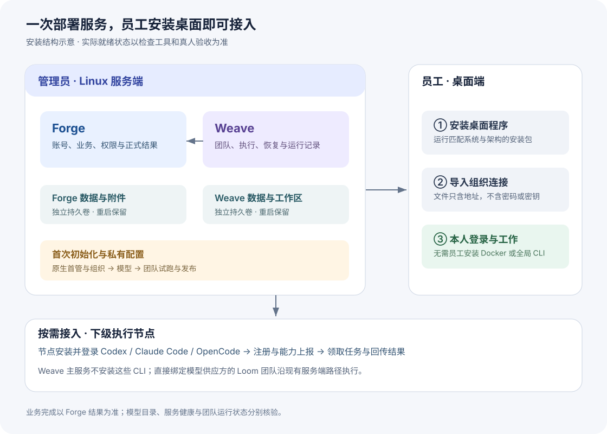
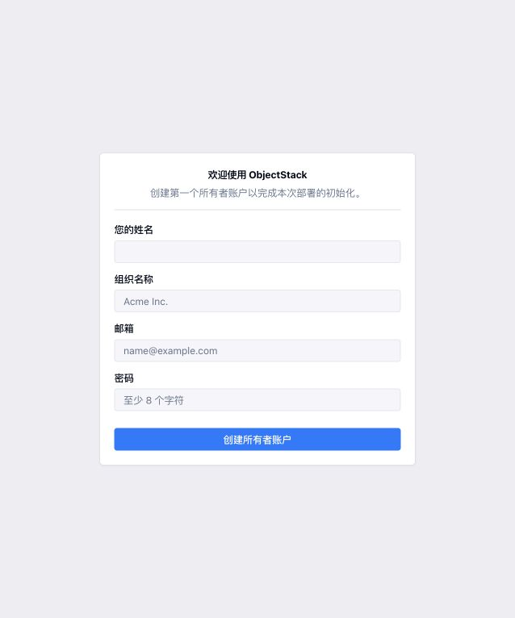
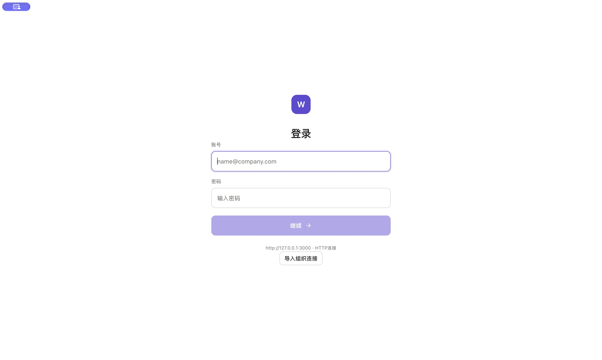
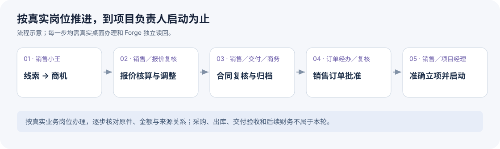

# 安装与初始化

本文面向部署管理员和首批员工。源码、版本组合见[开发与发布方式](../architecture/开发与发布方式.md)，实际部署与验收证据见[环境说明](../environments/开发联调环境.md#重制后的首次安装)。

**当前交付状态：基础安装与原生初始化已完成，团队和员工业务验收进行中。** 本轮已沿正式安装入口启动服务，Forge与Weave健康检查及Weave就绪检查通过；原生首管、唯一组织和Weave工作空间已完成绑定，组织共享DeepSeek Flash模型目录已准确读回。三平台桌面测试包已构建。总仓公开，GHCR容器包保持私有；实际安装、账号与业务证据见环境说明。

## 一、安装后的结构



部署管理员在一台Linux服务器上安装Forge、Weave及各自数据库。员工安装桌面应用，导入管理员提供的组织连接文件，然后使用自己的账号登录。桌面包包含所需的本地运行环境，员工不用安装Docker、Node或全局Pi／Prime，也不需要拉取源码。

Weave主服务默认不安装Codex、Claude Code或OpenCode，也不自动启用同机Runtime Host。需要这些执行器时，由运维在下级执行节点安装、登录并通过既有节点接入流程注册；节点上报可用能力后再领取任务。直接绑定DeepSeek等供应方的Loom团队继续使用已有服务端执行路径。多平台`weave runtime`文件用于节点下载安装，与主服务安装第三方CLI分开。

| 交付物 | 谁使用 | 用途 |
| --- | --- | --- |
| Linux服务端包及 `images.lock.json` | 部署管理员 | 启动确定版本的Forge、Weave、两个数据库和Forge入口 |
| macOS／Windows／Linux桌面安装文件 | 员工 | 日常工作、材料递交、本人待办及授权的团队开发 |
| `organization-connection.json` | 员工 | 导入本组织服务地址；不含账号密码、模型key或权限 |
| 本指南与校验清单 | 部署管理员 | 安装、验证、故障定位及交付核对 |

测试预发布未完成Apple签名和公证。应使用本次明确交付的测试包，不将它标成正式签名版本。仓库访问与私有镜像读取权限由发行方授予；尚未实现离线镜像导入交付，不将离线安装列为当前能力。

## 二、服务器准备

当前镜像面向Linux x86_64。服务器需要Python 3.10以上、Docker Engine和Compose 2.20以上，并能访问私有镜像仓库与配置的模型服务。Ubuntu 22.04／24.04／26.04可由安装入口显式安装Docker依赖；已有Docker不会自动替换。其他发行版先由管理员安装Docker与Compose。

若部署网络无法直连Docker Hub，管理员可按Docker官方方式配置受信任的 `registry-mirrors`，保持TLS校验和本次 `images.lock.json` 的原始摘要；不能改用浮动标签来绕过下载失败。本轮已用[DaoCloud官方镜像服务](https://github.com/DaoCloud/public-image-mirror)取回与原锁一致的PostgreSQL镜像；镜像入口影响下载路径，不替代镜像摘要及实际PostgreSQL版本检查。

确定两个员工可访问的地址，例如：

| 服务 | 本指南示例 |
| --- | --- |
| Forge | `http://server.example.internal:8080` |
| Weave | `http://server.example.internal:8081` |

管理员开放这两个业务端口；两个数据库不发布主机端口。已有HTTPS入口时沿客户部署配置使用HTTPS，安装器不自动申请证书。Forge地址还必须能从Weave容器访问，不能把员工地址和身份验证地址分别写成不同origin。

下载授权的服务端包，按随包校验清单验证文件后解压。`images.lock.json`必须包含三个真实镜像摘要和来源版本；源码中的 `images.template.json`故意留空，不能拿模板安装。镜像构建操作是发行方职责，见[构建入口](../../tools/server-image-build/README.md)。

**当前源码仓公开，GHCR容器包保持私有。** 部署管理员需取得包读取权限，并使用相应令牌登录；见[GitHub包访问控制说明](https://docs.github.com/en/packages/learn-github-packages/configuring-a-packages-access-control-and-visibility)。

1. 将部署管理员的GitHub用户名提供给发行方。发行方按 `images.lock.json` 中的每个私有GHCR包，在该包的 **Package settings → Manage access／Inherited access** 中确认此账号具有 **Read** 权限；使用独立包权限时，通过 **Invite teams or people** 添加账号并选择Read。包保持私有，部署账号只需读取权限。若权限继承自关联仓库，由发行方确认已有读取授权，无须把部署账号升为仓库或包管理员。
2. 部署管理员在自己的GitHub **Settings → Developer settings → Personal access tokens → Tokens (classic)** 中创建有期限的令牌，只勾选 `read:packages`。本安装不需要 `repo`、`write:packages` 或 `delete:packages`；若所属组织要求SSO，为此令牌完成该组织的SSO授权。令牌范围不能代替上一步的包读取授权。见[GitHub Container registry身份验证](https://docs.github.com/en/packages/working-with-a-github-packages-registry/working-with-the-container-registry#authenticating-with-a-personal-access-token-classic)。
3. 在部署服务器上，以执行安装的同一系统账号登录。下节安装使用 `sudo`，此处也使用 `sudo`；将 `YOUR_GITHUB_USERNAME` 换成已获Read权限且创建该令牌的GitHub用户名：

```sh
sudo docker login ghcr.io --username YOUR_GITHUB_USERNAME
```

在Password提示处粘贴刚创建的令牌，看到 `Login Succeeded` 后继续安装。令牌只交给正常Docker登录入口，不放入命令参数、镜像锁、组织连接文件、截图或本指南。

运行时模型key另存管理员所有、权限0600的文件，例如 `/root/weave-model-key`；该文件只放key，不放JSON或注释。

## 三、启动服务与创建首管

在解压的服务端包目录执行：

```sh
sudo ./install.sh \
  --images ./images.lock.json \
  --forge-origin http://server.example.internal:8080 \
  --weave-origin http://server.example.internal:8081 \
  --host-gateway-host server.example.internal \
  --model-key-file /root/weave-model-key \
  --output /srv/organization-connection.json \
  --install-docker
```

将示例地址换成本次实际地址。使用固定IP时不需要 `--host-gateway-host`；需要本机DNS回连时，它必须等于Forge规范主机名。已有外部入口使用 `--external-ingress`，具体参数见[安装器说明](../../tools/server-bundle/README.md)。输出目录须已存在。

这一条命令负责依次检查Docker、固定镜像和数据库版本，启动Forge与Weave，并提示打开Forge的 **`/_console/setup`** 页面。首次创建管理员仍在平台原生页面完成。

初版按一个Forge原生组织对应一个Weave工作空间安装。重复执行相同配置会沿原安装继续；更换地址、镜像锁或组织不会自动覆盖已有状态。不要用重新创建组织或改数据库的方式绕过身份错误。

无人值守的分阶段安装可加 `--non-interactive`：没有已完成首管设置的私有输入时，服务启动后返回 `native_setup_required` 和退出码2，这是等待原生Setup的状态。完成页面设置后，使用 `attach-organization`继续；不会自动制造账号。



上图为本轮捕获的原生空表单，未填写账号或凭据。按页面顺序填写四项信息：

1. 在浏览器填写管理员姓名、组织名称、邮箱和密码，点击“创建所有者账户”。
2. 确认进入本组织，管理员账号具有原生管理权限。
3. 回到安装终端继续，输入刚创建的本人管理员邮箱和密码；密码隐藏输入，不要求手工复制cookie或token。
4. 安装器核对当前原生组织、绑定Weave工作空间、完成运维初始化和共享模型目录读回，并导出组织连接文件。


## 四、区分安装结果

| 检查项 | 成功说明什么 | 仍须验证什么 |
| --- | --- | --- |
| 服务健康 | Forge／Weave进程与所需服务可访问，Weave来源吻合 | 账号、权限、团队与业务结果 |
| 身份交换 | 同一Forge账号与组织正常绑定到Weave | 普通员工权限及受限任务授权 |
| 模型目录及共享修订 | 实际模型目录可见、系统模型镜像版本读回一致 | 真实模型调用和团队执行 |
| 团队发布 | 同一修订完成试跑并通过正式发布条件 | 员工实际发起及Forge业务写回 |
| 桌面与Forge读回 | 员工完成操作并独立核对权威结果 | 尚未执行的异常／并发／长期稳定性路径 |

本轮安装器已正常完成并退出，结果为 `base_installed_business_pending`：首管“明序管理员”和唯一组织“明序技术”已原生创建，组织绑定、Weave运维初始化和共享模型目录读回通过。团队和员工业务验收仍在进行。系统模型读回异常返回 `mirror_committed_readback_unverified`，保留提交回执；不要创建个人provider冒充组织共享模型。

## 五、员工安装与连接

macOS将本次应用拖入“应用程序”后打开；Windows运行对应安装程序；Linux使用本次发行提供的对应安装格式。不要混用旧测试包。



上图为本轮新包的实际首次启动，尚未导入组织配置，因此显示本机默认地址。

1. 打开桌面，在登录页选择“导入组织连接”，选取管理员提供的 `organization-connection.json`。
2. 核对Forge与Weave地址及HTTP／HTTPS连接方式，确认保存，按提示正常重启应用。
3. 使用本人的Forge账号登录，进入自己的工作区和待办。

取消选取或预览不会改动连接，相同文件不会重写；错误文件会被拒绝。员工不需要编辑配置文件或选择运行时。

组织连接文件的完整示例：

```json
{
  "version": 1,
  "forgeOrigin": "http://server.example.internal:8080",
  "weaveOrigin": "http://server.example.internal:8081"
}
```

只允许这三个字段，不含员工密码、模型key或会话。文件只是连接配置，不是登录凭据。开发调试环境若显式覆盖地址，界面应如实显示覆盖状态；员工安装无需设置环境变量。

桌面使用应用专属运行配置与工作历史，不自动继承其他Pi、Prime、Codex或Claude工具的模型凭据。服务端团队模型与桌面本地助手模型分别验证；初始化管理员私有配置实际模型后再交付员工，不把读取模型名称当成真实调用成功。

### 管理员配置桌面助手

当前组织连接文件只下发地址，服务端团队模型不会自动成为桌面本地Pi的模型。默认Pi的设置页尚无凭据写入入口；这一步由部署管理员完成，普通员工不配置运行时或模型供应方。

正常退出桌面后，在当前系统的应用用户数据目录下找到 `runtime-profiles/pi/agent/`，保持目录0700、凭据文件0600。macOS位于 `~/Library/Application Support/weave-workbench-desktop/`，Windows位于 `%APPDATA%\weave-workbench-desktop\`，Linux位于 `~/.config/weave-workbench-desktop/`。

将获准用于该桌面的凭据保存为 `auth.json`：

```json
{"deepseek":{"type":"api_key","key":"<本组织私有模型key>"}}
```

实际服务返回的模型为 `deepseek-flash`；它与内置目录的 `deepseek-v4-flash`是不同标识，不能直接替换。与实际目录相符的 `models.json`如下：

```json
{
  "providers": {
    "deepseek": {
      "baseUrl": "https://api.deepseek.com",
      "api": "openai-completions",
      "models": [{"id": "deepseek-flash", "name": "DeepSeek Flash"}]
    }
  }
}
```

管理员重启并登录后，在输入区选择DeepSeek Flash，桌面会记住选择；随后验证一次实际回答及所需工具调用。不要把key放进组织连接文件、安装包或共享的 `~/.pi`／`~/.prime`目录，也不要把向Prime保存凭据当作已配置Pi。

## 六、演示组织与业务验收

按[演示账号主册](../../scenarios/演示账号与ObjectStack配置.md)建立账号、原生组织成员、岗位、用户任职和权限。本轮23个账号及23个岗位已初始化，23个账号均已用本人身份正常登录核验，22名普通员工不能访问管理员用户目录。管理员负责初始化，员工使用本人账号办理；口令只保存在受限私有交付中。团队试跑和员工业务链仍待本轮验收完成。

开始线索转化前，管理员进入销售 → 业务设置 → 客户管理 → 客户分类，维护启用的“项目客户”，编码为 `CUST-CAT-PROJECT`。当前转化动作要求该分类已经存在，不会自动创建；缺项时应先补配置，保留原失败记录，再由员工发起新一轮办理。报价主体、报价／合同／项目类型、设备与单位及所需结算账户也使用各自正常设置页维护。



本轮按[线索转商机](../../scenarios/lead-to-opportunity/线索转商机场景设计.md)、[报价核算与调整](../../scenarios/quotation-review/报价核算与调整场景设计.md)、[合同复核](../../scenarios/sales-contract-handoff/合同场景设计.md)及[销售订单闭环](../../scenarios/sales-order-handoff/销售订单闭环场景设计.md)顺序办理，终点为项目经理接收并启动。

每一步由实际员工在桌面发起或处理，并在Forge页面独立读回。按用户最新要求，业务材料、名称和编号采用正常项目文案，不出现仿真或测试字样；本轮仍不发生真实签署或资金操作，材料来源与操作边界在私有验收记录中保留。采购、出库、项目交付验收、后续开票回款和成本结算不属于本轮；配置了这些演示岗位，不等于要扩展这轮交易。

## 七、重启与常见问题

默认持久配置位于 `/var/lib/weave-workbench`，目录0700、文件0600。数据库、上传附件与工作区位于Compose持久卷。普通停止与重启保留这些数据：

```sh
sudo python3 server_bundle.py check
sudo python3 server_bundle.py stop
sudo python3 server_bundle.py start
sudo python3 server_bundle.py export-connection --output /srv/organization-connection.json
```

| 现象 | 处理 |
| --- | --- |
| 私有镜像无法拉取 | 核对每个GHCR包的Read授权、令牌的 `read:packages` 范围及有效期／SSO授权，并以安装使用的同一系统账号完成Docker登录；保持镜像锁的原摘要 |
| 首次设置后仍没有组织 | 回到原生组织入口核对成员与活动组织；不直接写库补身份 |
| Forge可登录而Weave失败 | 核对规范origin、容器到Forge网络、稳定身份来源与原生组织绑定 |
| 模型目录可见但不能执行 | 核对共享模型修订、成员冻结引用和真实执行错误；不扩大员工权限 |
| 桌面连接旧环境 | 核对导入预览、正常重启和界面当前地址；检查是否存在显式开发覆盖 |
| 重跑提示配置不一致 | 保留原状态，核对本次安装参数；不删数据目录强行继续 |

重启验收要再次登录同一员工，核对组织身份、模型修订、团队发布及本人数据未变化。安装器没有删除业务卷的命令；升级或重启不应重新生成认证和加密密钥。
