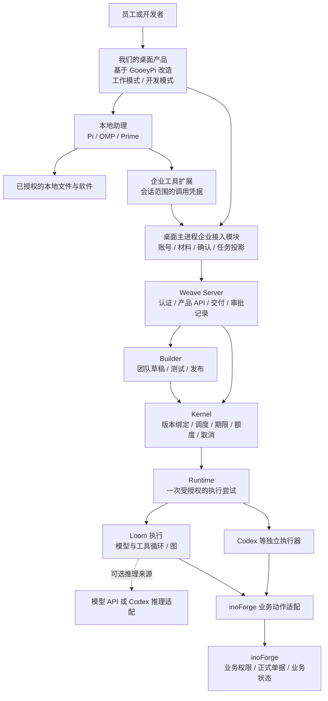

# 基于 GooeyPi 的桌面产品改造与职责调整方案

日期：2026-09-20。

状态：用户已明确以 GooeyPi 源码为基础改造自己的桌面产品。界面、主进程、本地智能体接入和发行体系都在改造范围内；本文记录源码审阅和实施方案，不代表改造已经实现或业务验收通过。

## 1. 本次范围与源码基线

用户给出的名称为 `googy-pi`。公开检索中与名称和用途相符的项目为 [am-will/gooey-pi](https://github.com/am-will/gooey-pi)，正式名称 GooeyPi。本次按此项目检查。

- 本地目标目录：`<MAINTAINER_LOCAL_PATH>`。
- 拉取方式：浅克隆和稀疏检出，保留源码、扩展、技能、测试、文档与构建脚本；暂不下载 `vendor/`、`public/`、图片等大资源。初次普通拉取在 HTTP/2 传输中断后改用 HTTP/1.1。构建前需补齐检出，不能把当前目录称为已安装环境。
- 上游 main 审阅提交：`459c9965690468c69d7434f82acf4b5eeee8e4bf`，2026-09-09。
- `package.json` 版本及最新发布标签：`1.1.17` / `v1.1.17`。
- 仓库标注 MIT；派生仓保留上游许可证和来源记录。
- 已检查 README、桌面安全模型、Pi/OMP/Prime 接入合同、扩展注入和主进程能力桥接源码。
- Weave 对照材料来自现有分层基线、独立仓本地代码和 OTC 验收记录；本次不把旧记录中的运行状态当成今天仍在运行的事实。

本次为源码拉取和调整方案分析，不安装智能体、不迁移凭据、不运行模型、不写入 inoForge 业务数据，不实施桌面替换。

后续构建前，在该仓库运行 `git sparse-checkout disable` 补齐打包依赖和资源，再按 `docs/validation.md` 选择工具链及安装步骤。历史提交如需上游合并分析，可单独补取；源码审阅绑定上述提交。

### 1.1 产品改造定位

GooeyPi 是桌面代码底座，我们维护派生产品并对完整用户体验负责。改造直接进入应用界面、主进程和智能体生命周期；扩展与企业桥接只是实现方式的一部分，不能把产品范围缩成在原版聊天窗口里增加几个工具。

| 改造面 | 产品目标 | 主要源码落点 |
|---|---|---|
| 应用框架与首页 | 自己的产品导航、工作与开发模式、账号及设置；普通员工从任务或材料开始，无需先选代码项目 | `src/App.tsx`、`src/components/Sidebar.tsx`、`src/app/workspace.ts` |
| 对话与业务工作界面 | 材料、团队方案、执行进展、待确认事项、正式结果和成果文件成为可操作的界面；状态卡与对应会话记录关联 | 调整现有对话与工作区组件，增加任务、确认和成果视图 |
| 桌面主进程 | 统一管理企业登录、用户切换、材料访问、工具授权、任务订阅及浏览器隔离 | `electron/main/`、`electron/main/lib/capability-bridge.ts` 及相应 IPC |
| 本地智能体 | 按身份与模式装配工具，管理启动、停止和凭据撤销；保留适配多个执行器的结构 | `electron/main/agent-rpc/manager.ts`、`harness-adapter.ts`、`electron/main/extension-manifest.ts` |
| 安装与更新 | 独立的应用标识、数据目录、安装包和更新源，支持 macOS 与 Windows | `package.json`、`electron/main/updates.ts` 及构建发布配置 |

上游的现有页面、项目模型、harness 列表和 MCP 配置方式都是可改造的实现，不是我们产品必须遵守的限制。需要时可以重构或替换相应模块；保留其有效的权限与隔离保障，并用实际验证证明替代实现。原版只支持本地 stdio 配置等事实，用于识别工作量，不用于否定我们增加受管理的企业连接。

复用重点是成熟的桌面基础、文件与浏览器能力、编码工作区和本地进程管理。通用个人任务可由本地助理直接完成；企业团队编排仍由 Weave 负责，业务事实仍由 inoForge 负责。桌面源码可大幅调整，后台职责边界继续保持。

独立模块和上游版本记录用于控制维护成本，不要求所有修改都只能叠加插件，也不承诺后续可以无冲突升级上游。

## 2. 能复用什么，不能误认为已经具备什么

| 范围 | 已见实现 | 对我们的影响 |
|---|---|---|
| 桌面基础 | Electron、React、项目、会话、终端、文件、Git 差异、工作树、浏览器、活动视图 | 可直接作为桌面产品基础，避免继续维护两套通用聊天和编码界面 |
| 三类本地智能体 | Pi、OMP、Prime Agent，各有进程、模型和会话适配 | 选择 GooeyPi 不等于选择一个固定执行引擎；当前适配列表没有直接的 Codex CLI 桌面适配器 |
| 扩展机制 | `extension-manifest.ts` 显式注入扩展；`CapabilityBridge` 提供按本地会话授权的主进程桥接 | 企业工具可沿既有扩展机制接入；无需把 Weave 调度器嵌入桌面 |
| MCP | OMP 原生支持；Pi 需要 `pi-mcp-adapter`；Prime 的 MCP 管理由其自身负责 | 原版 GUI 只管理受支持的本地 stdio 定义，不接管网络 MCP 认证；不能承诺填一个远程 URL 就完成企业接入 |
| 模型登录 | 凭据由本地智能体持有；桌面只处理特定模型和语音配置 | 模型供应商登录不构成企业用户身份，需要独立企业认证 |
| 权限 | Renderer、IPC、目录授权有边界；Pi 没有工具审批机制，OMP 有自身审批模式 | 隐藏开发按钮或给 Pi 一段提示词不能形成企业权限隔离；本地工具仍可能拥有操作系统用户权限 |
| 浏览器 | 当前 `BROWSER_PARTITION` 固定为 `persist:prime-work-browser` | 同一应用的浏览器会话分区不能直接视为逐企业用户隔离；企业账号切换必须设计分区与授权撤销 |
| 本地协作与定时任务 | 桌面可创建同目录会话、发送消息、运行本地计划任务 | 这些属于本地工作；不能同时接管同一个企业任务的重试、超时、额度和最终状态 |
| 多平台 | 已有 macOS、Linux、Windows 构建及发布资产 | 可复用打包基础，但不能据此认定 Windows 的 Weave 执行隔离、企业接入和业务能力已通过验收 |

主要源码入口：

- [桌面 README](https://github.com/am-will/gooey-pi/blob/459c9965690468c69d7434f82acf4b5eeee8e4bf/README.md)
- [能力接入合同](https://github.com/am-will/gooey-pi/blob/459c9965690468c69d7434f82acf4b5eeee8e4bf/docs/capability-integrations.md)
- [安全边界](https://github.com/am-will/gooey-pi/blob/459c9965690468c69d7434f82acf4b5eeee8e4bf/docs/security.md)
- [Pi 接入](https://github.com/am-will/gooey-pi/blob/459c9965690468c69d7434f82acf4b5eeee8e4bf/docs/pi-integration.md)
- [主进程能力桥](https://github.com/am-will/gooey-pi/blob/459c9965690468c69d7434f82acf4b5eeee8e4bf/electron/main/lib/capability-bridge.ts)
- [智能体适配](https://github.com/am-will/gooey-pi/blob/459c9965690468c69d7434f82acf4b5eeee8e4bf/electron/main/agent-rpc/harness-adapter.ts)
- [扩展清单](https://github.com/am-will/gooey-pi/blob/459c9965690468c69d7434f82acf4b5eeee8e4bf/electron/main/extension-manifest.ts)
- [浏览器分区及客户端类型](https://github.com/am-will/gooey-pi/blob/459c9965690468c69d7434f82acf4b5eeee8e4bf/src/types/api.ts)

## 3. 建议的目标结构

图中 Server、Kernel、Builder 的框表示职责模块，不要求新增独立进程。企业接入模块先放在 Electron 主进程中，与既有 IPC 和能力桥复用生命周期，不新建常驻的 Workbench Host。

桌面本地助理不自动成为 Weave Runtime。企业任务确需委派本机执行时，应由独立 Runtime 按平台认领和身份合同接单，不能把任意本地会话算成受管执行。

多运行时继续保留。执行器、推理提供方、部署位置和工具环境分开选择。既允许 Loom 直接接模型或经 Codex 获取推理，也允许 Codex 独立执行；每种组合如实声明恢复粒度。普通员工无需理解这些选项。

## 4. 两种工作模式与三种权限

| 行为 | 员工工作模式 | 开发模式 | 发布或审批权限 |
|---|---|---|---|
| 处理个人文件、生成草稿 | 按本地授权允许 | 允许 | 不默认逐步审批 |
| 调用企业已发布能力 | 按业务授权允许 | 按业务授权允许 | 按该动作的实际要求确认 |
| 建队、修改技能和流程 | 无权修改；可提交能力需求 | 可生成草稿、试跑、评估 | 发布团队单独授权 |
| 修改 inoForge 对象、页面和规则 | 无权修改 | 在隔离开发环境修改、测试和预览 | 发布应用单独授权 |
| 审批企业业务 | 取决于 inoForge 岗位权限 | 开发身份不自动取得审批权 | 必须由有业务权限的人办理 |

工作模式与开发模式是用户体验和工具范围，服务端身份与授权才是最终限制。企业登录由可信主进程与 Server 完成；不能由模型提交一个用户 ID、切换提示词或修改本地设置来提权。

GooeyPi 原版能访问本地终端、工具和第三方扩展。若工作模式承诺限制本地文件和进程能力，还必须收紧运行环境、工具和扩展加载。企业生产权限则始终由 Server / inoForge 控制；企业生产凭据不发给桌面通用智能体。OMP 的工具审批也不能代替业务审批。

首批只认证一套桌面 harness 版本与企业扩展组合，其他 harness 后续按同一合同验证。选择哪套本地 harness 不改变后台多运行时支持范围。

产品呈现也需要适配。员工登录后应直接看到工作、企业待办和材料，不应先被要求选择代码仓库、理解 Pi/OMP 或安装 MCP。个人文件夹作为需要时选择的材料来源；Git、终端、工作树、团队配置和发布入口按实际权限呈现。界面隐藏只是体验，实际调用仍由主进程与服务端分别校验。

开发者进入开发模式后再选择“企业能力”或“业务应用”，沿用对话、材料、进展和成果的共同体验，增加差异、测试、预览与发布视图。已有团队的日常调用不重复建队或发布。

现有 Server 的建队、试跑和许多发布接口依赖 `admin` / `owner`。因此开发模式不能简单给账号增加 `admin`；应拆出团队编辑、测试、团队发布、应用开发和目标环境发布等实际授权，既保留已有检查，又收窄其适用范围。

## 5. 优先补齐的五份交接契约

### 5.1 企业身份与会话

企业账号和模型账号分别管理。企业长期凭据由可信主进程管理，模型工具只获得短期、限范围的调用凭据；绑定企业、用户、客户端实例、会话、模式和允许操作。Server 校验真实授权，不能信任前端提供的权限列表。

退出、切换企业或切换用户时，撤销旧工具凭据，停止或隔离原用户的本地智能体进程，隔离会话与文件索引，切换浏览器登录分区。已提交的企业任务仍归原用户所有，不能因为新用户打开桌面而被重新归属。

现有 `CapabilityBridge` 绑定 cwd、session、harness，但没有企业主体和服务端授权；应复用其通信结构并扩展约束，不能直接当成企业身份机制。

### 5.2 原始输入、材料与任务提交

桌面先保存用户原话和明确选择的文件，再登记企业任务输入版本。助理的解释、执行计划和补充材料另存，不能覆盖原始输入。

现有 Server 的 `/v1/workbench/dispatch-inputs` 已提供输入修订、幂等及派发关联。应提取成客户端无关的产品合同，复用其事实所有者；不是删除原始材料保护，也不是为 GooeyPi 另起任务队列。

客户端会话 ID 与企业 Task/Run ID 分开。发送后回执丢失时，按原提交标识核对，不重新生成另一笔任务。关闭桌面或切换会话不会取消已托管的企业任务。

### 5.3 用户确认、执行许可与业务审批

普通问题可以使用 GooeyPi 的 Ask User。正式执行许可必须绑定具体动作、参数、材料版本、操作者、有效期和执行次数，由服务端保存决定。

模型提出待确认事项，可信客户端显示具体影响，用户通过可信界面确认；智能体工具不能自行调用一个“批准”接口冒充用户。已明确授权且内容未改变的动作避免反复确认。

用户确认提交不等于 inoForge 的岗位审批通过。Kernel 强制执行通用许可约束，Server 保存待办和决定，inoForge 再检查业务条件和岗位权限。

### 5.4 任务状态、恢复与通知

桌面展示 Server 的企业任务投影，保留事件游标并可重新同步。明确区分等待人工、等待设备、失败、已请求取消、已停止、结果未知和完成。

任务卡跟随发起它的对话消息，统一待办页提供跨会话查询；完成或失败的卡片不长期固定在输入框上方。本地助理回答结束不代表企业任务完成，两者分别呈现。

本地停止助理与取消企业任务是不同动作。企业重试、累计期限、用量和取消仍走统一执行链；GooeyPi 的本地 schedule/collaboration 不得对同一企业运行再实施一层自动重试。跨账号通知只提供该接收人有权查看的内容。

### 5.5 文件与业务成果

材料和成果都有归属、版本、内容摘要及访问权限。补齐二进制文件上传、下载和交付核验，不用本机路径冒充可交付附件。

报价等成果必须同时关联可打开的文件与 inoForge 正式记录。用量区分本地助理与企业运行；桌面统计不能直接覆盖平台核定用量。团队运行使用其绑定模型，不能假定桌面选择 GPT-5.6 Luna 后所有团队成员自动继承。

## 6. 调整落点与旧 Workbench 处理

以下新增路径是建议，尚未创建或实现。

| 位置 | 建议调整 | 复用和退出 |
|---|---|---|
| GooeyPi 派生桌面仓 | 直接改造应用框架、导航、工作区、账号设置、对话任务界面和智能体生命周期；建议用 `electron/main/enterprise/` 集中登录、授权、材料和任务订阅 | 复用桌面、浏览器、文件与 Git 基础；按目标体验重构所需模块，保留上游来源和变更记录 |
| Weave Server | 客户端无关的输入登记、任务查询、确认与文件合同；按用户过滤可用工具 | 复用 API、身份、输入修订、业务调用记录和交付存储；移除面向模型的 Workbench 专属假设 |
| Kernel | 补实际执行许可、身份与尝试约束；继续修复统一队列与恢复 | 不写 GooeyPi UI、OTC 业务分支或另一个任务生命周期 |
| Builder | 开发者建队、试跑、评估和发布；员工只调用已发布能力 | 复用已有团队构建机制，团队数量与岗位由它自主设计 |
| Runtime / Loom | 补二进制成果交接、明确恢复合同、保持多运行时能力声明 | Runtime 不依赖桌面 UI；Loom 不承担企业账号与业务审批 |
| inoForge | 复用业务 Action 建业务适配，落实委托身份、权限、幂等与结果回读 | 保留正式业务状态与规则，禁止直接数据库写入替代业务动作 |
| 旧 weave-workbench | 冻结通用 UI 扩建；盘点身份、输入版本、任务投影和交付逻辑 | 迁移可复用合同与验证案例，不整体搬入旧 TS Host；新路径验收后退役旧产品入口 |

建议维护 GooeyPi 的独立派生仓，与上游保留明确版本关系；本次只克隆上游，未创建远程 fork。企业产品还应有自己的应用标识、数据目录和发布/更新通道，不能继续使用上游更新源覆盖企业改动。

实现前可直接追踪以下既有文件，避免重新实现已经存在的合同：

- Workbench `packages/bundle/workbench-app/src/account.ts`：用户委托和会话授权。
- Workbench `packages/bundle/workbench-app/src/dispatch-input.ts`：冻结原始消息、输入修订、请求回执丢失后的核对。它依赖旧会话类型，需要提取语义与测试案例，不能原文件照搬。
- Workbench `packages/bundle/workbench-app/src/deliverable-content.ts`：成果内容交接。
- Server `internal/app/api/dispatch_input.go`：输入登记和修订事实所有者。
- Server `internal/app/mcpstdio/server.go`：要求 `_meta.weave_user_authorization`；不能退化成共享服务密钥执行。
- Server `internal/app/api/server.go`：当前建队与发布的权限检查及 Workbench 专用输入路由。
- GooeyPi `electron/main/agent-rpc/manager.ts`、`extension-manifest.ts`：本地进程、扩展注入和停止生命周期。

智能体调用企业能力时，首批建议通过原生扩展访问主进程企业桥，再由桥调用既有 HTTP 产品服务。桌面的登录、任务、确认和成果界面则直接通过可信 IPC 访问主进程，不依赖模型代为操作。普通员工无需自行配置网络 MCP。需要兼容其它工具客户端时，可复用同一服务适配 MCP；传输差异不得产生两套任务状态或授权规则。

旧目录和证据保留作迁移参考；不增加旧会话转换、旧快照读取或长期双产品运行。旧源码保留不等于旧入口继续作为正式产品。

## 7. 实施顺序与通过标准

| 批次 | 范围 | 通过标准 |
|---|---|---|
| P0 派生产品与可运行基线 | 补齐源码资源并验证本地构建；固定 GooeyPi、harness、Weave 版本；同步产品入口合同；复查既有登录和队列问题 | 本地 Mac 可启动固定版本桌面；全新环境能正常认证；真实 PostgreSQL 上四类任务首次入队和认领可用；区分已经修复与仍阻塞 |
| P1 桌面产品框架改造 | 首页、导航、账号与设置、工作/开发模式、材料入口；改造工具装配和账号切换生命周期 | 员工无需选择代码项目即可开始工作；开发者可进入项目工作区；换用户后看不到原用户任务、浏览器登录和材料；员工调用开发 API 被服务端拒绝 |
| P2 一次企业任务 | 原始输入和文件交接、幂等提交、任务展示、确认、文件下载 | 桌面发起任务；关闭重开可看到同一任务；断线重连不重复创建；用户拿到可打开的成果与正式业务回执 |
| P3 完整 OTC | 开发者先自主建队、试跑并发布；员工再用模糊业务请求完成 OTC | 不向 Builder 提供成员数量/岗位答案；团队自主执行；按业务权限完成确认和流转；页面独立回读全部正式结果 |
| P4 两类开发闭环 | 智能体版本开发、inoForge 应用修改 | 都能看到差异、测试和评审；分别发布；新版本不会悄悄改变在途任务 |
| P5 桌面交付 | 安装、更新、Windows 与目标 harness 的实际验证 | 新安装可用；企业配置不会被上游更新覆盖；如需本机受管执行，另证执行隔离、停止和恢复 |

完整 OTC 仍是最终验收目标；一笔报价任务仅作为中间检查点，不替代完整业务验收。当前继续优先使用本地 Mac；Windows 为产品交付批次，不成为这次 Mac 接入的前置任务。

真人验收仍遵守“只扮演普通用户、用产品正常路径、遇到阻塞先记录并停止”。开发者建队和员工办业务分别使用对应权限，不能用同一个管理员账号证明员工场景。模型按用户要求以 GPT-5.6 Luna 为验收配置，实际生效情况单独验证。

## 8. 需要同步的现有规则与证据限制

用户选择 GooeyPi 后，下一实施批次应同步修改以下旧入口假设，避免 AI 同时执行互相冲突的规则：

- `AGENTS.md` 的“Workbench 是唯一业务界面”和迁移期功能范围。
- `docs/架构/README.md`、产品合同、迁移计划与真人验收协议中的入口定义。
- Server MCP 指引中的 `Workbench owns ...`、输入登记路径和会话字段的客户端专用语义。
- `productguard` 中确实绑定旧客户端的检查，保留其禁止旁路业务执行的目的。

通用身份、版本冻结、输入可追溯、幂等、取消与唯一任务事实不因更换客户端而放宽。

本次未修改 GooeyPi 产品代码，未做编译、安装或运行验收，也未重新验证 2026-09-15 记录的登录及队列故障。已下载源码、存在跨平台发布资产和完成架构审阅，均不等于桌面产品改造完成。
