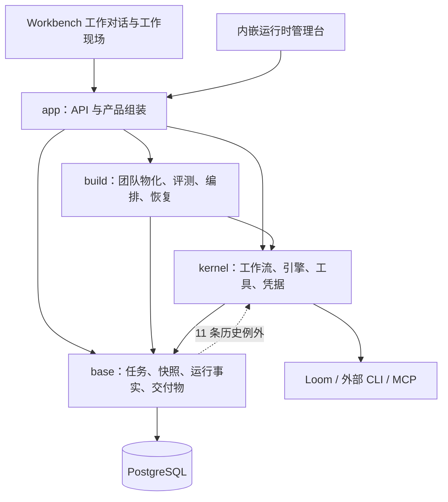

# Weave 全方位分析与治理

> 本文的工程数字与验证结果对应最初治理轮次。后续产品边界已收敛为 Workbench；源码删除和清理后验证见 [单一产品边界清理](./2026-09-05-Workbench单一产品边界清理.md)，不得用本文旧结果认证新版本。

日期 2026-09-05 · 范围 `<MAINTAINER_LOCAL_PATH>` · 起始提交 `23c6b1d`

本轮同时检查产品定位、用户旅程、功能闭环、接口一致性、架构、数据与权限、运行恢复、交付质量和后续投入。结论依据本仓库实现、产品合同、真实 PostgreSQL 测试及构建检查。文档中记载的历史业务验收与本轮亲自执行的验证分别标识。

**当前最值得保留的产品核心，是可重复使用的专业团队与可恢复的工作执行记录。最需要治理的，是产品承诺、客户端能力、运行边界和验收证据之间的不一致。** 功能广度已经足够开展受控试点；继续增加团队构建方式、业务页面或平台状态，会扩大已有的维护与解释成本。

## 1. 判断与事实边界

| 维度 | 当前判断 | 依据与限制 |
|---|---|---|
| 产品定位 | 私有部署的专业团队执行后端，适合部署方参与的设计伙伴试点 | 8 月 31 日发布基线；不等同于已验证的公开 SaaS |
| 业务闭环 | 建队、派发、人工等待、纠偏、停止、产物读取已有实现 | 本轮真库回归；尚未在独立 Workbench 与真实模型上重跑完整旅程 |
| 用户入口 | Workbench 是唯一页面入口，Weave 只提供后台服务 | 运行节点接入进入 Workbench；旧客户端方案与独立页面直接删除 |
| 核心架构 | 四层物理结构已形成，运行事实与事务约束较强 | 仍有 11 条 base → kernel 历史依赖，不能称为完全独立的协同基座 |
| 安全承诺 | 有明确的 MCP 声明写闸与任务身份约束 | 不是全执行面沙箱；CLI 启动参数明确跳过权限审批或沙箱 |
| 工程交付 | 本轮修复后本地 CI、真库并发检查与前端检查通过 | Docker 引擎未运行，未验证新镜像启动；远端 CI 未触发 |
| 商业与规模准备 | 证据不足以判断转化、留存、成本收益或生产承载能力 | 本仓库没有本轮可核验的试点样本、用户访谈、容量基准和运营数据 |

进入本轮前，工作区已有运行时阶段重试的 8 个已跟踪文件改动及一个新增文件。本轮保留这些工作，并修正其测试夹具；没有把这些既有功能算作本轮新开发，也没有提交、推送或部署。

## 2. 产品定位与用户价值

### 2.1 产品应该解决的工作

Weave 对以下工作有明确价值：多人或多角色分工、跨多个阶段、耗时较长、需要人工确认、需要在中断后接着做，并且必须留下可以检查的交付物。

例如研究、方案比较与审查型任务，需要保存哪些输入交给了谁、采用了哪个工作流版本、哪些阶段已经完成、哪里等待人处理，以及最后采用哪份产物。代码中的冻结快照、队列、检查点、人工恢复与交付物确实围绕这些问题构建。

对于一次问答或无恢复需求的短任务，创建团队、冻结工作流与部署运行节点的成本未必值得。应在首次使用说明里讲清适用门槛，避免用“多智能体”本身作为价值理由。

建议产品的一句话定位为：**让专业团队持续完成多阶段工作，并使过程可检查、中断可恢复、结果可领取。** 这是产品表达建议，不代表本轮新增了任何能力。

### 2.2 三类用户需要分开服务

| 角色 | 想完成的事 | 需要看到的对象 | 不应成为其必经步骤的内部对象 |
|---|---|---|---|
| 业务使用者 | 把任务交出去并拿到可采用成果 | 团队用途、任务、阻塞原因、待确认事项、交付物 | BuildRun、candidate、compiler revision、lease epoch |
| 团队维护者 | 定义分工、修改工作流、评估质量 | 团队定义、版本、输入输出合同、受控评测、近期健康 | 底层队列与数据库迁移细节 |
| 部署运营者 | 接入模型与运行节点，排障、更新、恢复 | 节点容量、认证方式、故障状态、用量、备份、版本 | 业务对话中的规划状态 |

现有功能能支持这三类角色，但文档和权限命名没有形成一张一致的产品地图。`admin`、`owner`、API key scope 与 workspace 成员资格承担不同职责，不能用一个“管理员”标签解释所有操作。

### 2.3 入口合同已统一

Weave 只服务 Workbench。业务接单、团队准备、派发、执行观察、人工处理、纠偏、停止、恢复、运行节点接入和成果领取均围绕 Workbench；服务端不再内嵌独立页面。

本轮直接删除旧业务控制台、独立 Codex/Claude 接入及独立业务 CLI，不额外归档边界外方案。MCP、HTTP、模型与执行引擎继续承担 Workbench 的后台依赖，不能因旧客户端退出而误删。当前保留关系、源码清理与清理后验证见 [单一产品边界清理](./2026-09-05-Workbench单一产品边界清理.md)。

## 3. 端到端使用旅程

### 3.1 从安装到首次有效产出

| 阶段 | 当前实现 | 发现的问题或证据缺口 | 验收应看什么 |
|---|---|---|---|
| 安装 | Compose、原生服务、bootstrap、runtime 安装脚本 | 原 README 指向错误环境文件、不存在的默认 Compose 文件及默认密码；本轮修正 | 新机器按文档完成，不借助维护者补充隐藏步骤 |
| 初始化身份 | bootstrap 幂等创建管理员与 owner-bound API key | 业务 key 与安装管理 key 的生命周期仍需部署说明 | 首次凭据可用，重复初始化不意外更换密钥或密码 |
| 接入能力 | Provider API/MCP、运行时注册、一次性 token、引擎能力上报 | 模型/节点选择仍需专业知识；未用真实外部账号重验 | 一项低成本任务能在指定节点完成，故障有明确解释 |
| 选择团队 | `team_list` 提供精简团队概要、`team_status` 提供细节 | 有信息面不代表匹配质量已验证 | 不选错团队；没有覆盖时明确指出能力缺口 |
| 创建团队 | 模板/YAML、声明式工作流；研究团队还有结构化定义路径 | 多种作者入口需要解释适用范围，避免模型随意换通道 | 零模型物化路径可重复；发布默认工作流；重复提交不重复建队 |
| 派发 | 默认工作流、身份与版本校验、请求指纹、运行快照 | HTTP、MCP 和客户端状态词汇仍需归一 | 响应丢失后重试返回同一工作，不生成第二笔任务 |
| 人工介入 | 待办读取、成员权限再检查、输入验证、恢复任务 | 纠偏与阶段重试的客户端可达性不同 | 人只处理合同声明的问题；无权者不可继续；重复提交结果一致 |
| 领取结果 | 按 `run_id` 查询与读取最终交付物、结构化内容选取 | 后端成功、产物可读与业务采用是三个不同判定 | 产物属于本次任务且可读取；用户能判断质量，而不只看到“完成” |
| 再次使用 | 保存团队与冻结版本；任务快照保留归属 | 缺少本轮可核验的重复使用与采用数据 | 用户第二次直接派活，减少重新配置成本 |

不能把 `ready`、节点在线、模型调用完成或状态 `succeeded` 单独当作用户成功。最终验收单位应是“一次任务及其可读取、可采用的交付物”。

### 3.2 中断与恢复旅程

运行恢复是当前最有价值，也最需要继续验证的一条链。实现已有任务租约、心跳、检查点、终态标记、人工恢复幂等与取消传播。真库测试覆盖了其中多条路径。

本轮暴露的情况说明，仅跑不带数据库的测试会掩盖恢复链问题：队列入队后尚未建立 TeamRun 的夹具直接读运行；parked 行缺少数据库强制字段；子任务缺少 agent 版本身份；测试读函数持有 `FOR UPDATE` 锁直到测试结束，令后续恢复阻塞。这些是测试构造问题，不能据此声称线上状态机也存在同样缺陷；但它们确实让关键恢复测试此前没有提供可信保护。

下一轮应以进程故障而不是仅以方法调用作为注入点：入队提交后断开客户端、检查点提交后杀掉 worker、人工恢复提交后丢失 HTTP 响应、运行节点失联后恢复、纠偏确认后重启服务。每次都检查工作身份、已完成输出、用量和终态，不能只检查返回码。

## 4. 功能地图与一致性

本轮统计 `server.go` 中有 **224 处 HTTP 路由注册**，MCP 工具定义有 **21 项**。前者是注册语句数量，不等于 224 个独立用户功能；后者也不代表与 HTTP 能力对等。

| 能力 | 后端/数据能力 | 当前客户端暴露 | 评价 |
|---|---|---|---|
| 团队创建与选择 | 模板物化、版本冻结、精简列表 | Workbench 经 MCP | 主链已成立，应优先验证首次选择与再次使用 |
| 固定工作流派发 | 校验默认工作流；无默认值时明确报错 | Workbench 经 HTTP/MCP | 未静默退到 free collaboration，边界较清楚 |
| 自由协作 | 保留明确模式及兼容策略 | Workbench 明确选择自由协作时使用 | 作为兼容通道解释，不应混同默认冻结工作流 |
| 人工节点 | 权限、schema、幂等、超时等机制 | HTTP 与 MCP 待办工具 | 需确认 Workbench 主对话与工作现场的展示和恢复一致 |
| 运行状态与活动 | Run、snapshot、stage、runtime、completeness | HTTP/MCP | 已区分完整与部分证据；客户端不得抹掉缺口 |
| 纠偏 | 请求、影响计划、确认、恢复 | Workbench 经专用 HTTP 路径 | MCP 无专用纠偏工具，不妨碍 Workbench 使用已接入操作 |
| 阶段重试 | fanout 分支重试；工作区已有 serial runtime 重试实现 | Workbench 经专用 HTTP 路径 | 仅对后端明确允许恢复的阶段提供重试 |
| 停止工作 | 运行取消与子任务传播 | `team_run_stop` 与 HTTP | 本轮补实真库测试；外部已完成副作用仍不能靠取消撤回 |
| 最终交付物 | 运行/项目归属、读取、下载、内容选取 | HTTP/MCP | 是用户完成判定的主对象，应与业务采用分开计量 |
| 评测与健康 | 受控报告、用量闸、只读健康观察 | 管理接口与摘要 | “可运行”“评测通过”“近期健康”必须独立 |
| 多运行时 | 注册、容量、引擎、池、隔离与撤销事实 | Workbench 运行节点设置与 `weave doctor` | 应按运维产品验收，避免承诺没有实现的实时刷新 |
| 向量记忆、外部工具、交付目标 | 有模块与 API | 配置依赖较多 | 本轮未验证真实外部服务；不能从构建通过推断可用性 |

### 状态与完成语义

产品合同使用 `queued/running/yielded/completed/failed`，底层 TeamRun 还包含 `parked/succeeded/cancelled/abandoned` 等状态；客户端 `terminalTeamRunStatus` 同时兼容多套词汇。兼容本身合理，但应存在唯一的用户展示映射，说明“等待人”“等待运行资源”“取消中”“已取消”和“失败”分别意味着什么，以及下一步谁能做什么。

Workbench 通过已有 HTTP 接口处理纠偏和阶段重试，MCP 负责团队准备、派发及相关查询。验收以 Workbench 的实际操作和回执为准，不要求两种内部连接提供重复工具。

## 5. 架构与复杂度

### 5.1 当前结构

目录迁移并未消除所有语义耦合。`base/teamrun` 的合同与队列部分有较好的基础层特征，但 workflow runtime、interpreter 和若干执行适配仍依赖 kernel。直接宣称 base 已完全 runtime-independent 会误导后续维护。

建议先以现有 `Executor`/runtime 接口为界，把运行事实、CAS、检查点存储留在 base，将工作流解释及 Loom 适配逐步移到 kernel。每移一条依赖，就同步删除其精确白名单并跑恢复回归。不要为了清零数量把整个 teamrun 包上移，或创建只隐藏依赖的转发包。

### 5.2 规模快照

统计包含四层所有 Go 源文件的物理行数，不含 SQL、前端、cmd 与工具；测试行数不是测试覆盖率。

| 层 | 包数 | Go 总行数 | 生产代码行数 | 测试行数 | 直接使用的外部模块数 |
|---|---:|---:|---:|---:|---:|
| base | 12 | 21,308 | 19,459 | 1,849 | 4 |
| kernel | 33 | 60,854 | 59,666 | 1,188 | 3 |
| build | 7 | 36,985 | 34,673 | 2,312 | 4 |
| app | 19 | 42,736 | 38,065 | 4,671 | 7 |
| 合计 | 71 | 161,883 | 151,863 | 10,020 | 各层有重复，不求和 |

数据库另有 **122 个 SQL 迁移文件**。数量说明升级历史较长，不代表迁移质量不好；它意味着空库启动与旧库升级必须分别验收。

`internal/app/api` 有 108 个文件，`internal/kernel/workflow`、`internal/build/teamforge`、`internal/base/teamrun` 是主要复杂度集中点。治理应以职责和变更风险拆分，不以文件数或包数作为机械目标。尤其不应为了通过行数门禁删除恢复测试。

### 5.3 前端已经缩入口，但没有缩维护面

从 `src/main.tsx` 出发按 TypeScript 本地导入解析（含类型引用）得到：100 个 TS/TSX 文件中 38 个可达；29 个 pages 文件中只有 `RuntimesPage.tsx` 可达，其余 28 个不在当前入口导入图内。

这不是可以立即删除 62 个文件的证明。它们可能包含共享资源、历史设计或后续迁移依赖。不过它明确表明“页面文件存在”不能作为功能已交付的依据。旧 UI 验收脚本仍以 `/projects` 等路径举例，并默认调用开发 token 端点；不能拿这些脚本名当作当前产品验收已经覆盖的证据。

建议先形成旧页面保留清单，区分被外部 Workbench 替代、仍有后端兼容需求、确实准备恢复的页面。未来删除应验证导入关系、静态资源和跨仓消费者，而不是顺便带进本轮修复。

### 5.4 门禁治理与预算取舍

本轮原始 `make ci` 的 build/vet/test 通过，但规模门禁失败，涉及四层行数、kernel 包数和 app 外部依赖数。旧 import 正则还会漏掉合法单行分组、raw-string import 等写法，未知来源目录会被直接跳过。

已改为共享 Go 解析器，检查构建标签与其他平台文件；未知目录、错误 module、空扫描、vendor 和解析错误均不再被当作通过。11 条历史越层依赖从“包名例外 + 计数上限”改为具体文件与具体 import 配对，防止旧位置减少一条后在新位置增加一条仍然过关。脚本从其他工作目录调用时也固定扫描仓库。

规模预算进行了**显式重新建立基线**，这是本轮的一项治理取舍，并不代表完成了瘦身。新硬上限精确等于本轮审计后的工作树，没有预留增长余量；原始迁移目标完整保存在 `migration_targets`，每次仍打印未偿还差额。新增独立生产行数上限，防止通过删除测试给生产代码腾额度；外部依赖改为同时核对具体模块，防止相同数量下偷换依赖。

相对原始目标仍有 7,488 行总差额、kernel 多 1 包、app 多 1 个外部模块。这些是仍待判断和消解的历史债务。app 的 YAML 依赖与Workbench 使用的 MCP 团队创建通道有关，kernel 的增包与现有 workflow health 模块有关，不应为了机械回退数字删除现有能力。后续预算增加必须说明用途；删除既有例外时也要收紧白名单。

## 6. 信任、权限与数据边界

### 6.1 最需要纠正的承诺

`internal/kernel/mcphost/writegate.go` 只有 `write_tools` 中的名称会被拒绝；名称启发式被明确标为审计提示，不能阻断调用。MCP registry 验证声明的名字存在，却不证明所有真实写工具都已声明。

同时 `engine/codex.go` 使用 `--dangerously-bypass-approvals-and-sandbox`，`engine/claude.go` 使用 `--dangerously-skip-permissions`。因此，对业务团队的限制依赖可信运行宿主、配置与外部系统权限，MCP 声明写闸并不覆盖 CLI 内的 shell、文件和网络动作。

**已做的治理**是收窄 README 的保证，明确当前边界，并保留现有执行语义。没有把名称启发式改成强制规则，也没有擅自改变 CLI 参数。前者会误伤合法读工具，后者会改变无人值守任务的运行合同。这两项需要专门的运行权限设计与兼容验证。

若计划支持不可信团队或公共多租户部署，隔离宿主、文件系统权限、出站访问及最小凭据必须作为发布前置。当前设计伙伴版本的私有部署范围不能被扩写成已满足这些条件。

### 6.2 权限不能只看租户字段

代码中有 workspace 过滤、owner-bound API key、人工任务成员再验证与任务范围 runtime token，说明隔离是有实现基础的。真库测试也验证了部分跨 workspace 不可见和人工权限变化。

仍需形成逐操作权限表。例如运行时创建/删除路由要求 `org` scope，运行时改名/配置又额外要求 admin/owner；团队创建与工作流发布的角色要求也不完全相同。未明确产品角色意图前，不能把这种差异一概判成漏洞或擅自统一。

建议按业务使用者、团队维护者、部署运营者、远端运行节点四类主体列出读取、创建、变更、派发、纠偏、重试、停止、导出的权限与审计要求。重点回归身份停用、成员移除、key 撤销、运行期间权限变化，而不只验证首次登录。

### 6.3 数据寿命与恢复

执行系统的可恢复性依赖数据库、凭据主密钥、运行时工作目录，以及独立 Workbench 的会话/任务投影。只备份数据库仍可能丢失解释任务所需的客户端上下文或无法解密凭据。

发布基线已有单向迁移、备份、隔离恢复的正确方向。本轮没有执行真实旧版本升级、备份恢复或密钥轮换。后续必须用旧版本样本数据库验证迁移，并保留恢复证明；不能把代码回退等同于数据库回退。

## 7. 交付、可观测性与运维

本轮复现并修复了两个确定的 Compose 问题。

1. 可选 runtime 的 token 使用必填插值，导致 runtime profile 未开启时首次启动也失败。现改为运行时环境注入，是否缺少 token 由 CLI 真正启动时验证；首启不再被未创建的 token 卡住。
2. 刷新脚本设置 `BUILD_COMMIT`，Compose 却没有把它作为 build arg 传入 Dockerfile，镜像会保留 `unknown`，刷新脚本等待版本匹配失败。现已接通并通过配置输出断言验证。

当前 Compose 的数据库服务使用普通 PostgreSQL 镜像，CI 使用 pgvector 镜像。因此基础运行与向量能力的部署前置不同，应在部署矩阵明确；本轮未替换已有数据库镜像，避免把数据卷兼容变更混入治理。

`/v1/health` 是存活与版本信号，`/v1/ready` 检查平台依赖；二者都不证明模型可用、工作流可完成或业务产物可采用。Compose 已使用 ready 探测，刷新脚本仍以版本与 health 确认刷新。真实业务验收需要再走一次小任务。

运行时页仅在加载、操作与手动刷新时重新查询列表，没有周期订阅。原提示承诺“稍后自动更新”，本轮改为要求点击刷新，并将一次性 token 提示改为准确的“原文仅显示一次”。没有增加新的轮询功能。

现有活动记录与用量收据已经承认部分观测缺失，这比把未知当成零更可靠。应继续保持：每个失败告诉用户失败阶段、是否可恢复、谁有权处理、已完成哪些输出，以及当前成本是否完整。平台在线率不应替代任务完成率。

## 8. 本轮已落地治理

| 编号 | 问题 | 本轮结果 | 验证 |
|---|---|---|---|
| G01 | 首启被可选 runtime token 阻断 | 调整为 runtime 环境注入，保留 CLI 缺 token 校验 | 无 token 首启配置、runtime profile、显式 token 三种配置通过 |
| G02 | 构建版本未进入镜像参数 | Compose 接入 `BUILD_COMMIT` | 断言配置输出的 build arg 精确匹配 |
| G03 | 导入门禁可漏检、未知来源被忽略 | Go parser 统一扫描，错误场景明确失败 | 单行、raw-string、注释、平台标签、未知目录等回归 |
| G04 | 历史越层额度可转移到新位置 | 固定 11 个文件/import 配对 | 移文件、改目标层被拒绝 |
| G05 | 规模预算长期失真、数量允许替换依赖 | 显式工作树基线，保留旧目标，生产行数与依赖名单额外约束 | 生产增长不能靠删测试抵消；相同数量更换模块被拒绝 |
| G06 | 纠偏/取消/重试真库夹具失效 | 正确建立 Run 与身份、补 parked 字段、释放测试行锁、校准重试时钟及存储依赖 | 真 PostgreSQL `make test` 与 `GOFLAGS=-race make test` |
| G07 | CI 未验证前端与治理工具行为 | 新增前端任务，统一 `make ci`，新增治理工具测试与 Compose 配置检查 | 本地等价命令通过；远端运行待提交后触发 |
| G08 | 缺少显式数据库测试入口 | 新增 `make test-integration`，缺连接配置时失败，内部仍调用固定 `make test` | 缺配置拒绝；配置后已跑真库全量 |
| G09 | 中英文 README 与当前产品不符 | 修正入口、部署文件、密钥配置、默认密码、数据库端口和不存在的 smoke 命令 | 对照实现与配置检查 |
| G10 | 过度保证写隔离与全量可回放 | 明确声明写闸、宿主信任与观测完整性边界 | 对照 dispatcher、engine 参数与活动合同 |
| G11 | 旧规划把已完成项仍列为最高风险 | 首轮补充旧文档适用范围；退出入口合同已在后续边界清理中直接删除 | 保留首轮治理记录，不代表当前保留旧合同 |
| G12 | 运行时页承诺未实现的自动更新 | 改为准确的手动刷新提示 | 前端 lint、设计 token 检查、类型与生产构建 |

## 9. 后续治理台账与执行顺序

P1 表示当前试点应优先处理，P2 表示在首批闭环稳定后处理。公开部署前置单独标注，避免把尚未承诺的 SaaS 能力混进当前试点范围。

| 优先级 | 待办与负责角色 | 完成条件 |
|---|---|---|
| P1 | Workbench 负责人核验恢复操作 | 主对话与工作现场的人工处理、纠偏、重试、停止可达，回执与实际状态一致 |
| P1 | 产品与客户端共同冻结状态映射 | 原始状态、用户状态、阻塞原因、下一步操作有唯一映射；等待资源不误报完结 |
| P1 | 执行与质量负责人补故障注入闭环 | 断线、重启、丢响应、节点恢复、重复请求不丢工作、不重复已确认输出，并解释用量 |
| P1 | 发布负责人重跑双仓设计伙伴验收 | 干净安装和一次真实任务，覆盖人工/纠偏、关闭重开、最终交付物；记录兼容提交 |
| P1 | 产品与安全负责人冻结信任及权限矩阵 | 声明写工具、CLI 权限、workspace 角色和 key scope 的合同一致；变更需回归 |
| P2 | 架构负责人逐步移出 base 中的执行适配 | 11 条例外逐条归零；基础运行事务与检查点 ABI 不变；恢复测试通过 |
| P2 | 运维负责人形成升级与恢复证据 | 旧库到当前迁移、备份还原、密钥可解密、客户端投影可读取，均在隔离环境验证 |
| P2 | 产品负责人记录真实使用与成本 | 至少达到发布基线要求的 20 个真实任务，再评估是否扩张产品面 |
| 公开部署前置 | 执行隔离与多租户安全专项 | 不可信工作负载不能依赖 CLI 自律；最小凭据、网络/文件隔离与权限撤销有独立验证 |

建议以三个验收批次推进，不预估未经验证的开发工期。

**第一批，统一可交付范围。** 固定入口与用户状态，重跑干净安装、首个任务和结果领取。在 Workbench 明确显示可用恢复动作及其适用条件。

**第二批，证明工作不会丢。** 跨进程故障注入、重复操作和权限变化测试；同时演练旧库升级与备份恢复。成功标准是业务身份、产物与用量一致，不只是服务重新启动。

**第三批，缩减维护与验证价值。** 逐步消除越层适配，再根据真实采用与重复使用情况选择后续工作。避免同时推进团队市场、新路由 agent、第二套项目监督状态机和公开计费。

### 需要记录的产品指标

| 指标 | 建议口径 | 当前证据 |
|---|---|---|
| 首次可派发耗时 | 从全新安装开始，到首个有效任务持久化 | 目标有文档，未在本轮干净机器实测 |
| 首次可采用产物耗时 | 从用户确认任务，到用户判断产物可采用 | 无本轮真实业务样本 |
| 匹配正确率 | 任务负责人确认团队适配的次数 / 有匹配决策的任务数 | 工具信息具备，缺使用数据 |
| 技术完成率 | 有可读取最终产物且状态正确的任务 / 有效派发任务 | 需同时读状态和产物，不只看 succeeded |
| 恢复成功率 | 故障后沿同一工作身份继续并取得产物 / 可恢复故障数 | 本轮方法与数据库级回归，不代替进程级演练 |
| 采用率与再次使用 | 被业务采用的交付物比例；用户是否继续派发第二、第三次任务 | 未核验 |
| 单位有效交付成本 | 可测模型/运行成本加人工处理成本，除以被采用的交付物数 | 用量收据有实现；人工成本与未知用量需单列 |

这些指标用于决定价值是否成立。本轮没有访问用户生产数据、调用付费模型或编造采用率、成本节省与竞争优势。

## 10. 验证结果、限制与复现

### 本轮执行

- `TEST_DATABASE_URL=... make ci`：Go build、vet、真实 PostgreSQL 测试、分层门禁、依赖白名单、预算与治理工具测试通过。
- `TEST_DATABASE_URL=... GOFLAGS=-race make test`：真实 PostgreSQL 及并发检查通过。保持仓库规定的测试范围 `./internal/... ./cmd/...`。
- `make ui-check`：ESLint、设计 token 检查、TypeScript 与 Vite 生产构建通过。
- `make compose-check`：平台 Compose 的首启无 token、runtime profile、显式 token 与 build commit 断言通过，不依赖 Docker 引擎运行。
- 治理工具共 11 项测试通过；独立的 Compose 测试 1 项通过。普通 `governance-test` 中该 Compose 项按设计跳过，由 `compose-check` 单独执行。
- `git diff --check` 通过。未修改 module 路径，未引入 vendor 或新的外部模块。

真库使用本轮创建的临时 PostgreSQL 16.14、UTF-8 数据库与测试专用 schema，未连接用户业务库。首次临时库初始化使用了 SQL_ASCII，导致 pgx simple protocol 的环境错误，改为 UTF-8 后重新运行；该环境错误不列为项目缺陷。

测试原始输出临时保留在本机 `/tmp/weave-governance-ci.log`、`/tmp/weave-governance-race.log`，用于本轮核对，不作为长期仓库依赖。工程验证完成后，临时数据库已停止。

### 尚未完成的证据

本轮未运行 Docker 镜像构建与真实容器启动，未在另一个 Workbench 仓库验证浏览器完整业务链，未调用真实 LLM/MCP 提供方，未验证 pgvector 路径，未进行容量压测、渗透测试、旧库升级或备份恢复，也没有核验远端 CI 和生产运营指标。因此“检查通过”只支持上述本地工程范围，不能等价为发布验收完成。

### 主要证据入口

- 产品与发布合同：[当前产品合同](../架构/2026-09-05-Weave-当前产品合同.md)、[设计伙伴版基线](../验收/2026-08-31-Weave-Workbench-v0.1-设计伙伴版发布基线.md)。
- 实际 UI：Workbench 的工作对话、现场、成果和运行节点设置；服务端不再提供独立页面。
- 功能与权限：`internal/app/api/server.go`、`team_dispatch.go`、`human_tasks.go`、`run_corrections.go`、`final_deliverables.go`。
- MCP 与状态：`internal/app/mcpstdio/tools.go`、`internal/app/weaveclient/client.go`。
- 写边界与运行权限：`internal/kernel/mcphost/writegate.go`、`internal/kernel/mcpregistry/resolver.go`、`internal/kernel/engine/codex.go`、`claude.go`。
- 执行事实与回归：`internal/base/teamrun`、`internal/base/db/migrations`、`internal/base/testutil/postgres.go`。
- 治理与交付：`tools/go_inventory.py`、`tools/goimports/main.go`、`tools/depguard`、`tools/budget`、`tools/tests/test_governance.py`、`Makefile`、`.github/workflows/go-ci.yml`、`docker-compose.platform.yml`。
