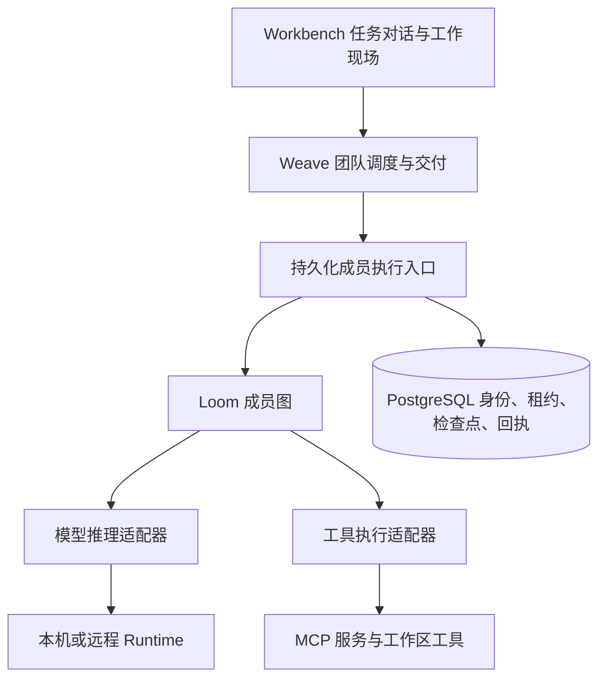
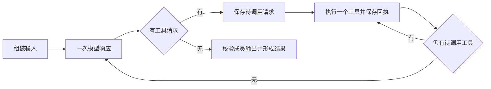

# Loom 成员执行补齐方案

2026-09-07 · v0.1 · 待评审方案，未实施。

状态补充：本文件保留为候选架构。后续是否采用 Loom，先按 [采用价值验证计划](2026-09-07-Loom采用价值验证计划.md) 比较现有路径、最小恢复补丁与 Loom 增量收益；不默认实施本文全部工单。

目标是让 Workbench 中一个成员的工作可以可靠地使用工具、保存进度、在中断后继续，并能从明确的历史位置修改后重算。建议保留 Weave 的团队调度与交付职责，把 Loom 接成具备持久化身份的成员执行器。

本文依据当前 `5cbc3eb35c3f12a1818d4f813c372e17287ed118` 工作区代码，以及 [9 月 6 日验证报告](../验收/2026-09-06-Loom替换验证/README.md)。报告中的产品实验使用当时本地运行服务，内核实验使用仓库锁定的 Loom v0.8.1；本文没有重跑产品验收。以下“建议”“新增”均为设计，不能理解为现有能力。

**一、完成以后，用户实际得到什么**

以日冕任务为例，成员需要读取基线、复算速度场景、复核结果、生成报告。

1. 在成员设置里选择 Loom，配置明确的模型来源和工具，发布时能确认这个版本实际会获得哪些工具。
2. 运行过程中，工作现场显示已完成的工具、当前执行步骤、最后保存的位置及真实输出。
3. 计算完成后服务重启，任务保留原身份，从复核继续；已经确认的计算结果和产物仍在。
4. 用户暂停时，界面先显示“正在暂停”，到实际保存且执行收束的位置才显示“已暂停”。之后可继续。
5. 用户希望只改报告解释，可以从复核完成的位置创建分支，只生成新报告。修改速度或质量则要回到计算之前，重新计算、复核和生成报告。
6. 原版本、分支版本、工具回执和最终交付各有出处。成员运行结束后，还要完成团队交付登记与文件可读性检查，任务才能显示交付成功。

第 1 至 4 项组成第一阶段产品闭环；第 5 至 6 项中的历史分支和版本采纳属于后续阶段。第一阶段的交付检查仍沿用现有团队链路。

**二、已经证实的缺口，以及它们的后果**

| 代码或实验事实 | 后果 | 补齐方向 |
|---|---|---|
| `standard_frozen.go` 的工厂输入固定为 `{}`，依赖枚举没有 MCP | 成员配置了工具，发布产物仍可没有工具 | 完整冻结成员工具引用和可调用契约 |
| `workflow_interpreter.go` 每次生成新的成员图 ID，并传入 `NewMemStore()` | 团队阶段可恢复，不等于成员内部进度可恢复 | 持久化成员身份，接入统一执行生命周期 |
| `compiler.go` 的 `chat` 使用 `NewToolLoopStep`，多轮推理与调用发生在一个步骤里 | 简单换成数据库存储，仍没有每个工具完成后的图检查点 | 拆成有持久化边界的通用工具循环 |
| Loom v0.8.1 普通 `Resume` 对空 phase 重入最后一步 | 可能重复最后一项工作 | 对新执行契约明确使用 `after_step` |
| Loom 先写 latest，再尽力写 history，历史写入失败不阻断 | 可恢复点与可分支历史可能不一致 | 在 Weave 存储适配层原子保存新契约所需的数据 |
| 已有 `loomruntime.PreparedRun` 提供身份、租约、恢复和历史入口，但工作流成员图直接调用 `Graph.Run` | 不能自动继承统一生命周期的全部约束 | 为冻结成员图提供同等受控的装配入口 |

内核实验的安全恢复使用了人工拆分的四步图；它证明了机制可用，还没有证明当前通用 `chat` 内部的任意工具都能断点续跑。工具执行可靠性与报告内容正确性也分开验收，实验原报告中的相对论修正文字错误已在验证报告中保留。

**三、各层职责和部署位置**

Weave 决定哪个成员在哪个团队节点工作，何时并行、汇合、暂停、取消、接受结果和交付。Loom 推进一个成员内部的步骤和工具循环。Runtime 提供实际模型调用、受控本机工作或远端执行能力。

第一阶段由服务端承载 Loom 图和持久化协调，现有 Runtime 承接推理或已支持的执行任务。远程 Runtime 继续通过服务端协议领任务和报告结果，不获得数据库连接。跨主机接管必须先验证工作目录、输入文件和工具可达性；第一阶段恢复验收限定同一可用执行环境。

`engine=loom` 表示由 Loom 推进成员，不表示模型必须更换。已有 `runtimellm` 可以让 CLI 承接一次模型响应，但应使用现有受限推理路径，并用运行回执证明没有绕过 Loom 执行原生工具。工具仍必须显式提供；不能假定 Loom 自动拥有 Claude CLI 的所有本机能力。

团队 `parallel/join`、成员授权和发布快照继续由 Weave 管理。图下放到各台 Runtime、自由工作流全量切换和整队迁移不属于第一阶段。

**四、发布契约如何补齐**

发布链路必须做到以下事实一致。

`成员配置 → 工厂输入 → 依赖清单 → 冻结包 → 实际模型 tools → 实际工具派发`

新工厂输入应包含工具服务引用、选择的工具集合及版本化的执行选项。发布解析后保存服务器版本、传输配置、工具过滤规则、读写属性、工具名称及输入契约摘要，并记录凭据引用。凭据值沿用现有凭据解析边界，不写进冻结包。

现有 `FrozenMCPBinding` 已有服务器版本、传输、过滤、写工具和凭据引用，可复用；它没有完整工具 schema 快照。建议将补充的工具契约清单放入新版本工厂输入，形成内容哈希，并在运行前核对实际工具定义。服务器版本只是配置版本，不能保证远端实现或外部数据从未变化；基线文件和输入数据要另存内容哈希。

有明确工具引用却无法解析、过滤后缺少必需工具、名称冲突或 schema 不兼容，应在发布阶段给出成员和工具的具体错误。运行时服务下线则报告依赖不可用，并保留恢复点。不能把缺少工具悄悄解释成无工具运行。

推理来源也需要可追溯。已有冻结模型绑定与默认 Runtime 推理路径应分别核对，保存选中的配置身份、版本和允许的回退范围。恢复不能临时读取另一个默认配置。对外部服务实际使用的底层模型，只记录可验证回执，不能把配置别名当成独立证明。

建议增加 `standard` 工厂 v2 及对应 ABI，保留 v1 编译器供旧发布物加载。需要一起解决三处兼容问题。

1. 当前 `SelectFactoryKey(graphType)` 在同类多个版本时会报歧义。新增发布必须显式选择完整工厂键；角色证明与候选构建必须使用同一键。历史加载始终使用产物中记录的键，不能取最新版本。
2. 当前 DTO 规范化硬性要求 `standard.factory_input={}`。调整为明确识别旧空输入和带 schema 标记的新输入；v1 描述器仍只接受旧输入，v2 严格校验新输入。保留旧规范化字节与哈希的回归样本。
3. 工具依赖要贯穿候选构建、角色证明、冻结解析、运行时 host 构建和发布预检。不能只改 `EncodeFactoryInput`，也不能在恢复时从可变成员注册表补读 MCP。

旧发布物不补写工具、不重算哈希、不获得新的恢复承诺。需要工具和持久化的新运行应通过重新发布得到新版本。

**五、成员执行身份与团队身份怎么对应**

建议增加一份持久化的成员执行记录，复用现有 registry、租约、结果和用量机制。下面是逻辑字段，具体表名可在实现评审时确定。

| 字段组 | 内容和约束 |
|---|---|
| 所属上下文 | workspace、TeamRun、快照、团队节点、成员及成员版本、冻结包哈希 |
| 逻辑调用 | `member_execution_id`、节点进入序号、并行 leg 身份；首次调度事务中建立唯一映射 |
| 图身份 | 稳定 `loom_run_id`、图名、完整工厂键、图状态 schema |
| 执行所有权 | 所属团队 generation / lease epoch、成员 attempt ID / epoch |
| 进度 | 最近检查点序号、状态、暂停请求、终态回执及结果引用 |
| 分支来源 | 父团队运行、父成员运行、父检查点序号、修改补丁 |

节点可能循环进入，也可能出现在并行 leg 中，因此不能只用“团队运行＋节点 ID”作为永久唯一键。入口先持久化逻辑调用，再执行；基础设施重投和进程重启查回这份记录。现有包含恢复代数的 invocation ID 不能直接作为跨恢复逻辑身份。

正常恢复保留成员逻辑调用和 Loom run ID，接管进程领取新 attempt。明确“重新执行该成员”创建新的逻辑调用和 Loom run，记录替代关系。从历史点分支则创建新的团队运行上下文及成员运行，保留父子关系。

统一入口建议采用 `PrepareFrozenMember` 一类接口，接收已经校验的冻结图、不可变归属事实、持久化存储及执行依赖。可抽取现有 `PreparedRun` 的生命周期公共部分；不能为复用入口而重新查询当前成员并调用普通 `CompileAgent`，破坏冻结契约。

团队协调层通过契约调用该入口，由装配层注入实现，避免新增向上依赖。串行节点先接入；并行 leg 等后续使用同一个入口，不复制第二份成员恢复状态机。

**六、工具循环如何形成真正的恢复点**

建议为 v2 标准图实现通用循环，业务任务仍由模型和工具定义，不把“读取、计算、复核”写死成产品节点。

需要保存消息状态、模型响应、待执行工具队列、当前位置、实际工具回执、结果与产物引用、累计用量、循环次数和用户已确认的修正指令。模型请求多个工具时，第一阶段按明确顺序处理，每个工具一个确认边界。

每个边界使用 `CheckpointRequired`，并明确 `yield + after_step`。已保存的模型响应可直接用于后续派发；已确认的工具回执不会因重启而再次执行。正常运行时，成员协调器在该边界后自动继续。内部边界不都呈现为用户暂停，也不创建新的团队任务。

内部自动续跑需要单独的受控入口，不能把每次 yield 都转换为已有根运行的终态或用户暂停。协调器持有有效成员租约时，在相同所有权下继续；进程接管才更换 attempt 并隔离旧执行者。每次继续都校验租约、暂停/取消请求和剩余预算。成员成功只产生成员终态，团队终态仍由团队调度与交付链路决定。

每次恢复可能重新进入 Loom 调用，所以总步数、工具次数、耗时与费用上限必须保存在成员状态中并累计核对，不能每次自动继续都重置预算。用量区分新消耗与历史继承，工具回执复用不再次记作新调用。

可先在 Weave 新工厂中组合细粒度步骤，保持 Loom v0.8.1 锁定；后续若抽成 Loom 通用原语，应另做兼容评审。第一阶段不依赖未发布的上游功能。

**七、数据库检查点、工具副作用与崩溃窗口**

新成员图的 Store 适配器需要在处理 latest 写入时，用同一 PostgreSQL 事务验证当前团队和成员所有权，写入 latest、不可变历史副本、成员进度索引和对应进度事件。后续 Loom 的同序号 history 写入只做内容一致的幂等确认。按租户和成员域隔离命名空间；同序号不同内容必须拒绝。

这样可避免直接依赖 Loom v0.8.1 的“latest 成功、history 尽力写入”行为。这个适配器依赖锁定版本的检查点格式，需要契约测试；不允许业务入口任意拼写检查点。保留策略由平台统一决定，被分支或交付引用的检查点和产物不得被 Loom 普通窗口淘汰。

检查点无法单独消除外部副作用的不确定性。工具调用需另存稳定调用身份、规范化参数哈希、派发状态、实际回执和外部操作 ID；恢复时从已保存请求复用该身份，不能让模型重新生成后仅凭参数相同去猜测。

| 崩溃窗口 | 恢复规则 |
|---|---|
| 工具派发前 | 从已保存请求派发 |
| 远端已完成，平台尚未收到结果 | 先查询已有执行任务或外部操作回执；确认前不重复派发 |
| 工具回执已保存，图检查点未保存 | 用原回执完成状态合并与检查点，不再调用工具 |
| 图检查点已提交，进度通知未送达 | 从事务事件重放通知，执行位置不倒退 |
| 成员结果已确认，团队尚未保存节点输出 | 以成员结果唯一键幂等接收，补齐团队输出和后续调度 |
| 旧执行进程在接管后返回 | 租约代数校验拒绝其进度、结果和工具派发；必要的历史回执仍可按原操作身份核对 |

只读、可重复工具允许受策略约束的重试。写工具必须提供外部幂等键或可靠结果查询；两者都没有且结果未知时，状态进入“结果待核对”，不能显示可直接继续，也不能自动重做。第一阶段仅验收只读/计算以及明确支持幂等回执的工具。

不能声称任意工具 exactly-once。目标是“确认过的结果不重复执行；不确定的副作用不盲目重放”。平台租约只能阻止平台接受旧写入；远端副作用还要依靠工具/Runtime 的幂等与所有权协议。

**八、暂停、继续、重试和修改的具体规则**

以下为新增的成员内部状态语义，不是直接替换现有 TeamRun 状态枚举。

| 当前状态与操作 | 条件 | 结果 |
|---|---|---|
| 执行中 → 请求暂停 | 记录幂等操作请求 | 进入“正在暂停”，阻止新的工具派发 |
| 正在暂停 → 已暂停 | 当前执行已收束、回执已处理、检查点已提交，无未核对的副作用 | 保存可继续位置，释放成员执行租约 |
| 执行中断 → 恢复 | 有兼容检查点，依赖与工作环境可用，旧租约已被隔离 | 同一成员运行领取新 attempt，沿原位置继续 |
| 已暂停 → 继续 | 指定当前进度版本且未终结 | 同一运行继续；重复请求返回同一操作结果 |
| 结果待核对 → 继续 | 先取得实际执行结果或用户明确处理事实 | 根据核对结果恢复，不能直接跳过 |
| 执行失败 → 从保存点重试 | 失败可恢复，检查点完整、调用状态可判定 | 保留逻辑运行，新增 attempt，累计新消耗 |
| 执行失败 → 重新执行成员 | 用户明确选择从头执行 | 新成员运行，旧结果保留来源关系 |
| 任意未终态 → 取消 | 先阻止后续派发，并处理正在运行任务 | 形成取消终态，不走普通继续入口 |

“取消请求已记录”和“实际执行已停止”需要分别记录。CLI 进程或工具仍在运行时，不可提前显示已暂停或已停止；已有无法撤回的写入不因取消自动回滚。

团队解释器也必须区分“成员可恢复中断”“成员正在暂停”“成员业务失败”和“成员终态成功”。当前直接图执行错误映射不能原样用于新入口。成员暂停或等待恢复时，团队记录该节点仍未完成，不创建下一份成员调用，不推进下游；团队执行器重启后通过持久化指针重新附着该成员。基础设施恢复可由租约接管流程自动进行，用户主动暂停则必须等继续指令。

修改分为两类。对尚未执行工作的补充指令，在安全点登记并提示生效范围；影响既有计算输入的修改，必须创建分支并重算受影响部分。第一阶段不提供修改任意内部状态的接口。

**九、历史分支如何保证不沿用失效结果**

第一版分支限定固定串行工作流、已声明的安全检查点和具名输入补丁。每个可分支点需要声明允许修改的字段、这些字段影响的最早步骤，以及保留和重算范围。

日冕例子中，改变报告解释条件可从复核完成点开始，复用三份工具回执；改变速度或质量必须从计算之前开始，清除旧计算、复核、报告及相应缓存。普通工具循环没有天然的业务依赖声明时，保守地从受影响输入进入图的位置重算，不能让模型自行断言“这些结果还可复用”。

创建分支事务验证来源权限、快照与历史存在性，固定父检查点并创建子运行及输入补丁。源检查点保持不可变，新运行继承的每份结果带来源。分支操作还要同时复制允许复用的团队上游输出、清除受影响节点及其下游输出，防止只 Fork 内层图而团队继续消费旧结果。

终端检查点不能用于“重新生成终端报告”；应选择汇总之前的有效检查点。没有合适位置时，界面明确提供更早的重算起点。

分支属于同一个 WorkTask 下的不同运行版本。新结果完成后由用户选择“采用此版本”，保留原版本和对比；存在并发的新主版本时，采纳操作应检查版本号，避免覆盖。跨并行区域的任意历史分支、修改执行模型和工具后沿用旧状态，留在后续扩展。

**十、Workbench 交互与 API 契约**

成员设置提供 Loom 选项、明确模型来源和工具清单，发布前显示缺失依赖。工作现场的成员详情显示当前步骤、最后保存时间、实际工具回执、产物与执行状态；任务对话接收暂停完成、恢复失败、需要核对和交付完成等有行动意义的事件。

后端先提供读取成员执行状态与能力的投影，再提供暂停、继续、重试接口。历史与分支接口在第二阶段增加。所有变更操作携带 workspace、TeamRun、成员逻辑执行身份、预期进度版本和幂等键。路由命名在 API 评审时确定，不能把这里的逻辑操作名当作已存在端点。

后端返回 `can_pause`、`can_resume`、`can_retry`、`can_fork` 及原因，前端按当前能力显示入口。响应过期时刷新并解释冲突；不能对某个成员的按钮实际作用于整个团队运行。浏览器重连通过事件序号去重，并从状态快照补齐间隙。

工具开始/结束、检查点提交和产物写入来自实际执行记录。若提供运行时摘要，名称应表达它是执行摘要；界面不承诺私有推理逐字直播。

**十一、实施顺序、交付物与完成判据**

| 工单 | 必须交付 | 完成判据 |
|---|---|---|
| A：新发布契约 | v2 描述器、工具与推理依赖冻结、版本选择、兼容样本 | 从真实成员配置发布后，指定工具完整到达模型和实际 host；缺失工具在发布时报错；v1 仍按原字节和行为加载 |
| B：持久化成员入口 | 逻辑身份、冻结入口、租约接管、存储适配与终态接收 | 双进程竞争只有一个有效执行者；重投映射同一逻辑调用；成员完成和团队接收之间崩溃可恢复 |
| C：可恢复通用循环 | 细粒度推理/工具步骤、调用回执、累计预算、安全暂停 | 杀死真实进程并用新进程恢复，已确认工具不重复；无保存成功就无下一步；未知副作用进入待核对 |
| D：第一阶段 Workbench | Loom 选择、状态、实际步骤/回执、暂停和继续、可行动错误 | 在浏览器完成配置、发布、运行、暂停、重启恢复、查看最终交付的闭环 |
| E：限定历史分支 | 分支点声明、输入补丁、失效传播、父子关系、版本比较和采纳 | 只改解释仅重做汇总；改速度重算计算及下游；源记录哈希不变；采用版本有明确操作记录 |
| F：扩展覆盖 | 并行 leg、更多工具和执行环境、成员迁移批次 | 每种新路径有独立故障注入和用户流程验收后再扩大范围 |

第一阶段完成范围为 A 至 D，限定一个团队副本、一个 Loom worker、固定串行流程、同一可用执行环境及受控工具。A 完成只能叫工具接线修复，B 完成只能叫持久化入口接入；A 至 D 全部通过才叫可恢复成员执行可用。

E、F 是目标状态，须按实施时的迁移阶段另行排期。项目当前禁止迁移期间扩展产品功能，因此本方案不把历史分支、自由工作流扩展作为本轮迁移修复的默认实施项。本轮用户请求为详细方案，尚未进入任何生产实现。

**十二、验收样本与失败反例**

| 样本 | 必须看到的证据 |
|---|---|
| 产品链路真实任务 | 真实基线哈希、发布冻结包、模型请求中的 tools、实际调用回执、独立数值复核、Workbench 交付文件 |
| 工具完成后进程退出 | 新 PID 接管相同 Loom run；原工具调用次数保持 1；后续步骤继续 |
| 工具完成但响应丢失 | 幂等/查询取得同一操作结果，或进入结果待核对；无第二次盲目写入 |
| 数据库写入失败 | 停在保存失败处，不执行下一工具、不显示“已保存” |
| latest 与 history 写入间故障 | 新契约下同一事务保留一致版本；可见分支点必有完整历史 |
| 两个恢复者及旧进程晚到 | 唯一有效租约；旧进程无法覆盖进度、重复交付或越过派发门禁 |
| 重复暂停/继续请求 | 相同幂等键返回同一操作，不重复创建运行；真实停止前保持正在暂停 |
| 依赖变化与旧发布物 | 旧版本保持原契约；新运行不会回退到当前可变配置；不兼容依赖可定位 |
| 持续恢复与预算 | 累计费用和工具次数不归零、不重复入账；额度耗尽按同一限制停下 |
| 两种历史修改 | 解释修改复用有效回执；数值输入修改清除失效结果并重算；父记录不变 |
| 产品结果完整性 | 成员成功但交付文件缺失时不显示交付成功；文字和数值分别核验 |

先针对变更模块做契约与故障注入测试；数据库测试必须显式配置 `TEST_DATABASE_URL` 且确认实际执行。实现阶段按仓库要求完成 `make depguard`、`make productguard`、`make test`、`make workbench-install workbench-check` 和 `docker-compose.platform.yml` 平台验证，最后进行真实浏览器闭环。测试通过后只有新改动或未解决问题才扩大重测。

**十三、发布与退回路径**

以新发布版本启用 v2，先验证副本再逐个接入业务成员。已有运行沿自己的工厂键和快照结束，不将内存旧运行伪造成可恢复运行。

退回时停止创建 v2 新运行，新任务可重新选择仍兼容的旧发布版本；已经开始的 v2 运行必须保留兼容执行器并排空，或明确暂停。数据库迁移采用可并存的增量结构，不能在仍有 v2 活跃运行时删除其状态表或检查点。回滚计划须包含 v2 执行器的保留方式。

**十四、实现定位与尚需验证的边界**

| 位置 | 计划修改职责 |
|---|---|
| `internal/base/frozen/{types,codec}.go` | 版本化输入与工具契约的规范化、旧哈希兼容 |
| `internal/kernel/compiler/{standard_frozen,frozen_abi,frozen_role_proof,compiler}.go` | v2 工厂、选择规则、工具依赖及细粒度图 |
| `internal/kernel/workflow/{candidate,runtime_loader,runtime_host_factory}.go` | 冻结清单、精确依赖装配及工具能力验证 |
| `internal/kernel/loomruntime/` | 冻结成员生命周期、持久化适配、回执和预算语义 |
| `internal/base/teamrun/` | 逻辑调用契约、团队与成员边界、结果幂等接收；新增实现通过契约注入 |
| `internal/app/api/` 与数据库迁移 | 装配、状态投影、操作接口、租约和事务数据结构 |
| `workbench/packages/client/ui-weave/` | 成员配置、工作现场状态与操作、后续分支对比 |

团队检查点当前为严格解码的 V1；如需嵌入成员指针，应定义 V2 与按版本选择的读取器，不能直接追加未知字段破坏旧读取。本方案建议先以成员执行表关联团队，减少对已有团队检查点的侵入。

实施前需要通过小型契约样本最终确认三件事：冻结成员入口如何复用现有终态/租约机制而不双重登记；新 Store 的原子历史写入与 Loom 后续幂等写入、清理行为兼容；默认 Runtime 推理依赖在新发布物中如何保持精确身份。这些是实现验证项，不阻碍当前方案的边界与先后顺序确定，也不能提前写成已通过。
