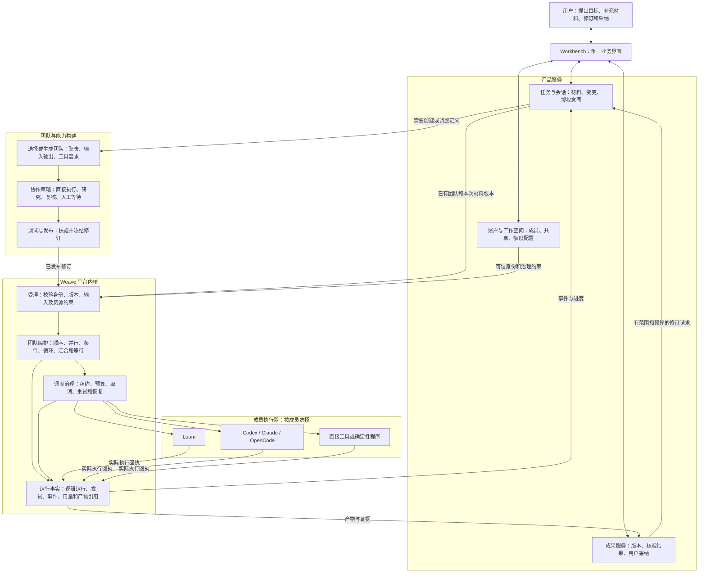
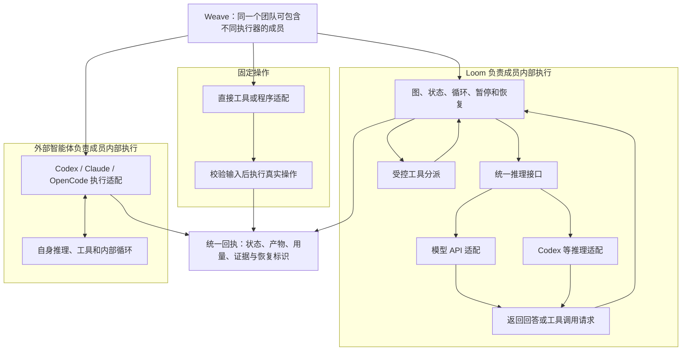
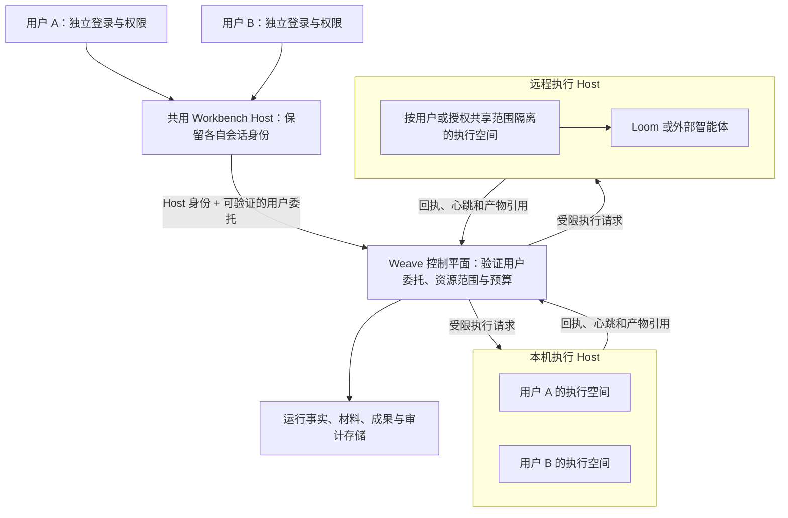
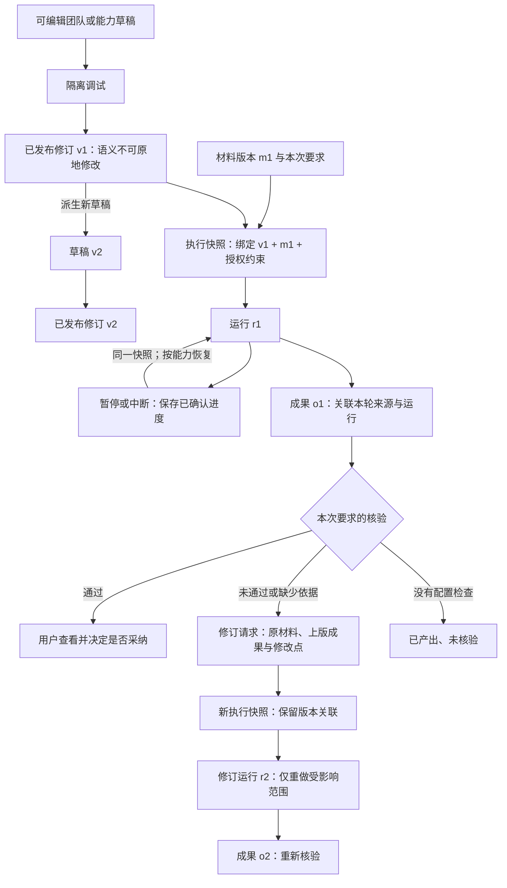
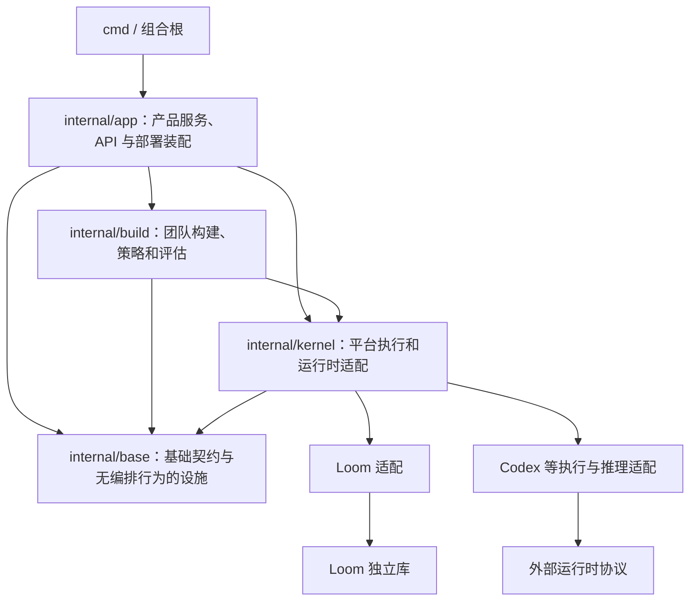
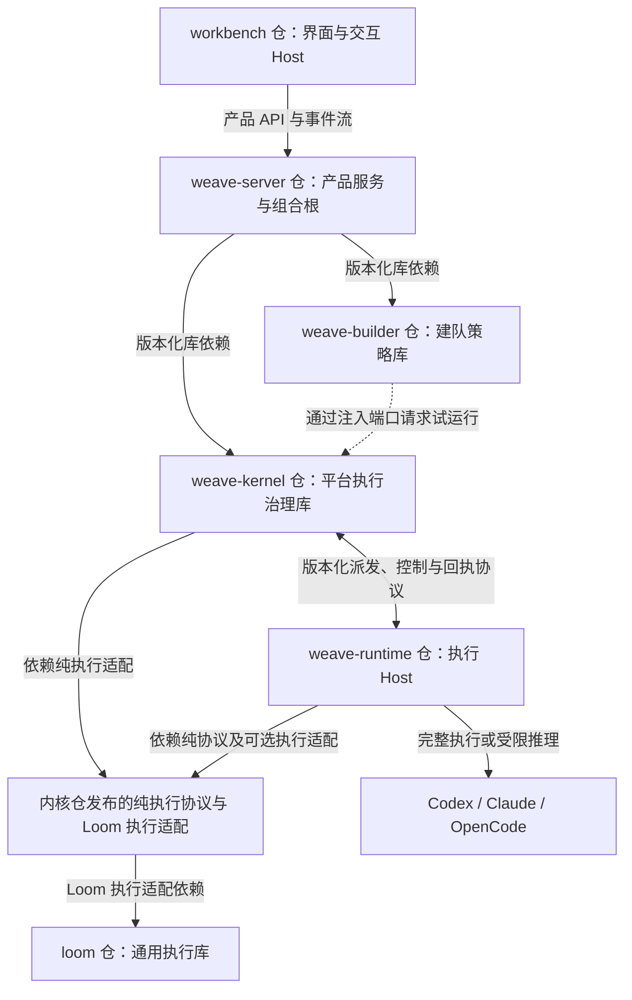

# Weave 理想架构详图

日期：2026-09-13。状态：目标架构，用于职责拆分和后续实现，不代表全部能力已经验收。

依据：[分层收敛基线](2026-09-13-分层收敛与Loom职责基线.md)、[开发者契约](2026-09-12-Weave内核边界与开发者契约.md)。

核心决策：Weave 是组织和管理智能体团队的平台。多运行时与组合执行是核心能力。Loom、Codex、Claude、OpenCode 等可以担任成员执行器；Loom 还可以经适配使用 Codex 等作为推理来源。收敛的是平台重复的治理职责，不是运行时的多样性。

## 1. 产品与运行全景

本图箭头表示业务请求或结果流转，不是代码 import 关系。复用已发布团队可以直接提交执行，不必再次建队。

研究、复核、人工等待都是按需求选择的策略。平台可以验证定义是否合法和证据是否关联，但不会硬编码所有任务都需要四个成员。

## 2. 四个独立选择

| 选择 | 回答的问题 | 例子 | 约束 |
|---|---|---|---|
| 执行器 | 谁管理成员内部的工作过程？ | Loom、Codex、Claude、OpenCode、直接工具执行器 | 一个成员的一次执行应有明确的循环所有者 |
| 推理来源 | 谁产生模型回答和下一步建议？ | 模型 API、通过适配器调用 Codex 等 | 由执行器支持范围决定；不是任意组合都自动可用 |
| 部署位置 | 执行发生在哪里？ | 平台进程、本机 Host、远程 Host | 同一执行器可以有不同部署方式；恢复能力分别声明 |
| 工具环境 | 实际可操作哪些资源？ | 浏览器、文件、终端、MCP、业务连接器 | 工具受授权、环境隔离和资源范围约束，模型名称不代表工具能力 |

用户可以用自然语言表达偏好，产品根据可用能力给出选择；底层保持这四个维度独立，不要求用户手写代码或 JSON。凭据在执行位置按授权引用解析，不能假设所有部署都采用同一种凭据存放方式。

Codex 在两条路径里的职责不同。作为推理来源时，适配协议只接受回答和工具请求，由 Loom 路径执行工具；作为完整执行器时，它管理自己的内部过程。前一种模式的能力声明还必须有实际约束与回执验证，不能只用提示词证明没有越界执行。

当前源码已经包含这两种外部运行时用途，证据为 `internal/kernel/runtimellm/adapter.go` 和 `internal/kernel/workflow/runtime_loader.go`。这证明接入路径存在，不证明每种部署组合都完成了真实验收。

## 3. 控制平面与本地、远程 Host

Workbench Host 是接入角色，执行 Host 是执行角色，可以部署在一台机器上，也可以分开。Host 注册凭据只证明机器，不代表最终操作者。

执行请求绑定工作空间、操作者、委托范围、任务、成员、发布版本、输入版本和尝试标识。工具、文件和凭据访问在实际执行位置继续受约束。共享团队定义不等于共享人员凭据、私有材料或所有成果。数据库过滤之外还要处理操作系统进程、文件目录、浏览器配置和工具会话的隔离；具体隔离强度由部署能力声明，不以一个用户 ID 字段替代。

## 4. 定义、运行与交付是三条关联的版本链

恢复继续原执行语义，修订创建新输入快照或新运行。修改说明文案不一定要发布新执行版本，改变成员职责、步骤、工具权限和失败策略则需要新修订。运行中撤销权限仍需生效；冻结快照不授予永久资源访问权。

“执行完成”“成果存在”“核验通过”“用户采纳”分别保存。未配置核验不能伪装成核验通过；用户采纳不能篡改原检查结果。业务检查器可以执行为普通受控任务，其检查结论绑定具体成果版本。

## 5. 每种事实由谁管理

| 事实 | 管理者 | 其他层如何使用 |
|---|---|---|
| 用户目标、材料版本与修订意图 | 产品服务 | 内核只接收本轮明确绑定的输入及授权引用 |
| 草稿与已发布定义 | 构建和发布服务，冻结约束由内核强制执行 | 运行保存实际使用的不可变版本 |
| 团队运行与成员调用状态 | Weave 平台执行内核 | 产品订阅事件并显示，不按聊天内容猜测终态 |
| Loom 图内状态与检查点 | Loom 及其存储适配 | Weave 保存运行关联，使用公开暂停恢复契约 |
| 外部智能体会话与内部检查点 | 对应运行时 | 适配器上报可用的恢复句柄与恢复粒度 |
| 尝试、租约和物理用量 | 执行侧回执，Weave 统一核对记账 | 明确父子归属，避免重复计费；缺失不按零用量处理 |
| 工具外部操作事实 | 实际工具回执及业务系统 | 平台关联请求与回执；未知结果保持未知，禁止盲目重试 |
| 成果版本与核验、采纳 | 产品交付服务 | 引用运行、材料和检查证据，保留历史版本 |

统一事实管理不要求所有数据放进一个表或所有内部状态机合并。关键是每一种事实的写入责任明确，跨层使用稳定关联，不互相覆盖终态。父任务取消后，子执行停止确认、迟到结果和已发生的外部影响分别记录。

## 6. 对代码分层的约束

此图仅表示允许的代码依赖方向；不表示每个请求必须经过所有层。

Loom 独立库内部保持“核心原语 → 通用接口 → 通用组件 → 适配与宿主”的依赖边界：上层使用下层，核心不导入宿主业务。Weave 不复制 Loom 的内部循环，也不要求外部智能体通过 Loom 才能执行。

代码里应拆开执行器适配、推理适配和部署连接。它们可以复用传输实现，但不能共享一个含糊的 engine 字段来承担所有含义。字段和类型随新契约直接调整，本次迁移无需旧协议兼容；本文规定职责，具体类型由实现与场景验收确定。

## 7. 当前与目标之间

- 已核实存在 Loom 图与工具循环、外部成员执行、外部运行时推理适配三种路径。
- 第一批已将 capability 定义、编译和执行移入 kernel，并提取 API 内的执行适配；独立 capability 任务生命周期、base/teamrun 执行行为及 11 条反向依赖仍待收敛，见职责基线和第一批验收。
- 修订材料接续、业务核验、多用户执行环境隔离，以及各路径的远程恢复需要分别实现或补验收证据。
- 后续按职责基线分批提取，保留多运行时及混合团队能力；按用户决定不承担旧团队、旧数据或旧在途运行兼容。

迁移成功的标准是：换成员执行器不必重写产品任务；换推理来源不必重写团队编排；换部署位置不丢身份和版本关联；新增业务任务无需修改通用内核。

## 8. 面向独立分仓的功能拆分

用户已明确后续分仓管理。先在现有仓库建立边界是迁移方法，长期单仓不再是目标约束。以下仓名是职责名称建议，尚未创建仓库或修改模块名。代码分层、源码仓库、部署进程分别设计，不把 `base/kernel/build/app` 机械变成四个仓库。

建议终态为六个源码仓库，其中 Loom 已是独立上游。Builder 最后分出，先保持独立模块形状；它与平台内核可以作为库链接进服务端，不增加必需网络跳转。

| 仓库建议 | 功能模块 | 对外产物 | 明确不承担 |
|---|---|---|---|
| `workbench` | Web/桌面界面、交互 Host、前台助手、会话、待处理动作与执行观察 | 页面/桌面包、交互 Host 程序 | 平台队列、跨成员调度、实际用量账本、伪造运行终态 |
| `weave-server` | 产品任务与材料、团队资产目录、人员和工作空间、共享与凭据授权、成果采纳、套餐、API 与服务装配 | 产品服务程序、面向 Workbench 的 API 契约/客户端、部署版本组合 | 复制平台调度内核、运行时内部循环、建队算法 |
| `weave-builder` | 需求转团队、角色配置、定义生成、模板选择、建队迭代与候选评估策略 | 建队库：输入目标与可用资产，输出候选定义、差异、缺口与评估证据 | 保存人员权限、直接写资产数据库、领取物理任务、直接激活已发布团队 |
| `weave-kernel` | 定义校验与冻结、计划解释、跨成员编排、运行时调度、控制责任执行、运行事实与用量、执行授权强制检查 | 平台内核库、持久化适配、版本化执行协议及纯客户端包、可复用 Loom 执行适配 | UI 会话、套餐价格、如何与用户澄清、业务答案和用户采纳 |
| `weave-runtime` | 本地/远程执行 Host、进程生命周期、执行器适配、工作目录与工具会话隔离、产物收集、停止与恢复回执 | 各系统的执行 Host 程序及适配组件 | 控制平面数据库、全局重试策略、平台账单、扩大用户授权 |
| `loom` | 通用图执行原语、模型与工具循环、检查点与暂停恢复、通用组件 | 独立 Go 库及其自身适配 | Weave 团队/租户/发布/计费/交付的业务语义 |

交互 Host 与执行 Host 不合并。前台助手理解用户意图、操作平台工具并维持对话，这是 Workbench 的产品职责；团队成员的实际任务运行归 Weave 调度。前台助手保留自己的交互循环，但不自行建立第二套平台团队状态机。

`base` 不单独建公共工具仓。现有内容按职责归到产品、内核或运行时；真正跨仓的契约由提供方发布小而稳定的包。身份、能力、存储、工具与任意 util 混装成一个公共仓会重建耦合。

## 9. 仓库连接与发布形态

图中明确区分 API 通信和库依赖，不要求库与调用方分进程。

典型部署仍是交互 Host、平台服务和零到多个独立执行 Host。平台可承载本进程执行，远程机器按需增加；builder、kernel 和 Loom 默认是库。分仓首先带来独立职责、测试与发布，不自动要求六个服务、六个数据库或全流程 RPC。

产品 API 契约归 server，执行协议归 kernel，建队接口归 builder，Loom contract 归 Loom。协议包独立发布，不让 Host 因为使用执行请求类型而依赖平台数据库和产品服务。

## 10. 五条必须先抽清的边界

下面的接口名是语义示意，不是当前已存在的 API，也不授权提前固定全部能力字段。

| 边界 | 输入与输出 | 必须满足 |
|---|---|---|
| 产品 → 建队 | `BuildRequest`：目标、受限材料引用、可用资产和约束；`BuildResult`：候选定义、改动、缺口与证据 | AI 生成内容经平台校验；builder 不直接操作其他模块的表 |
| 产品 → 执行 | `SubmitExecution`：已冻结定义/明确的一次执行快照、输入版本、可信委托与约束；返回运行引用 | 已有定义无需再建队；一次性任务是否提供新产品入口等待场景验证 |
| 内核 ↔ 执行 Host | 派发、领取确认、控制指令、心跳、事件、回执 | 关联运行/成员/尝试/领取世代，迟到回执受约束；协议版本和恢复粒度明确 |
| 执行 ↔ 推理/工具 | 推理请求与结构化回答；工具请求与真实操作回执 | 执行器和推理来源分别绑定，调用继承任务授权及额度，结果未知不冒充成功 |
| 执行 → 产品交付 | 产物清单、内容摘要、来源、用量及核验证据 | 产品将运行产物组织成成果版本，保存采纳；不反向修改执行事实 |

产品向内核提供的是经过认证与授权校验的主体和资源范围。内核在受理、派发、续行和工具调用边界强制校验；运行时只能在委托范围内执行。真实用户身份不能由客户端自己填一个 ID 或给 Cookie 做摘要来替代。

### Loom 适配需要内部再拆两部分

- **可复用执行适配**：冻结输入解码与校验、图装配、推理/工具端口、事件及用量输出。由 kernel 仓维护独立的轻依赖模块，平台和执行 Host 都可使用。
- **平台治理适配**：领取世代、成员 journal、用量核对、平台终态、与 PostgreSQL 的原子写入。留在 kernel 的服务端实现，Host 不依赖它。

完整的 `loomruntime` 不能直接当 Host SDK 搬出去。当前 `daemon/loom_exec.go` 使用 compiler/loomruntime 装配，而 `loomruntime/member_checkpoint.go` 将检查点与成员记录原子写入同一事务；两类职责必须先拆开。

两条已有桥接继续保留：`runtimellm.Adapter` 使 Loom 经 Codex 等获得推理；远程 Loom 的模型/工具代理允许授权资源留在服务端。分仓不能把它们误删，也不能把整套 Weave 治理迁入 Loom。

## 11. 数据所有权和跨仓一致性

| 数据 | 唯一语义所有者 | 允许的关系 |
|---|---|---|
| 用户、组织成员、工作空间、资源共享与商业配置 | server | kernel 接收可信约束并可核验撤销，Host 获取任务范围授权 |
| 任务目标、原材料、用户修订、团队目录与草稿 | server | builder 通过端口读写候选；kernel 接收本轮明确快照 |
| 已冻结的可执行修订、依赖摘要 | kernel 的发布模块 | server 保存展示、共享与激活引用；builder 请求校验并提供候选 |
| 平台运行、尝试、队列、租约、实际用量事实 | kernel | server 查询或订阅，Host 回报事实；各层不直接覆写内核表 |
| 建队轮次与策略结果 | builder 定义语义，server 通过存储端口持久化 | 建队进度不是第二套物理执行队列，实际运行仍提交 kernel |
| 本地进程、外部会话和恢复句柄 | runtime | kernel 保存关联与必要回执；本地缓存丢失不能被包装成可恢复 |
| Loom 图内检查点 | Loom 定义格式，所选存储适配负责持久化 | 平台实现可与运行 journal 原子提交；Host 路径分别证明跨进程恢复 |
| 原始执行产物清单与证据 | kernel 接收并关联，存储适配保存内容 | server 按权限访问和组织，不更改来源 |
| 产品成果版本、核验呈现和用户采纳 | server | 指向确定运行与产物版本；核验任务经平台执行，判定语义由检查器定义 |

分仓初期可以继续共用 PostgreSQL 实例，但每张表、迁移和写操作只有明确的模块所有者。公共接口不泄露 `pgx.Tx`、连接池或其他仓库的具体 Store。需要原子性的终态、用量与检查点操作留在同一内核事务中。

发布采用“校验并生成不可变修订 → 产品引用/激活”的明确流程：失败时允许保留未激活修订，重试通过幂等请求关联完成，不把不同仓库间共享事务当成公开契约。产品请求与执行受理之间同样需要幂等、可恢复关联；事件投影通过持久投递和对账补齐，避免请求成功但页面长期找不到运行。具体机制在提取相关职责时实现，不先引入新的通用工作流框架。

## 12. 从当前代码怎么迁移

| 当前区域 | 目标归属与拆法 |
|---|---|
| `workbench/` 的 Web、desktop、bundle/workbench-app | 先保留为一个 Workbench 仓；分清交互任务记录与平台运行事实，移除对父仓布局的构建假设 |
| `internal/app/api`、users、projects、attachments、conversation | server；handler 只转换请求并调用所属服务，移出执行与建队实现 |
| `internal/kernel/org`、registry、skills、credentials 等混合资产模块 | 按成员/技能/工具资产目录、人员授权与执行快照拆职责，不凭原目录归属整体搬进内核 |
| `internal/build/*` | 算法和建队策略到 builder；目录持久化和激活到 server；实际试运行和物理队列归 kernel |
| `internal/base/teamrun`、fanout、taskqueue；`internal/kernel/capability` | 执行决策归 kernel；capability 定义、编译及执行已迁入。剩余基础层行为继续提取；capability/build 队列收敛到共同执行机制，保持必要原子性 |
| `internal/kernel/workflow`、freezer、compiler、loomruntime | kernel；拆纯编译/执行适配与平台治理，新系统的发布冻结和恢复语义必须满足 |
| `internal/app/daemon`、engine、execenv、runtimes | daemon、本地进程与工具适配到 runtime；节点目录、分配和租约到 kernel；拆开混合包 |
| `internal/kernel/runtimellm` | 推理协议与纯 client 适配可供双方用；受控派发/记账的服务端 broker 留 kernel，CLI 推理操作留 runtime |
| `internal/base/db/migrations` | 按数据所有者提供新模块的建表与迁移集，由 server 组合根协调执行；不要求保留旧迁移链或转换旧数据 |
| `cmd/weave`、部署与验收装配 | server 组合根和 runtime 入口分离；全产品版本组合与跨仓验收由 server 维护 |

当前已核实的阻碍包括：`teamorch.PhaseDeps` 持有大量具体 Store 并要求与 API wiring 同步；`teambuild.Store` 暴露事务能力；capability 的物理任务生命周期仍在 app；daemon 依赖内部 registry/taskqueue/loomruntime 类型。仅改 import 路径不能解除这些依赖。

### 迁移次序与分仓条件

1. **本轮先形成边界**：确认上述模块所有权；落实控制责任；建立四类场景基线；合并当前规则并标记历史方案。未验证的产品优化继续保留为假设。
2. **现仓内提取真实契约**：模块通过窄接口和版本化数据交互；移出反向依赖与跨模块直接写表；保留必要原子事务。不靠类型转发包装原有耦合。
3. **先分 Workbench 和 Runtime**：在各自干净检出中独立构建；仅通过已发布 API/协议依赖平台，保留交互助手和两种 Codex 用法；验证新 Host 契约与逐用户身份传递。
4. **再分 Kernel**：公开包不依赖 server 或 builder；本地/远程执行、控制责任、冻结版本、运行历史和新系统中断恢复验收通过，server 通过发布版本引用。
5. **最后分 Builder**：去掉跨模块 Store 和事务依赖，候选与正式发布使用相同执行契约；成为独立发布的库。原仓剩余部分作为 server 和产品集成仓，当前 Go module 在物理迁移前保持不变。

分仓不是以删除目录为完成标志。每个仓必须独立检出、构建和测试，消费者不依赖相邻目录、私有 `internal/` 或长期本地 `replace`。可以保留仅开发使用的组合工作空间，但发布验证必须关闭这些捷径。

不同仓库采用固定发布版本，server 维护可复现且经过验收的版本组合。本次迁移直接切换到新契约，不为旧 Host、旧数据、旧快照或旧在途运行提供兼容。新系统运行保存实际解释器、计划和发布版本，不支持的组合明确拒绝。正式发布后的版本演进另立规则，不能借本次迁移豁免随意改写已发布契约。

每仓的当前架构、公开契约、迁移说明和验收证据分开。全产品架构图和跨仓版本组合矩阵在 server 保留唯一入口，各仓只维护自身事实并链接它，避免复制六份互相漂移的总设计。
