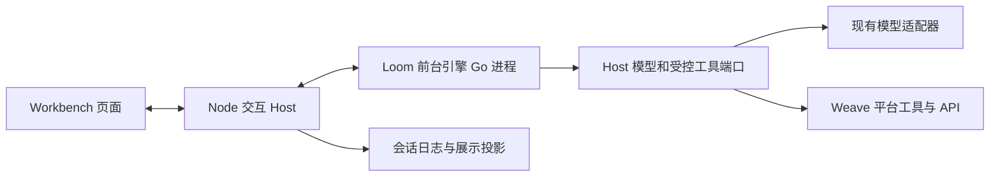

# Loom 承载 Workbench 前台循环评估

W7 链接修订（2026-10-05）：本页指向已删除源码或原始取证文件的链接改为删除前提交 `d9d7f797d059b43ffc71c990cd089f0956f5accc` 中的准确路径；原记录的结论、日期和未验证项保持原义。

日期：2026-09-14

状态：评估建议，未实施替换，未批准为迁移待办。本文不改变现行分层基线及 G1–G8 的实施范围。

评估基线：Weave-next `7ec1bad5`，Go 模块锁定 Loom `v0.8.2-0.20260912125929-2d1aeb8e3a12`。本地 Loom `cfe9385` 与锁定提交的文件树无差异。结论依据源码、现有局部测试和无网络模型探针，不代表线上或真人式产品验收。

## 1. 判断

技术上可行，不能按现成插件直接替换。建议保留 Workbench 的交互 Host，通过现有 AgentFactory 接口接入 Loom 驱动的前台 Agent。前台与团队成员仍是不同的运行实例，只共享 Loom 的执行机制。

主要收益是逐步统一模型与工具循环的停止、工具调度和回归维护。主要成本是 Node 与 Go 的通信、消息与事件语义适配，以及会话持久化和执行检查点之间的恢复规则。这是中高成本的运行框架迁移，短期代码量可能增加。

建议先验证一条真实前台路径，再决定全面切换。尚无证据表明更换循环本身会提高回答质量、减少 token、降低延迟或修复团队业务交付问题。

本次评估也暴露了 Loom 的成熟度不足，应按三类处理。

- **明确缺陷**：`NewStreamingLLM` 没有传播流错误、缺失结束标记和完成原因，能够把部分响应按成功返回。错误及截断属于通用运行事实，应在 Loom 组件中修复。
- **通用能力缺口或语义差异**：富内容消息、逐轮接纳输入、有界并发和写屏障、完整执行事件，尚不足以直接保持 DSH 前台的现有契约。若 Loom 要作为通用交互智能体引擎，这些应成为它的能力要求；只读优先的调度不能直接声称与 DSH 等价。
- **合理的职责边界**：Workbench 页面、用户身份、提问表单、团队派发与成果采纳仍由 Host/平台负责。Loom 不内置这些业务组件，本身不构成缺陷；跨语言适配成本也不等于引擎错误。

更准确的定位是：Loom 已具备图执行及受控模型工具循环的基础，上层通用智能体组件尚未证明能够承载保留全部现有体验的 Workbench 前台。本次探针主要针对 `stdlib` 和 `contract`，不能据此推断图核心也存在同样缺陷。通用语义应在 Loom 内补齐，再评估前台替换，避免由 Workbench 桥接层兜底后继续保留第二套循环逻辑。

## 2. 已确认的替换入口

- Workbench profile 组合 `dsh-base`、`dsh-web-app`、`dsh-workbench-app`。底层默认加载 `dsh-agent-loop`。
- `core/agent` 定义 AgentFactory；当前循环通过 `ctx.agents.setFactory(this)` 注册。创建、恢复、停止、输入和运行状态已有公共接口，页面不必直接依赖 ReactLoopAgent。
- 会话日志拥有消息与事件事实。模型历史由 `deriveMessages()` 派生，页面和 WorkTask 投影消费这些事件。保留这些契约，有机会保留大部分页面与业务插件。
- 当前前台工具执行入口仅允许 `weave_dispatch`、`ask_user_question` 和 `mcp__weave__*`。这条限制在实际执行时仍须生效。
- Workbench 原生 DeepSeek provider 已禁用，模型服务通过当前 Host 的配置和适配器提供。迁移循环不需要同时迁移模型配置与凭据。

当前 `core/agent-loop/src` 六个文件合计 1,691 行，包含驱动、工厂事务、会话恢复、上下文投影与工具调度。这个数字不是可直接删除的代码量；生命周期及事件职责仍需要实现或复用。

## 3. 推荐结构与所有权

新增一个实现 AgentFactory 的前台适配插件。Node Host 管理一个配套 Go 进程，Go 进程嵌入固定版本 Loom，通过内部双向协议交换运行控制、模型请求、工具请求及执行事件。先评估与交互 Host 同机部署，不增加普通用户需要配置的独立服务。一个 Host 管理的进程可承载多个隔离运行，不必每条消息启动进程。

| 所有者 | 保留或承担的职责 |
|---|---|
| Workbench 交互 Host | 认证、会话、输入队列、材料引用、系统提示词与请求投影、提问 UI、模型配置与凭据、受控工具执行、WorkTask 关联及结果呈现 |
| Loom 前台引擎 | 当前回合内部何时请求模型、何时派发工具、何时继续或停止、循环限额及执行游标 |
| Weave 平台 | 团队运行、成员调度、业务授权、平台取消、用量账本、成果与采纳事实 |

前台启动一个对话回合不应自动创建团队任务、领取平台 Worker 或生成业务成果。只有调用原有派发工具时才进入平台业务执行流程。前台停止与已派发团队停止继续分开处理。

复用 `ctx.tools.execute()` 的单次执行、身份校验和 guard，不把一批工具重新交给 DSH 的 `executeToolCalls()` 调度，否则会留下两套工具调度器。Loom 下发的会话标识必须由 Host 映射到当前已认证 Agent，不能把子进程提供的标识当作授权证明。

保留 AgentFactory 和会话事件属于保留当前消费契约，不需要旧格式读取、旧运行转换或新旧循环自动回退。验证环境可以与基线分别运行；正式切换后 Workbench 只激活一个前台循环。

## 4. 能力差距

| 能力 | 现有事实 | 替换要求与成本 |
|---|---|---|
| 模型与工具往返 | Loom 已有 ToolLoop、循环控制、工具暂停及恢复原语 | 可复用；普通对话回复不应被强加团队交付核验或方法研究 |
| 文本流式显示 | ToolLoop 调用 `Chat()`；`NewStreamingLLM` 可以在其内部消费流并推送文本 | 有基础，但错误、结束原因和事件提交需补齐；不能直接把显示 sink 当作持久化通道 |
| 图片、推理块和模型回放信息 | Workbench 使用内容块、图片引用、provider 回放元数据；Loom Message 主要是字符串加工具调用 | 高成本。需要不丢信息的通用消息契约，或有明确定义的消息引用协议；禁止扁平化后悄悄丢失材料、签名或上下文 |
| 用户插话与排队 | Workbench 区分 `followup`、`steer`、`inject`，分别在下一回合或下一步骤接收 | 高成本。Loom ToolLoop 缺少对应的公开逐模型轮次输入钩子；需增加通用轮次边界接入，保留消息消费身份和顺序 |
| 上下文及工具集合更新 | Workbench 每一步组装提示词，接纳插件上下文并刷新工具限制；Loom 普通 ToolLoop 在循环外获取工具清单 | 需明确逐轮刷新时点和冻结范围。仅在运行开始时复制一次不足以保持行为 |
| 工具次序与并发 | DSH 使用有界并发及独占屏障；Loom 当前按只读/写入分组，先执行只读组 | 必须证明顺序等价；需要保留写屏障、并发上限、取消后停止补发，以及按模型顺序提交回执 |
| 等待用户回答 | 当前 `ask_user_question` 等待 Host UI 回答，再返回工具结果；Loom 支持 Park/恢复 | 可桥接，但不是现成接线。先保留当前提问服务的行为；如采用 Park，需绑定问题、调用和恢复回执，另验跨进程重启 |
| 停止和继续输入 | DSH 取消会保留部分输出并收敛活动，UI 取消使用 `keepInbox: true` | 高成本。必须区分取消请求、模型停止、已发工具回执和待处理输入；不得把连接断开当成安全重试 |
| 会话日志和恢复 | Workbench 拥有事件日志和请求重建；Loom 拥有图内状态与检查点 | 高成本。需要明确提交顺序、确认序号、恢复世代及未知副作用处理，不能让两份 transcript 各自成为真相 |
| 压缩与失败重试 | DSH 当前通过 `agent/pre-step`、`agent/request-error` 等钩子实现；Loom 也有压缩组件 | 首轮验证保留当前会话压缩策略，关闭 Loom 的重复压缩；每次模型请求只允许一个重试策略所有者。后续是否迁移策略单独判断 |

本轮没有证明图片已在实际部署启用，但当前产品接口已支持图片请求，不能在保留 Workbench 能力的替换中默默删掉这一契约。

Loom 的通用扩展应使用中性的消息、轮次输入、执行事件和调度契约，不引入 Cordis、Workbench 会话类、团队、用户或账单类型。Host 适配层负责生成既有事件；UI 不直接理解 Loom 私有状态键。

## 5. 本轮探针结果

在锁定模块上执行 `GOWORK=off go test ./stdlib -run '^TestStreamingLLM' -count=1`，现有两个测试通过。它们覆盖文本增量转发与建立流失败后的 Chat 回退，不能证明完整前台语义。

另在 Weave-next 模块中运行临时 Go 探针，直接调用锁定版本的 `NewStreamingLLM` 与 `DispatchWithHooks`。使用内存模型及工具，未调用真实模型、网络或业务 API。临时源码已清理。

| 探针输入 | 实际返回 | 结论 |
|---|---|---|
| 文本增量后正常 Done，finish=`stop` | 文本正常转发，返回 nil error，StopReason 为空 | 基本文本流可用，结束原因丢失 |
| 文本增量后 `StreamChunk.Err` | 返回部分文本及 nil error，sink 收到 Done | 流错误被吞掉，不能据此判定回合成功 |
| 文本增量后直接关闭通道，无 Done | 返回部分文本及 nil error，sink 收到 Done | 缺失终止块仍被当作正常结束 |
| Done 的 finish=`length` | 返回 nil error，StopReason 为空 | token 截断原因丢失 |
| 文本增量后 `StreamChunk.Err=context.Canceled` | 返回部分文本及 nil error，sink 收到 Done | 取消错误块没有向调用者传播；未据此推断所有取消路径均有问题 |
| sink 返回错误 | Chat 仍成功 | 符合当前展示 sink 的忽略错误设计；不适合作为唯一会话落盘确认机制 |
| 工具调用顺序为 write、read；read 标记 ReadOnly | 实际执行顺序为 read、write | 与 DSH 写屏障语义不同；只读不代表可以越过前面的写操作 |

流探针最小复现方法：实现 `contract.LLM`，让 `Stream()` 返回缓冲通道，依次写入 `{Content: "partial"}` 与 `{Err: errors.New("probe")}` 后关闭；提供记录收到 chunk 的 StreamSink；调用 `stdlib.NewStreamingLLM(mock, sink).Chat()`，观察 error 为 nil 且 sink 收到 Done。EOF 案例省略第二块；length 案例改成 `{Done: true, FinishReason: "length"}`。

工具顺序复现方法：工具定义分别为 `write/ReadOnly=false`、`read/ReadOnly=true`，Dispatcher 记录调用名；向 `DispatchWithHooks` 传入 `[write, read]`，输出为 `[read, write]`。这属于已验证的语义差异，不将其夸大为当前 Workbench 线上已经发生的缺陷。

## 6. 会话与执行状态的具体约束

1. SessionEvent 继续拥有用户输入、消息、请求配置、工具调用和回执的事实。Loom 检查点是关联指定会话事件序号和请求版本的执行快照，不能另建可独立修改的聊天历史。
2. 每次模型请求前，Host 接纳指定输入、完成上下文与压缩投影、记录实际请求；Loom 只使用这个明确版本。不得在模型回调中悄悄换成另一份历史。
3. Go 侧执行事件经适配写入现有 `turn/start`、`step/start`、`assistant/chunk`、`assistant/message`、`tool/call`、`tool/result` 和结束事件。Host 确认关键事实已持久化后，执行器才越过相应继续执行边界。
4. 事件确认和 Loom 检查点无法原子提交时，恢复协议必须用调用身份、已提交序号和回执核对。没有回执的外部操作保留未知，不能仅从最后一个检查点自动重发。现有检查点不天然保证外部副作用恰好一次。
5. Host/子进程断开后，旧运行的迟到事件不能写入新的运行世代。前台 `idle/running` 由真实活动及停止回执派生，适配器不能独立宣告完成。
6. 现有 `weave_dispatch` 的输入冻结、请求标识和重试核对路径继续复用，不让模型重新拼任务正文，也不创建第二个派发实现。

这些是候选接入契约，尚未实现；不能把它们描述为 Loom 现成功能。

## 7. 收益与方案选择

| 方案 | 判断 |
|---|---|
| 保持 DSH 前台，Loom 继续负责后台 | 短期成本最低；保留两套循环维护，是当前基线 |
| AgentFactory 适配 + 同机 Loom 引擎 + Host 模型与工具回调 | 推荐验证方案。保留产品面，逐步移除前台的独立循环与调度实现；付出协议和进程成本 |
| 把每条聊天作为 Weave 团队/成员任务 | 本次不推荐。会改变输入、等待、调度和取消路径，甚至让前台派发依赖另一层前台派发；超出替换内部循环范围 |
| 把 Loom 重新实现成 TypeScript | 本次不推荐。会产生两种语言的 Loom 实现，无法得到单一执行机制的维护收益 |

保留模型、工具、会话和 UI 后，DSH 包名与大量底座仍会存在。仅换循环不会完成 DSH 全量剥离，也不自然减少安装体积。新增桥接代码若覆盖了大半原循环，统一收益可能不足，应停止扩大迁移。

## 8. 候选验证与停止线

以下属于评估提出的验证方案，尚未执行，不直接追加到现行迁移计划。

先修复并验证 Loom 的流式错误/结束原因与工具屏障语义，再建立只覆盖一条真实前台路径的 AgentFactory 原型。原型不得复制 ReactLoopAgent 或保留它驱动同一会话。

比较时固定模型、提示词、材料、工具、用户输入序列和输出要求。基线与候选分别运行，避免用模型、工具或提示词变化制造收益。

| 必验场景 | 完成判据 |
|---|---|
| 普通对话与长回复 | 原页面逐字显示，部分输出/错误/截断正确，刷新后历史一致 |
| 列团队、确认、派发、读结果 | 只生成一个业务请求；真实成果继续来自平台；既有输入版本和请求标识不变 |
| 运行中插话与排队 | steer 进入下一个可接纳步骤，followup 保持独立回合；无丢失、重复或隐式合并 |
| 取消后立即发新消息 | 旧活动收尾后新消息可执行；保留待处理输入；旧回执不覆写新回合 |
| 提问、回答及刷新 | 原提问 UI 可用，回答绑定原问题和调用；无法恢复的等待明确报告，不伪造答案 |
| 图片与长上下文压缩 | 实际模型输入保留图片及必需回放元数据；会话可重建实际请求，关键派发材料不丢失 |
| write/read 混合工具及同 Host 双用户 | 写屏障、身份和工具限制生效；会话、材料、回执互不串用 |
| 模型流故障及 Host/Go 进程中断 | 失败不记成功；已确认派发不重复；未知外部结果先核对；旧世代不再写入 |

功能门槛是上述适用契约全部通过，不接受为了采用 Loom 退化图片、插话、取消或会话可追踪性。最后按真人式验收协议在桌面 Workbench 正常路径完成用户、任务负责人、成果使用者和独立审计者检查；内置浏览器可辅助观察同一页面，但局部探针和网页预览不能替代桌面验收。

性能验证建议先做每类至少 30 组交错样本，分别记录冷启动、热请求首字、回合总耗时、桥接耗时、内存、模型物理请求数和实际 token。候选试验停止线可设为热请求新增桥接开销 p95 不超过 100ms、单纯换循环不增加业务模型轮次；这只是建议阈值，尚无实测依据，也不构成正式 SLO。整体耗时和成本需要报告样本波动，不能仅凭平均值宣布优化。

维护收益必须在实际移除旧驱动和旧批量工具调度后重新盘点。若仍由 TypeScript 决定每次模型调用及循环继续，或要通过重新实现大量 DSH 扩展点才能保持产品能力，就应停止该路线并保留当前实现。

## 9. 主要源码证据

- [Workbench profile 组合](https://github.com/jinyitao123/weave-next/blob/d9d7f797d059b43ffc71c990cd089f0956f5accc/workbench/packages/boot/app-boot/src/profile.ts#L146)、[产品覆盖配置](https://github.com/jinyitao123/weave-next/blob/d9d7f797d059b43ffc71c990cd089f0956f5accc/workbench/packages/bundle/workbench-app/cordis.patch.yml#L54)。
- [AgentFactory 替换接口](https://github.com/jinyitao123/weave-next/blob/d9d7f797d059b43ffc71c990cd089f0956f5accc/workbench/packages/core/agent/src/index.ts#L167)、[当前工厂注册](https://github.com/jinyitao123/weave-next/blob/d9d7f797d059b43ffc71c990cd089f0956f5accc/workbench/packages/core/agent-loop/src/index.ts#L351)。
- [Agent 输入与取消契约](https://github.com/jinyitao123/weave-next/blob/d9d7f797d059b43ffc71c990cd089f0956f5accc/workbench/packages/core/agent/src/runtime-types.ts#L82)、[当前执行循环](https://github.com/jinyitao123/weave-next/blob/d9d7f797d059b43ffc71c990cd089f0956f5accc/workbench/packages/core/agent-loop/src/agent.ts#L232)。
- [会话日志与请求重建](https://github.com/jinyitao123/weave-next/blob/d9d7f797d059b43ffc71c990cd089f0956f5accc/workbench/packages/core/session/README.md)、[流式内容块](https://github.com/jinyitao123/weave-next/blob/d9d7f797d059b43ffc71c990cd089f0956f5accc/workbench/packages/llm/llm/src/types.ts#L356)。
- [前台工具强制限制](https://github.com/jinyitao123/weave-next/blob/d9d7f797d059b43ffc71c990cd089f0956f5accc/workbench/packages/bundle/workbench-app/src/foreground-tools.ts)、[工具屏障调度](https://github.com/jinyitao123/weave-next/blob/d9d7f797d059b43ffc71c990cd089f0956f5accc/workbench/packages/core/agent-loop/src/tool-calls.ts)、[单工具执行入口](https://github.com/jinyitao123/weave-next/blob/d9d7f797d059b43ffc71c990cd089f0956f5accc/workbench/packages/core/tools/src/index.ts#L1341)。
- [原始输入与派发幂等](https://github.com/jinyitao123/weave-next/blob/d9d7f797d059b43ffc71c990cd089f0956f5accc/workbench/packages/bundle/workbench-app/src/dispatch-input.ts)、[提问 UI 工具入口](https://github.com/jinyitao123/weave-next/blob/d9d7f797d059b43ffc71c990cd089f0956f5accc/workbench/packages/interaction/tool-ask-user/src/index.ts#L80)。
- [分层基线](2026-09-13-分层收敛与Loom职责基线.md)、[前台交互职责](2026-09-13-Weave理想架构详图.md#8-面向独立分仓的功能拆分)、[真人式验收协议](../验收/Workbench真人式验收协议.md)。

Loom 证据均按上述锁定提交核对：`contract/types.go:11` 的消息类型，`stdlib/streaming.go:41` 的流适配，`stdlib/toolloop.go:239` 的工具快照、`:825` 的批量派发，`stdlib/toolloop_control_step.go:146` 的受控循环，以及 `stdlib/toolloop_control.go:17` 的暂停恢复契约。
