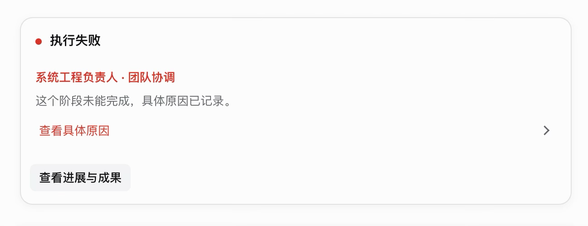
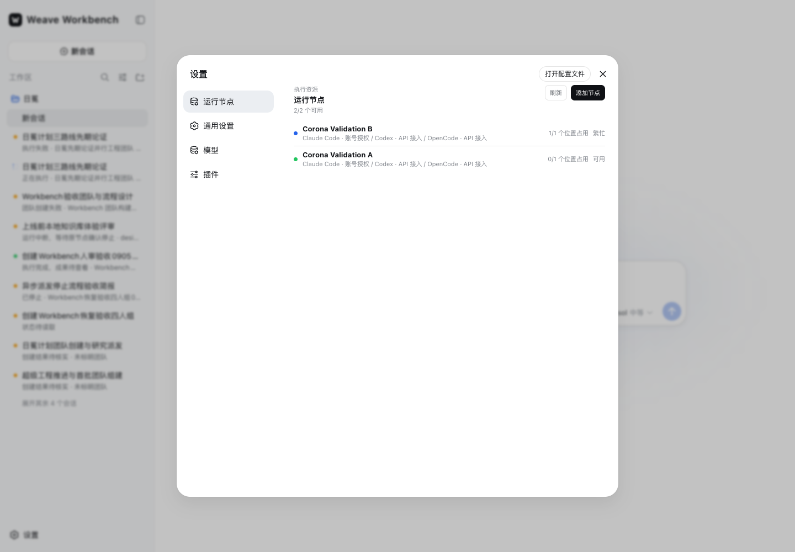
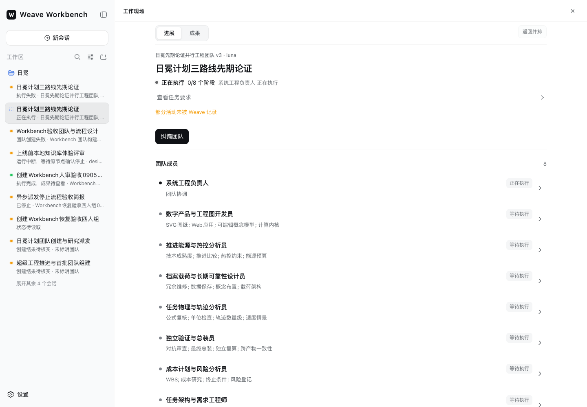
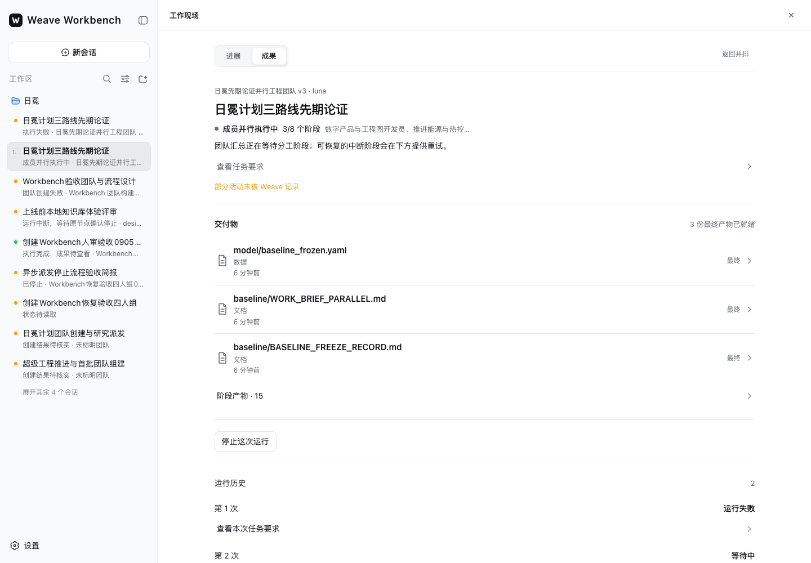
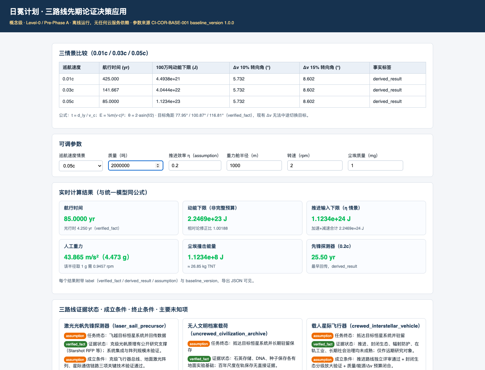
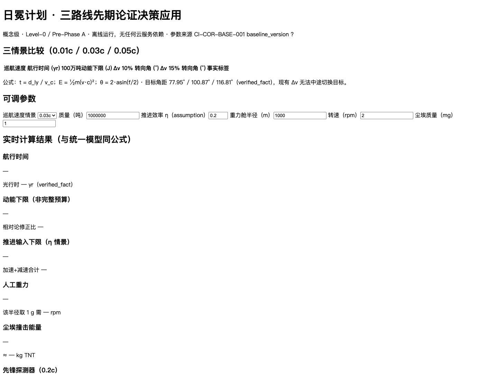
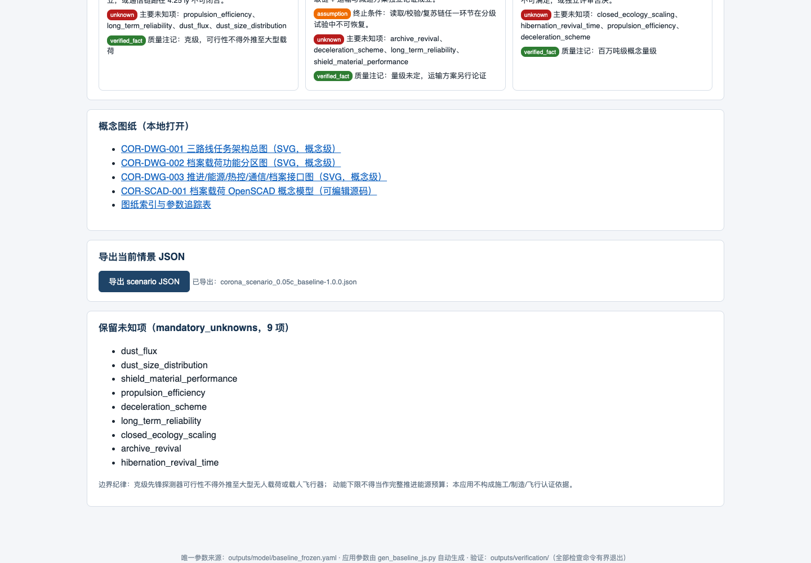
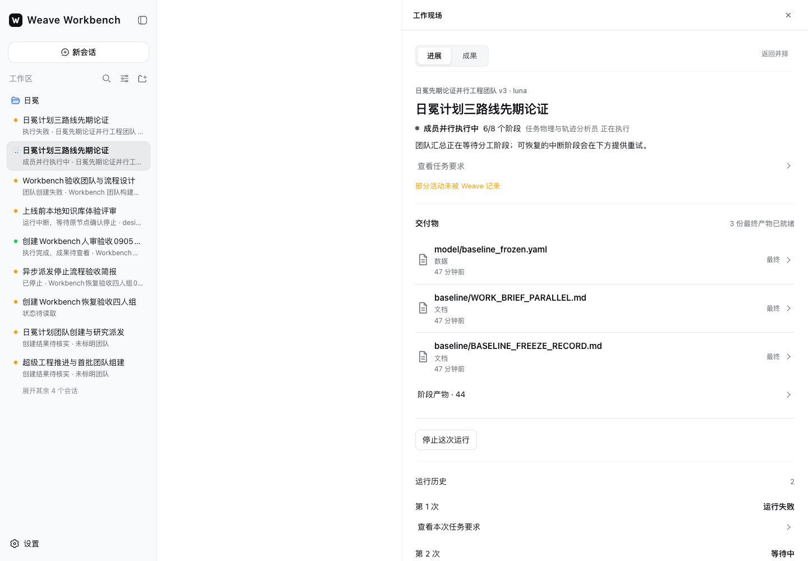
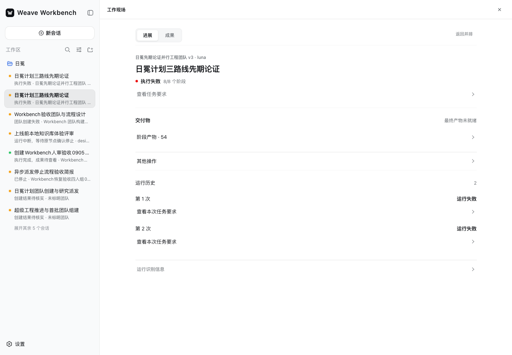

# 日冕真实执行问题与 Claude CLI 切换

更新于 2026-09-06。记录以本次运行、页面截图和队列事实为准。

## 当前结论

当前日冕验证团队的八名智能体已改为 `claude`，工作流第 3 版已发布，并通过原 Workbench 会话的“修订并重新运行”启动。新运行 `run-b66d312c-b3ec-5250-9714-ce26ecfa7b40` 的负责人执行任务已确认使用 Claude CLI，冻结智能体版本为 4。本轮在 15:17 结束，平台判定 `failed / team_run_delivery_unavailable`，没有最终交付物。八名成员均完成过执行，但物理校核额外重跑一次。业务验收不通过。

本机 Claude CLI 实际使用 Kimi 配置，探针返回 `CLAUDE_RUNTIME_OK`，模型记录为 `k3[1m]`。这是 Claude CLI 执行路径，并不代表使用 Anthropic 模型。未修改本机全局 Claude 配置。

页面目前没有按智能体选择 Codex / Claude CLI 的控件。“设置 → 运行节点”只展示引擎和认证状态，并提供节点管理。此次切换通过现有智能体 API 完成。

## 问题记录

| 编号 | 问题及影响 | 处理与验证 | 状态 |
|---|---|---|---|
| 01 | 失败卡的边距、行距和阴影偏重，占用过多对话空间。 | 收紧宽度、内边距、圆角及失败原因区间距。保留详情及进展入口。见调整前后截图。 | 已修复 |
| 02 | 初始输入路径有多余空格并漏掉目录，妨碍读取真实材料。 | 后续简报使用已核对的四个绝对路径；本轮沿用更正后的简报。 | 已更正 |
| 03 | 会话派发缺少显式 `project_id` 时，没有从所属会话推导项目。 | API 从会话归属补齐项目，并继续拒绝显式项目不匹配。新增真实 PostgreSQL 验证覆盖派发、归属、重复提交和冲突拒绝。 | 已修复 |
| 04 | 推导项目后，重复派发比较了存储项目与请求中的空项目，可能把同一请求判为冲突。 | 原请求指纹仍完整校验；只对显式项目补充比较。真实 PostgreSQL 测试确认相同请求返回同一运行，不增加任务。 | 已修复 |
| 05 | 修改智能体当前模型后，旧工作流仍冻结空模型。两次旧失败不能证明 `gpt-5.6-luna` 生效。 | 旧任务证据显示负责人版本 1、模型为空。必须发布引用新智能体版本的工作流；本轮已发布第 3 版，成员全部为 Claude CLI。 | 本轮配置已对齐 |
| 06 | 旧 Codex 任务先遇到网关不支持默认模型，后遇到 `ONEAPI_API_KEY` 缺失；此前被归为普通工作失败。 | Codex API 模式增加缺凭据预检；明确配置错误优先于“重连”等临时错误，不标为可直接重试。保留 Claude、OpenCode 自有认证路径。 | 已修复；当前业务切换至 Claude CLI |
| 07 | 智能体更新接口无法用显式空模型清除旧模型，CLI 被迫保留平台模型绑定，发布时报 `workflow_provider_revision_required`。 | 允许 CLI 智能体显式清空模型以沿用本机默认；省略字段仍保留原值。测试覆盖省略、清空与内置引擎边界；八名成员清空后工作流发布成功。 | 已修复 |
| 08 | 页面缺少按智能体切换引擎及本机模型策略的入口。 | 实际打开设置页面并检查前端控件。当前只有节点管理，没有成员引擎配置。见运行节点截图。 | 未实现 |
| 09 | Claude 登录探针显示账号授权，但本机设置实际将请求发往 Kimi。只看认证标识无法判断实际模型供应商。 | 本次以实际调用回执记录 Kimi / `k3[1m]`，不把账号授权标识解释为 Anthropic 模型。 | 产品展示缺口仍在 |
| 10 | 当前外部执行活动采用完成后回传；运行中缺少连续工具活动和用量。 | 本轮活动接口明确返回 `update_mode=on_completion`；截图中的运行中状态不能作为实时工具轨迹或业务完成证据。 | 能力边界，未完成实时化 |
| 11 | 负责人刚完成时，三个基线文件被标为 `final`，而总任务仅完成 1/8 阶段。 | 队列与活动回执确认这些文件来自 `lead`。串行节点成功分支固定传入 `final=true`，已改为阶段产物；活动接口校正旧记录。页面还按文件数量缓存分类，Host 已补充按活动引用校正标签。不能以“已有 final 文件”证明全队交付完成。 | 已修复并通过真实页面复核 |
| 12 | 四个专业阶段显示运行中，但队列当时只有两个任务实际执行，另两个仍排队。 | 两个运行节点各有一个执行位置；活动记录在任务领取前发出成员开始事件。页面缺少“等待运行节点领取”的准确状态。 | 已修复；真实排队回放测试通过 |
| 13 | 本轮最初简报已包含三个速度情景，无法验证任务书要求的“第一次并行后，由单情景纠偏为三情景”。负责人文件把这一要求写成了“已批准并入”和安全点记录。 | 平台活动接口的纠偏记录为空。文字记录不能代替实际请求、影响方案和确认回执；本轮不计作纠偏流程通过。 | 过程验收未覆盖 |
| 14 | 数字工程节点完成了 32 个文件，但平台仅收集 18 个；Python、JavaScript、CSS、Shell 源文件未进入成果记录。 | 从实际回传内容重建目录后，应用四项资源加载失败，三情景表为空、计算结果为占位符。完整运行目录副本则能调整情景、质量并导出 JSON。见两种文件集合的浏览器验证。修复后实际调用 Go 收集器获得完整 32 文件，逐个字节比对一致；仅用该集合重建的应用也能导出，零资源失败。此验证不冒充新平台运行。 | 收集器已修复并独立复核；当前旧运行的缺件未补录 |
| 15 | 上游文件没有传递到专业成员工作目录，成员重新创建同名、同版本基线。 | 数字工程成员明确报告上游 outputs 未挂载；负责人和开发员的 `baseline_frozen.yaml` 都声称 1.0.0，但结构和内容不同。当前关键参考值复算一致，不能据此认定文件交接和统一配置基线通过。 | 文件交接缺口 |
| 16 | OpenSCAD 只做了结构检查，没有用 OpenSCAD 编译器解析或渲染。 | 成员明确记录本机缺少 OpenSCAD 可执行文件。括号、模块名等结构检查不能证明完整语法和几何渲染通过。 | 专业验收未覆盖 |
| 17 | 用量摘要在 4096 字节处切断中文字符，经过 JSON 编码变长，服务器以 HTTP 400 拒绝整个结果。物理校核 CLI 已结束，任务却长时间显示运行。 | 修复 UTF-8 截断；接口可修复旧截断尾部。无效附属用量改为不可用并留下提示，完整正文和文件继续保存。真实 PostgreSQL 完成接口验证已通过。 | 已修复、数据库验证通过并部署 |
| 18 | 明确的结果格式拒绝也被无限重试，同一物理校核结果被拒绝 49 次。 | 400、413、422 结束同包重发并登记可定位的结果回传失败；503 和丢失应答仍可重传结果，不重新执行 CLI。HTTP 回归证明只执行一次、只提交一次无效结果、登记一次失败。 | 已修复、验证并更新运行节点 |
| 19 | 服务重启期间原物理任务被取消，恢复陈旧分工任务又创建了一次物理执行；原回执没有入库。 | 保留两次物理任务身份及时间。不能把运行池“不重复执行”的局部测试扩大为全部重启恢复均已保证；分工恢复还缺少对既有执行及本机结果的核对。 | 恢复机制仍有缺口；本轮已发生重复计算 |
| 20 | 汇总智能体把未完成 OpenSCAD 编译、未单独提供否定意见等缺口列为“非阻塞”，仍宣称所有硬门通过。 | 保留原文；主验收不采纳此 PASS。任务书要求全部硬门及过程、专业两层同时通过；现有证据不足以支持无条件通过。平台又因汇总 Python 文件未收集而拒绝最终交付。 | 智能体结论超出证据，验收不通过 |

## 最终判定与修复范围

本轮真实运行耗时约 65 分钟，走到最终汇总后因交付缺件失败。[最终运行记录](evidence/final-run.json) 与 [全部物理执行身份](evidence/final-engine-tasks.json)保留了实际终态、重复物理校核、引擎以及缺件诊断。汇总智能体的 [原始验收报告](evidence/original-finalizer-acceptance.md)只作为待审查的模型产物，不能代表本次验收结论。

最后一版代码已更新到验证 API 和两个运行节点，更新前队列没有运行中或等待任务。其正文、文件收集、统计降级、结果重传边界的修复不会追溯改写本轮失败记录，也不会把散落在运行目录的文件冒充已交付文件。完整自动模型回退和跨节点文件交接仍未完成，不能宣称整套回退与日冕业务闭环已经通过。

## 证据更正

此前临时记录中，“负责人模型已修复且实际使用 luna”和“预检已阻止 CLI 启动”的判断不成立。旧运行 `run-69813a97-…` 与 `run-764dba61-…` 都冻结了负责人版本 1、空模型；后者的缺凭据错误来自实际 CLI 执行，当时新预检尚未部署。详见 [执行任务字段](evidence/engine-tasks.json)。

此前的 `run-lead-failed-evidence.png`、`input-path-evidence.png`、`runtime-credentials-evidence.png` 是把文字排版后生成的说明图，不是真实产品截图。本记录不将这些图当作运行证据；旧失败详情截图也只证明当时那次页面状态，不能代替后续运行证据。

## 真实页面截图

### 01 失败卡调整前

### 02 失败卡调整后

### 03 工作流校验错误

### 04 旧运行的失败详情

### 07 运行节点配置边界

### 08 切换后从原会话启动

### 09 中间文件被提前标为最终成果

### 10 完整本机文件的应用

### 11 平台实际传回文件的应用

浏览器检查见 [应用验证记录](evidence/app-browser-check.json)。完整副本默认航行时间为 `141.667 yr`，改为 `0.05c` 后显示 `85.0000 yr`，导出质量为 `2e9 kg`；平台回传副本三情景表为零行，四个依赖资源加载失败。两张图都是实际浏览器渲染，不是文字排版说明图。

### 12 修复后的收集器输出

完整 32 文件及逐文件摘要见 [收集器复核](evidence/fixed-collector-check.json)，浏览器结果见 [修复后应用检查](evidence/fixed-collector-browser-check.json)。这些是修复后收集器的独立复核，不是当前旧运行重新交付的记录。

### 13 分类已更正但页面缓存仍旧

### 14 当前页面正确保留失败与阶段产物

## 配置与检查

- 配置结果与八名成员版本见 [切换记录](evidence/switch-result.json)。新任务的实际引擎见 [运行活动摘要](evidence/claude-run.json)。
- 已完成负责人的 [CLI 用量回执](evidence/lead-usage-receipt.json) 确认实际模型 `k3[1m]`，且没有启动原生 CLI 子智能体。费用字段是 CLI 自报值，不作为账单金额。
- 原智能体配置及团队模板备份保存在 `/Users/jinyitao/Documents/日冕/complex-validation/claude-switch-20260906/`。源模板已改为 Claude CLI，并更新全部运行节点引用。
- `make test`、`make depguard`、`make productguard` 通过，见 [检查日志](evidence/go-checks.log)。最后版本已构建并部署，见 [部署记录](evidence/deployment.json)。
- `TestTeamWorkflowDispatchKeepsInputIdentityAndAdmissionRealPG` 使用隔离 PostgreSQL schema 真实执行通过；不属于跳过数据库的结果。
- `make workbench-install workbench-check` 通过，见 [Workbench 检查日志](evidence/workbench-checks.log)；Host 包 61 项测试、定向 lint、文档配对和 Agent Note 格式检查通过。分类同步新增同文件数量回归及可见投影快照，已在真实页面复核。

回传拒绝见 [运行节点日志节选](evidence/usage-result-rejection.log)，原物理任务取消见 [任务记录](evidence/physics-result-recovery.json)，附属统计失败仍保留成果见 [真实数据库检查](evidence/usage-preserves-work-postgres-check.log)。

过程验收与专业成果验收须分别判断。启动成功、写出阶段文件、模型返回成功都不等于日冕复杂任务验收通过。
