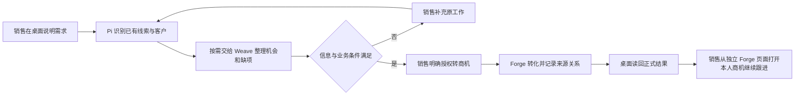

# 销售线索转商机

这是合同之外的第一条复用验证场景，截取自[OTC 业务主流程](../../docs/architecture/订单到回款业务流程.md)的“线索与项目立项”阶段。它验证员工能否把零散信息交给 Pi 整理，在明确授权后，将**指定的一条线索**转成可继续跟进的商机，并保留客户、负责人和来源关系。

**状态：2026-09-24 在清空后的 124 主线上走完“桌面 Pi 分析 → 明确授权转商机 → Weave 团队调用 Forge 动作”。** 线索被标记为已转化，Forge 创建了关联客户与商机；销售用户的线索列表可读回已转化状态，独立管理员浏览器可读回商机金额与日期。本次仍未形成完整闭环：Weave 收件箱结果错误声称没有调用工具、销售账号的商机列表未显示其本人新商机，另一个临时只读账号未获准读取，该观察不作为产品故障或扩权依据。后续完整流程图仍是目标，不计入[MVP1 第一阶段](../../docs/releases/001-MVP1第一阶段里程碑.md)的既有成果。

### 124 新数据实际走过的范围

服务部署组合为 Forge/ObjectStack `bfd8c89d`、Weave `01cafe25`、桌面 `033e16cd`。旧业务卷已清空。开发者小周从桌面创建并更新“线索分析团队”及“线索情况整理流程”，选用 DeepSeek V4.1 Flash，试跑只包含新材料且未绑定业务写动作。销售小王通过 Forge“线索管理”页面创建新线索 `QL-MVP1-20260924-001`（青峦工业视觉检测改造，负责人为销售小王）。

销售在自己的桌面 Pi 附加 `mvp1-124-qingluan-lead.md`（620 字节，SHA-256 `ecc1edc24d832a5bb9390d695baf564a0177321107c3c902dca080c4207ddd7a`），要求“先看、先别转”。Weave 第一轮完成事实整理，Forge 原生通知投递记录为成功、尝试 1 次，收件箱仅有 1 条；员工在桌面“我的工作”读到结果并交给 Pi 查看。团队先没有 Forge 读动作，Pi 因此未绑定线索；开发者后来通过桌面只给团队负责人绑定 `sales_lead_convert_to_opportunity`。

Pi 按员工要求查找完整线索名，返回唯一候选和可读线索号，但没有返回负责人/状态字段；销售随后在 Forge 页面核对负责人和“新线索”。员工明确授权创建客户与商机，金额填 480,000 元并声明为销售内部估算、预计成交日期留空。第一次交接结果没有调用工具。员工在桌面重新打开结果消息、再次明确授权后，Weave 修订轮运行 `run-bf5c05f4-11ce-5aee-a56f-c2054bc1c47c`，允许动作包含线索转商机，运行轨迹记录 `tool_started` 与 `tool_completed`。Forge 实际将线索转为客户与商机，创建金额 480,000、阶段“需求确认”、预计成交日期为空、负责人销售小王的商机。

**实际缺口：** 同一成功运行的 Forge 原生通知正文仍称“未执行任何业务动作”；销售账号在 Forge 线索列表读到“已转化”，但商机列表为 0，独立管理员页面才能看见商机；独立只读核验员访问线索列表也是 0。Pi 曾因材料里的测试用途和早先只读声明多次要求额外确认；材料内容不应覆盖员工后来对同一测试对象的明确授权，这部分仍需按当前轮次验证。转化后商机记录未在销售本人列表读回。上述状态反馈和读取权限差异未通过，不能称为完整场景闭环。

**2026-09-24 只读归因：** 负责人节点实际调用转化动作一次，整理员只读到前序文字、未获得可核验动作回执，又受到“没有本轮工具调用就不能声称完成”的平台指令影响，输出否认写入；发布流程直接交付整理员文本，通知无改写。需同时修正团队执行顺序和 Weave 跨成员结果证据，不能仅改通知文案。新商机 `responsible_id/created_by` 为销售，`owner_id` 为空，而原生本人范围依赖 `owner_id`，这是 Forge Action 在系统执行上下文中漏设归属。临时核验账号只配置普通 `viewer_readonly`，其无结果符合未获授权的边界，不能认定平台故障。用户明确要求按实际业务角色验证，因此不再给该账号扩权或新增核验权限。以上为运行数据和源码核对，未修正业务记录。详细改法见[问题清单](../../docs/plans/问题清单.md#三场景断点的责任归属与处理方案)。

## 最小参与流程

| 参与人 | 业务职责 | 桌面助手如何参与 |
| --- | --- | --- |
| 销售小王 | 整理客户需求、判断是否继续跟进、授权转商机 | Pi 关联线索与客户，区分事实和待确认信息，整理转化摘要 |
| 团队开发者小周 | 配置可复用的线索分析团队 | 从桌面配置职责、输入、结果与获准的业务能力；不自动获得销售数据权限 |
| 商机使用者（本批仍为销售小王） | 打开本人正式商机继续跟进 | 在独立 Forge 页面/会话读回客户、来源、负责人和金额，核对没有重复记录；不新增核验员业务角色 |

最小场景由线索当前销售负责人继续负责商机，不另造一个人工审批或接力流程。若客户要求 KP1 立项评审，必须先满足该前置条件；本场景不能用“转为商机”绕过 KP1。KP1 的材料审查、会签和项目群建立不在本批范围。

独立核验是取证方式，不意味着授予另一个测试账号全组织销售数据。2026-09-24 曾用临时只读账号读回为空，此现象不计作产品缺陷，也不为通过验收扩权。跨账号验证使用无关销售/开发者不能访问，以及后续真实业务角色在其授权范围内可访问。

## 账号与进入方式

普通员工从桌面“我的工作”与 Pi 开始；开发者从“开发中心 / 智能体团队”维护团队。账号沿用 Forge 身份，切换账号后应重新读取本人工作、材料和权限。浏览器中的 Forge“线索管理”“商机管理”和“客户管理”用于独立核验，不代替员工桌面操作。

本批起点是一条**已登记且员工有权处理的线索**。首次由口述直接新建线索属于后续扩展，不能用后台建数据掩盖这条扩展尚未打通。验收前准备的线索、客户和授权账号应记入当次验收记录。

图示为目标路径；本轮只通过桌面材料递交、团队分析及结果重开读回，后半段正式转化仍待验。

## 起点

销售已有一条“北辰设备产线升级”的线索，以及一次客户沟通纪要。公司名称、联系人和当前负责人有记录；预算和时间可能尚不确定。另准备一条名称相近、同一员工可访问的线索，验证 Pi 不会仅凭相似名称写错对象。

销售可以说：

> 昨天聊的北辰那条线索值得继续跟。他们想改造现有产线，预算先按二十万估，争取年底定。帮我把情况理一下，先别转。

Pi 应先整理需求、信息来源、待确认问题和建议。员工说“先别转”时，不得创建商机。对象有歧义时，只询问是哪一条；“年底”对应的具体日期没有业务约定时，不编造精确日期。

## 执行大纲

1. 小王用本人账号登录桌面，打开这条线索相关工作和沟通材料，用日常语言说明目标。Pi 读取获准的线索、关联客户与负责人，说明哪些内容来自记录、哪些只是员工估计。
2. Pi 固定本轮要处理的线索与材料。存在同名公司、多个线索或来源冲突时，让员工选择具体对象；不自动合并客户，不把相似名称当作相同客户的充分依据。
3. 需要综合整理时，Pi 根据已发布团队说明找到“线索分析团队”，递交需求、材料与只读范围。员工不填写成员、工具或内部记录编号。接单后 Pi 结束等待，Weave 独立运行。
4. 团队交付机会摘要、依据和缺项。缺少关键内容时，结果返回原销售的收件箱；员工打开消息后，Pi 接回原线索与材料继续补充。团队建议“值得跟进”不等于已创建商机。
5. 小王说“就这条，按刚才确认的内容转成商机”。Pi 检查本轮授权、当前账号、准确线索和客户要求的转化条件，形成可检查的提交摘要，不重复要求形式确认。若先前只授权分析，此时才允许转化动作。
6. 获授权的 Pi 或 Weave 成员通过 Forge 开放的受控动作执行转化。Forge 检查员工权限、线索当前状态和业务条件；建立或关联客户，创建商机，记录源线索、负责人及转化结果。团队不得指定无关员工或借用开发者凭据。
7. 桌面根据 Forge 的真实回执显示已转商机，并能打开对应结果。回执不确定时先查询原线索的转化结果，不能直接新建第二条商机。
8. 小王重开桌面仍能找到本次结果；独立账号从 Forge 打开源线索、客户和商机核对关系。商机使用者能继续查看需求摘要与下一步跟进内容。本批在此结束，不自动进入报价或合同。

## 线索分析团队与开发者配置

先使用一个负责人完成“整理需求 → 核对缺项 → 交付摘要”。只有材料确实需要不同专业判断时再增加成员，不为证明通用性复制合同的并行评审结构。

1. 小周在桌面新建团队，写清接收已有线索及沟通材料，交付事实摘要、机会判断、信息依据与待确认项；通用示例可以是设备需求、软件咨询或服务咨询。
2. 在团队分工中定义职责和交付要求，选择已开放的业务读取能力。首轮分析不绑定写入范围；需要承担转化时，再给明确负责提交的成员绑定“转为商机”能力。
3. 用流程节点配置输入与执行者，保存前不存储。模型、工具和能力从目录选择；客户资格标准放在团队说明或 Forge 业务规则中，不写进桌面核心代码。
4. 用同一条线索及材料进行不回写调试，核对实际输入、拟执行动作和输出；调试通过后更新团队，再由销售账号实际运行。当前目录绑定、结构化对象输入和同材料调试是否完整支持此场景，均需实际验证。

## 页面、系统与模块对照

| 环节 | 用户入口与职责 | 当前代码依据与证据状态 |
| --- | --- | --- |
| 员工对话与递交 | 桌面“我的工作”/ Pi；选择当前对象、授权与材料 | [桌面主入口](../../desktop/src/App.tsx)、[能力桥](../../desktop/electron/main/enterprise/agent-bridge.ts)已在隔离候选实际递交一份合成 Markdown；真实线索绑定仍待验 |
| 团队配置与执行 | 桌面开发中心 → Weave 已发布团队 → Loom 成员 | [开发中心](../../desktop/src/pages/DevelopmentPage.tsx)、[调试面板](../../desktop/src/pages/team-workspace/TrialPanel.tsx)已配置并试跑非合同团队；正式运行读取了同一文件原文，输出质量仍需校正 |
| 转化业务动作 | Forge 校验、建立客户/商机并回写线索 | [销售动作](../../platform/forge/apps/forge-objectstack/src/actions/sales.action.ts#L573)的 `sales_lead_convert_to_opportunity` 已存在；远端当前员工目录可调用性未验证 |
| 业务对象与独立读回 | Forge“线索管理”“商机管理”“客户管理” | [线索/商机对象](../../platform/forge/apps/forge-objectstack/src/objects/sales.object.ts#L236)、[CRM 页面](../../platform/forge/apps/forge-objectstack/src/pages/sales-crm-service-pages.page.ts#L102)已有；页面完整操作和读回未验证 |
| 结果、失败与续办 | 桌面“我的工作”中的运行结果和消息；ObjectStack 收件箱留存 | [企业工作页](../../desktop/src/pages/EnterpriseWorkPage.tsx)在桌面重开后读回一次完成状态和工作消息，并可交给 Pi 查看；原线索及材料能否完整续接仍待验 |

## 失败或中断后如何继续

以下是必须验收的恢复行为，尚未证明已具备。

| 员工遇到的情况 | 应有行为与继续方式 |
| --- | --- |
| “先等等”，或改成另一条线索 | 未提交的旧授权失效；重新固定新对象。已经转化的结果应如实展示，撤销按 Forge 业务规则处理 |
| 名称相似、预算不明、负责人缺失 | 指出具体待确认项，保留已确认内容；不猜客户、不把未知金额伪装成确认金额 |
| 团队超时、材料不足或销售离线 | 消息留在原账号；打开后可接回同一条线索、材料和问题，重跑关联原工作 |
| 点击两次、回复丢失、执行后桌面重启 | 查询同一线索原转化结果；只保留一条有效商机及来源关系 |
| 另一员工同时转化，或修改了线索 | Forge 拒绝过期提交或返回已完成结果；桌面提示刷新实际结果，不覆盖对方工作 |
| 无权读取或转化 | 显示无法办理及可行下一步，不换用管理员或另一员工身份继续 |

## 已有能力、缺口与业务差异

| 判断 | 内容及处理位置 |
| --- | --- |
| 仅有代码依据 | Forge 现有动作按线索状态转换，查找同公司名客户，并写入来源关系；这不证明桌面自然表达、MCP 目录、权限、重复恢复已经连通 |
| 需优先验证的共性缺口 | 准确对象与本轮授权绑定、本人运行结果和续办、跨账号隔离；与合同共用能力，应修在桌面能力桥、Weave 与 Forge 边界 |
| 转化前必须补证 | 动作体未见以源线索为唯一键的竞争写入保护或重复请求读回；虽然声明事务能力，实际并发与部分失败仍需验证。最小目标是同一源线索只产生一个可追溯结果 |
| 需明确的业务差异 | 客户去重依据、商机命名、初始阶段/成功率、预算要求、KP1 前置条件。当前动作按公司名复用客户并默认阶段/成功率，不能当作各客户通用规则 |
| 后续规划 | 从口述新建线索、完整 KP1 会签、负责人转交、自动生成跟进计划。是否需要、由谁办理再按客户业务确定；本批不宣称这些能力已具备 |

去重依据可以因客户而异；**按已确定规则识别对象、执行权限、避免重复写入和保留关联结果**属于共性能力，不能因规则未统一而全部后置。

## 本批穿插验证的关键断点与通过条件

- “先整理”“先别转”只分析；后续明确授权才写入，员工无需说内部编号或动作名。
- 同名客户与相似线索中选择正确记录；另一员工不可读取材料或代为转化。
- 团队至少实际交付一次缺项结果，员工从原消息补充并继续；另测失败后恢复。
- 同一请求重复、回执丢失和重开后不产生重复客户或商机；并发提交保留唯一真实结果。
- 独立身份在 Forge 核对源线索、客户、商机、负责人及实际保存的金额和日期，随后能继续跟进。

当次证据写入 `docs/acceptance/`，记录桌面操作、真实账号角色、所用团队与组件版本、源记录和结果关联、独立读回及未通过项。只有上述用户链路完成后，才把本页状态改为已验证；当前没有该验收记录。
