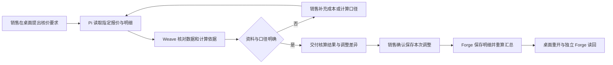

# 销售报价核算与调整

**当前空数据重验（2026-10-06）：** 更早日期证据为重置前记录，不作为本轮通过。云岚唯一线索本人桌面授权转化已独立读回；小王从正常Forge报价页创建 `QT-20261006-031746841925`，关联同一客户／商机，初始设备2×1000、安装培训1×300，总额2300／核价版本0、税率折扣0、成本未知。03:21本人只读团队22秒完成，业务动作0；后续开发试跑门禁／读取事务／覆盖刷新已修，原B三次实际模拟回执通过。17:03新版报价流程正式发布，定义与试跑相同；小王在最终新QA重新只读两行，再新消息只授权设备行900、服务与数量不变，交正式团队办理。17:13本人Summary显示20秒完成、动作成功1／失败未知0；内置浏览器本人同报价独立读回草稿、设备2×900、服务1×300、合计2100／核价版本1，成本仍不可分析。本人完成消息已正常只读打开，无重复调价。报价后续已实际提交，缺行旧轮经本人驳回、补完整新快照后重提并由独立小赵批准，Forge读回已审批／2100／版本1；发送轮被桌面未注明动作的旧submit回执误导而未执行，修补正在重验，客户接受及转合同未验。组合及详细证据见[环境说明](../../docs/environments/开发联调环境.md#当前销售订单联调运行基线)。

**当前进展与边界：** 旧版本3与旧B零调用却complete保持失败原义。新稿前两步无写、后置唯一调价，精确原B关闭为0工具／0覆盖且禁发布；三次开启均后置工具1／模拟成功回执1，前两步0，参数900／版本0准确且正式Forge动作0。新包已修覆盖刷新与可读回执，正常发布后独立确认修订7／正式流程4及冻结定义与B3完全一致。随后本人正式授权调价已在Forge读回2100／版本1；模拟与正式证据分别保留。并发、响应丢失／恢复、长期运行和后续交易仍待验，不能宣布生产稳定。

**2026-09-30 当前组合新数据：** 小王在 Forge 正常“新建报价”页保存草稿 `QT-20260930-085345541698`：视觉检测设备 2×¥1,000、安装调试服务 1×¥300，总额 ¥2,300；成本未提供。实际桌面 Pi 读取完整 2/2 行并交报价核对团队只读试算，唯一结果消息返回本人并交 Pi 续办。小王随后明确授权只把设备单价改为 ¥900，Pi 重新读取版本 0 后交团队；该次运行有 Forge 动作成功回执。小王从独立 Forge 报价页重开同一草稿，读回核价版本 1、设备 2×¥900、服务 1×¥300、总额 ¥2,100，成本分析仍不可用，报价未审批、未发送。尚未做同请求重复和并发旧版本的本轮验收；原场景止于草稿。

**本轮报价消息续接：** 9/30报价成功消息从小王本人桌面打开，没有第二次改价。Pi先把旧输入2300/版本0当当前并将汇总节点零调用误解为整团队未执行；明确纠正后区分可信平台成功与原快照。Pi先声称没有只读工具，但实际尝试后，既有对象目录/精确查找/记录读取全成功，读回草稿版本1、设备2×900、服务1×300、合计2100、成本未知。包内扩展与源码一致、会话实际tool calls证实已加载，不新增查询实现。线索原成功消息也已正常续接，实际原生只读查到已转化、当前可见客户/商机各一条、金额200000及预计日期空；此次未返回归属字段，不能扩大成当前归属已核。Weave聚合仍55成功/8失败、46事件全投递，本轮续接未增加运行或事件。原件R2已完成整页和逐字检查；浏览器Forge独立读回仍等待用户将Edge验收窗口手动置前，不以后台定位代替页面通过。

**2026-09-29 新数据真人闭环：** 销售小王从 Forge「销售报价」正常页面新建报价 `QT-20260929-143948842382`，保存设备 SKU `MVP1-EQA-SKU-20260924` 两件 × ¥1,000、安装服务一项 × ¥300；两行税率和折扣均为 0，含税总额 ¥2,300，成本未提供，记录为草稿、核价版本 0。小王在桌面 Pi 指定该新报价并把完整两行交给报价核对团队只读核算；Weave 运行成功，业务动作为空，桌面收到一条结果消息并交回 Pi 核对，成本/毛利保持未知。小王另起员工轮次，明确只授权把同一草稿的设备行含税单价调为 ¥900，数量不变、服务行不变。Weave 真实调用 Forge `quotation_adjust_line_price` 一次，团队结果消息确认业务动作成功。Pi 随后重开并独立读回该报价，将动作回执与当前业务记录分开表述；Forge 销售报价正常页面刷新并重开同一记录，也读回设备 2×¥900、安装服务 1×¥300、含税总额 ¥2,100、核价版本 1。记录仍为草稿，未提交审批或发送客户报价；成本和毛利仍未知。本轮请求的创建、只读核算、明确授权改价、Pi 续读与 Forge 独立读回均通过；重复请求、并发改价和业务结果未知时的恢复仍未验。

**2026-09-27 打包桌面与独立账号续验：** 当前 QA 包由小王本人登录 124，成功与失败两条历史报价结果消息均能打开交给 Pi。Pi 只读重看正式报价，设备行 ¥900、服务行 ¥300、总额 ¥2,100、核价版本 1；工作与消息数量仍为 21/23，没有重放调价。打开较早的失败消息时，初版 Pi 曾把后来成功的当前值说成与旧回执矛盾；桌面 `de69ddc7` 修正时间边界后，同一消息再次打开，Pi 保留“这次业务动作失败”并单列当前 ¥2,100，未把后续结果倒推给旧运行。小周从独立浏览器登录 Forge 正常报价页面看到无权限和 0 条报价；小王从本人页面独立读回两行和 ¥2,100。列表标题仍将业务动作失败的历史运行写为“流程已完成”，真实重复请求尚未实测。

**2026-09-26 阶段结论：** 前述“版本已变化”失败已在 124 用同一新报价草稿修复重验。Forge 正式动作参数区分核价版本 `pricing_version` 与记录快照版本，已部署 `032db4e`；小周从本人桌面修订报价团队并重新发布。小王另起真实员工轮次仅授权把设备单价 ¥1,000 改为 ¥900；Weave `run-f967da8f-1478-5490-8638-34014f82ae97` 对 Forge 原生动作成功一次，小王桌面收到唯一结果消息并交回 Pi，Forge 本人页面重新打开同一草稿读回设备 2×¥900、服务 1×¥300、含税总额 ¥2,100，成本仍未知，未进入审批或对外发送。两次失败运行仍作为历史缺陷证据；团队运行显示“已完成”但业务动作失败的状态表达还需改，不能把技术成功当业务成功。

这是合同之外的第二条复用验证场景，截取自[OTC 业务主流程](../../docs/architecture/订单到回款业务流程.md)的“方案、报价与招投标”阶段。它验证 Pi 与团队能否处理**真实业务明细、计算依据和员工修改**，让员工拿到保存一致、可以继续使用的报价结果。

**2026-09-26 124 真人续验：** 小王 Pi 按本人权限从既有草稿读回设备 2×¥900、服务 1×¥300、总额 ¥2,100，并明确指出成本不可分析；当时没有报价团队，Pi 拒绝拿合同/线索团队顶替。开发者小周在本人 GooeyPi 通过 Pi 提案与右侧编辑区新建“报价核对团队”，保存两名成员的职责，仅给负责人绑定 Forge“调整报价明细单价”，在画布形成“理解任务 → 执行成员 → 汇总核对结果 → 交付结果”；调试以两行测试数只读完成，零工具调用，远端读回已发布修订版 4/流程版本 1。小王随后把既有草稿及新报价 `QT-20260926-104826546115` 的真实记录交给团队只读核算，两次运行均成功、各只投递一条工作消息，成本仍为不可分析。新报价由小王从 Forge 正常页面保存为设备 2×¥1,000＋服务 ¥300＝¥2,300，再由本人 Pi 在新轮次明确只授权设备行单价改 ¥900。Weave 真实调用了 Forge 原生动作，但 Forge 拒绝“报价版本已变化”；团队运行最终仍标为 `succeeded`，消息摘要说明业务动作失败。Forge 数据库只读核对新报价仍为核价版本 0、总额 ¥2,300、原两行及 0 条调价回执。因此**团队只读核算已通过，新的 Pi→团队单行调价闭环未通过**；不能把旧报价通过 Forge 页面手工调价的成果代替这一轮。当前需核对工具入参 `expected_version` 是否把快照版本 1 错当报价核价版本 0，并保留 Forge 旧版本拒绝。当前 Mac 再次锁屏，后续桌面和浏览器验收待解锁；服务端排障和代码验证可继续。细节与下一步见[项目状态](../../docs/项目状态.md)及[问题清单](../../docs/plans/问题清单.md)。

**当前实走状态（2026-09-25）：** 销售小王先以本人账号从 Forge“销售报价”读回空列表。客户“青峦工业”、设备 SKU `MVP1-EQA-SKU-20260924`、报价类型“标准销售报价”及测试主体均由正常页面配置；测试主体 `MVP1测试主体` 明确不用于真实报价、签约或开票。首次保存被 Forge 拒绝，原因是缺少 `sales_quotation_draft_create`。经用户确认，管理员随后只把既有 `sales_quotation_draft_operator` 直接授予小王个人账号，没有赋给通用 `user` 角色；小王重新登录后成功保存两行 ¥2,300 草稿，设备单价改为 ¥900、服务价保持 ¥300，含税总额重算为 ¥2,100。返回列表后首次看到旧 ¥2,300，刷新后列表改为 ¥2,100；重新打开同一报价，设备 ¥900、服务 ¥300、总额 ¥2,100 均读回。Forge 页面保存、调价及重开已通过；成本不可用仍显示为不可分析。Pi/Weave 团队读取、核算与建议后保存的联动仍待 Weave 凭据和结果消息链路修复，故报价场景整体未关闭。

**历史实走状态（2026-09-24 修复组合）：** Forge“销售报价”已有可点击的“新建报价”入口，销售能打开真实草稿表单；销售本人报价列表为 0。新表单客户字段只列出“青峦工业”，物料规格下拉当时只有占位项。管理员通过供应链物料管理正常表单新建了场景设备主数据 `MVP1-EQUIP-A-20260924`，尚未形成报价表单需要的规格/SKU；后续补验已在正常设置页创建 `MVP1-EQA-SKU-20260924`。本场景未保存报价、未完成桌面团队试算或金额调整，不计入[MVP1 第一阶段](../../docs/releases/001-MVP1第一阶段里程碑.md)。本批目标仍止于内部核算、员工明确修改并保存报价草稿，不包含正式审批、对外发送、客户接受或转合同。

**2026-09-24 新部署后的补验：** Forge `2340e35063e043d9eb8a355036eb202061839e7e` 已通过标准部署脚本切换，镜像 `inoforge-app:sha-2340e35063e0` 健康，现有数据卷保留。系统管理员通过 Forge Setup 给自己分配了既有“供应链业务设置维护”权限集后，正常菜单显示“业务设置 → 商品管理 → 规格与价格”；随后在该页面为既有物料 `MVP1-EQUIP-A-20260924` 创建并读回启用 SKU `MVP1-EQA-SKU-20260924`，售价 1,000 元、成本未提供。此项只补齐可选规格，不代表销售报价草稿完成。由于销售小王和开发者小周的本机凭据文件缺失，桌面目前无法切回这些真实员工账号；因此两行草稿创建、调整和重新打开读回尚未执行。报价仍止于内部草稿，不进入审批或发送。

### 124 新数据阻塞

**2026-09-25 设置补验：** 系统管理员在正常页面分配自身既有“销售业务设置维护”权限后，创建并读回“标准销售报价”。用户随后明确授权使用标记清晰的联调主体，管理员在正常页面创建 `MVP1测试报价主体（非真实法定主体）`，未使用 API 或数据库造数。销售的报价列表仍为 0；后续必须由销售本人登录，创建两行草稿并从本人 Forge 页面独立读回。

**2026-09-25 销售本人正常页面尝试与修复验收：** 首次保存两行草稿时 Forge 返回当前调用方缺少 `sales_quotation_draft_create`；销售报价草稿办理权限集在源码和线上均存在，但未绑定给小王。Setup 显示小王没有岗位绑定，只有通用平台角色 `user` 和 5 个直接权限集。用户确认后，管理员通过 Setup 将现有 `sales_quotation_draft_operator` 直接授予小王个人账号；没有创建岗位或把权限集赋给所有 `user`。小王退出并重新登录后，从 Forge 正常报价页保存设备 A 两台 × ¥1,000、服务 B 一项 × ¥300 的草稿。先后刷新列表及重开同一记录，确认将设备单价改为 ¥900 后含税总额为 ¥2,100，服务仍为 ¥300。成本未提供时分析显示不可用。此举验证 Forge 草稿和调价能力，不替代桌面 Pi/Weave 核算与业务员工授权链路验收。

权限变更前，桌面 Pi 只读查找返回无可见草稿且无写入；Forge 列表亦为空。权限授予后，Forge 本人页面上的两行草稿及新总额已读回；Pi/Weave 对该报价的明细读取、字段映射、同材料试算和授权后保存尚未开始。不得因 Forge 手工页面子路径通过而将整条报价场景记为完成。问题和关闭条件见[问题清单](../../docs/plans/问题清单.md#三场景断点的责任归属与处理方案)。

## 最小参与流程

| 参与人 | 业务职责 | 桌面助手如何参与 |
| --- | --- | --- |
| 销售小王 | 明确客户需求与报价调整、确认保存哪版 | Pi 关联报价和明细，说明变化，区分试算与正式保存 |
| 团队开发者小周 | 配置报价检查团队 | 定义输入、计算依据、缺项处理与交付内容，绑定获准的读取和核算能力 |
| 报价使用者（本批仍为销售小王） | 使用本人已保存报价继续商务工作、核验计算 | 从独立 Forge 页面/会话核对每行与汇总；不为验收新增核验员或组织范围读取角色 |

本批不新增财务人工审批。团队的核算意见属于辅助结果，不能代替正式审批；后续需要财务或主管处理时，由 Forge 原生业务流程按客户规则确定人员和事项。

读取和办理权限以实际业务角色为准。独立核验是验收方式；不得为测试给商务财务、团队开发者或临时账号授予全部报价权限。当前验证销售本人可读改、无关员工拒绝；后续真实接力出现时再验证对应参与人的授权读取。

## 账号与进入方式

销售从桌面“我的工作”与 Pi 开始；开发者从“开发中心 / 智能体团队”配置。浏览器 Forge“销售报价”及报价记录/明细页面用于独立读回。员工不需要知道字段名称、团队节点或计算工具名称。

本批起点是一份员工有权处理、含至少两条明细的既有报价草稿。首次由一份任意格式清单建成完整报价不在本批范围；若输入含 Excel 或 PDF，应另验证解析与真实文件传递，不能把人工抄出的文本算成原文件支持。

图示为目标路径；正式保存和恢复能力仍需验收。

## 起点与最小材料

为同一客户准备一份报价草稿：设备 A 两台，含税单价 1,000 元；服务 B 一项，含税单价 300 元；折扣均为零。税率、币种和成本来源在本次材料中明确提供。只验证含税总额时，基线应为 2,300 元；把设备 A 单价改为 900 元后，应为 2,100 元。该样例不预设客户的毛利或审批门槛。

销售可以说：

> 这份先帮我核一遍，设备数量别动。客户希望设备单价降到九百，看看总价变多少、成本有没有问题，先别改原报价。

Pi 应读到当前报价和全部明细，交付试算差异。成本缺失、含税与不含税口径不一致时，明确标记无法判断毛利，并询问具体缺项，不能把空成本当零成本得出高利润结论。

## 报价凭证与合同转换续验

报价草稿核算的已通过结果保持原义。本轮另接复刻来源的报价发送、客户接受及转合同修复，按[报价事务契约](../../contracts/v1/README.md#报价凭证与转合同)区分普通合同草稿的报价来源和唯一正式转换绑定；来源已合Forge主线、17.3原生PG及HTTP MCP通过；部署及完整桌面路径待验，不计为桌面业务已通过。

使用新的明确合成报价及凭证，完整保留当前报价版本、全部来源行和原件。先核对原生审批、发送登记及接受登记；原请求成功后保持完全相同参数重放，核对原时间、文件引用及数量不变。随后并发调用正式转换，独立读回唯一转换绑定、同一合同草稿和完整明细；换参数、旧版本、其他员工及跨组织须被拒绝。发送／接受文件持有后和合同头／明细写入后分别注入故障，验证事务回滚和重启读回。组件检查只证明这些边界，不代替员工产品路径。

普通“新建合同”从报价导入明细仍可保存多份来源草稿，不得误占正式转换绑定；新的模板来源标记必须由 Forge 动作产生。对124已有的两份同源合成草稿只读保留，不将其自动选作转换结果，不删除或断开原关联。未判明来源的遗留报价须明确待核对，不能把拒绝记为迁移成功。若本轮进入员工联调，须从正常桌面及原生事项办理，使用有权员工在 Forge 页面独立读回；模拟凭证不代表客户签署或真实交易。

## 执行大纲

1. 小王用本人账号登录桌面，打开对应报价工作，用自然语言说明希望核算的内容。Pi 识别准确报价、当前草稿和明细，不以客户名猜测多份报价中的哪一份。
2. Pi 获取获准的报价、产品/服务明细、数量、单价、折扣、税率和成本依据，标记读取时的版本。员工只要求试算时，不改 Forge 记录。
3. Pi 根据已发布说明找到能接报价检查的团队，把本次对象、结构化明细与依据交给 Weave。团队接单后独立运行，Pi 不持续等待。不能只传总价或把明细塞进不可核对的摘要。
4. 团队核对缺项与计算依据，交付逐行差异、汇总金额、成本数据来源和待确认事项。需要确定性计算的金额由规则或工具计算，模型负责解释；不凭语言生成一个看似正确的总数。
5. 小王说“设备改九百，服务不变，就把这版保存下来”。Pi 将明确授权绑定到这份报价、本次改动和当前版本，展示可检查的差异摘要后执行，不再要求一次同义确认。员工若改口，尚未提交的旧改动不得继续。
6. 通过 Forge 受控业务能力保存指定明细的调整并重算主表。Forge 检查员工权限、草稿状态、旧版本是否过期及数值有效性。每行金额与汇总应属于同一次完整结果；失败时不能显示“已保存”。
7. 桌面展示实际保存的报价、变化及核算依据。团队建议、员工确认、业务保存分别显示；接单成功或团队运行成功都不能替代报价保存成功。
8. 小王重开工作仍能取得保存后的明细和核算结果；销售在独立 Forge 页面/会话查看本人同一报价，核对本例设备单价 900 元、服务单价 300 元、数量不变、总额 2,100 元。报价保持草稿，供后续正式流程使用。

## 报价检查团队与开发者配置

最小团队可由一个负责人承担明细检查和汇总；确有需要时再增加成本检查成员。是否分工由工作量决定，不照搬合同的交付/商务双审。本团队的目标设计卡见[智能体团队设计](../../docs/architecture/智能体团队设计.md)。

1. 小周在桌面新建团队，写清接受报价及完整明细，返回数值差异、计算依据、缺项与建议；示例兼容物料和服务，不限定某个合同模板。
2. 为成员选择报价/明细读取及允许使用的核算能力。试算与保存范围分开；只有获员工本次授权的保存动作才能写入。若当前能力目录没有明细调整动作，明确记录缺口，不给团队通用数据写入来绕过。
3. 在流程中明确输入来源和字段映射，成员实际收到数量、单价、税率等结构化内容。桌面当前字段映射是否足够、调试是否可载入真实明细，均须现场验证。
4. 保存团队配置前不存储；用同一份明细分别试算原价、改单价和缺成本三种情况，查看实际调用与输出。隔离调试通过后更新团队，由销售账号验证实际保存和独立读回。

## 页面、系统与模块对照

| 环节 | 用户入口与职责 | 当前代码依据与证据状态 |
| --- | --- | --- |
| 报价对话、版本与授权 | 桌面“我的工作”/ Pi | [桌面主入口](../../desktop/src/App.tsx)、[能力桥](../../desktop/electron/main/enterprise/agent-bridge.ts)已有；报价明细路径未实跑 |
| 团队配置与明细传递 | 桌面开发中心 → Weave → Loom | [团队开发侧栏](../../desktop/src/components/inspector/TeamDevelopmentWorkspace.tsx)、[步骤输入配置](../../desktop/src/pages/team-workspace/StepInspector.tsx)、[调试面板](../../desktop/src/pages/team-workspace/TrialPanel.tsx)；完整映射与同材料调试待验证 |
| 数据与核算 | Forge 报价及明细，按业务规则计算与保存 | [报价对象](../../platform/forge/apps/forge-objectstack/src/objects/sales.object.ts#L21)、[金额重算动作](../../platform/forge/apps/forge-objectstack/src/actions/sales.action.ts#L17)已有；动作目录授权与一体保存尚未验证 |
| 结果与消息 | 桌面“我的工作”及 ObjectStack 收件箱 | [企业工作页](../../desktop/src/pages/EnterpriseWorkPage.tsx)已有通用入口；报价和结果版本能否续接尚未验证 |
| 独立读回 | Forge“销售报价”与报价记录/明细 | [CRM 页面](../../platform/forge/apps/forge-objectstack/src/pages/sales-crm-service-pages.page.ts#L102)为通用列表实现；详细编辑与逐行读回可用性须现场验证 |

## 失败或中断后如何继续

以下为验收目标，尚未证明已具备。

| 员工遇到的情况 | 应有行为与继续方式 |
| --- | --- |
| 缺成本、税率或价格依据 | 指出缺哪一行、哪项口径；保留已完成核算，不生成虚假的毛利判断 |
| “只看看”“还是别改了” | 不保存原报价；在未提交时使旧修改授权失效。已保存的结果需明确告知，再按新授权修改 |
| 员工关掉桌面、团队运行失败 | 结果或失败原因留给原账号；重开可接回报价、原输入及差异继续处理 |
| 明细保存一半失败 | 不声称完整成功；Forge 保持原完整版本或给出可确定恢复的未完成状态，不让新明细与旧汇总冒充同一版 |
| 重复请求或保存回执丢失 | 核对原请求和当前报价结果，避免重复加行、叠加折扣或再次调整价格 |
| 另一员工已改价或已提交审批 | 拒绝旧版本覆盖，展示最新差异；不能仅因页面隐藏按钮就认为服务端阻止了写入 |
| 成本字段无权读取 | 允许继续获准的金额核算，明确成本分析不可用；不扩权或用模型补出成本 |

## 已有能力、缺口与业务差异

| 判断 | 内容及处理位置 |
| --- | --- |
| 仅有代码依据 | Forge 已有主表和明细、金额/税额/成本汇总动作；当前未证明桌面能读取完整明细、保存员工修改并续办 |
| 核算前必须验证 | 重算动作累计既存 `taxed_subtotal`；数量或单价变化后，明细小计是否一同重算尚无完整证据。必须保证明细与汇总一致，不能用模型口述金额填补 |
| 已实现、仍待桌面验收 | Forge `quotation_adjust_line_price` 已实现单行改价、同事务重算、版本检查和原请求回执，本机原生 PostgreSQL 有证据且已部署 124；应复用该动作，不能继续将其记录为尚未开发。当前仍缺普通报价录入路径、完整明细读取及本场景的桌面保存与独立读回 |
| 通用产品缺口 | 结构化字段映射、同材料调试、本人结果续办及真实进度，与合同/线索共用；不能逐场景另造回执和恢复机制 |
| 客户可变规则 | 折扣权限、税率与舍入方法、成本来源、毛利算法和门槛、报价模板与有效期。先确定样例口径；系统必须有能力执行规则、记录依据并拒绝不一致结果 |
| 后续规划 | 正式报价审批、发送给客户、客户接受、转合同、从任意文件新建报价。现有提交/同意/发送动作主要改变状态，不能据此认定审批人接力或外部发送已经实现 |

规则允许按客户变化，但金额一致性、员工权限、修改留痕和不中途丢失结果是本批共性要求。“毛利门槛尚未统一”不构成允许错误金额保存的理由。

## 本批穿插验证的关键断点与通过条件

- 员工无需口述字段名，Pi 能找到指定报价和全部明细；相似报价不会串用。
- 试算不写入；明确保存后只改变授权行，基线 2,300 元变为 2,100 元，数量与服务价格不变。
- 缺成本时返回具体缺项；补齐后使用明确口径重算，结果附依据，不把未知值当零。
- 重复、断线和重开不重复加行或改价；两名员工并发时不覆盖新版本。
- 团队结果、业务保存和后续审批状态不混淆。原发起人重开能继续使用结果，独立账号逐行核对保存内容。

当次证据写入 `docs/acceptance/`，记录原始明细、员工改动、计算口径、团队/组件版本、实际保存与独立读回，以及未通过环节。本页目前只有后续验证方案与代码依据，没有这条桌面业务链路的验收记录。
