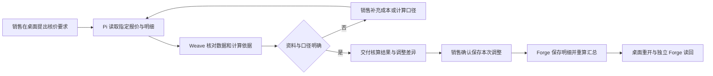

# 销售报价核算与调整

这是合同之外的第二条复用验证场景，截取自[OTC 业务主流程](../../docs/architecture/订单到回款业务流程.md)的“方案、报价与招投标”阶段。它验证 Pi 与团队能否处理**真实业务明细、计算依据和员工修改**，让员工拿到保存一致、可以继续使用的报价结果。

**状态：2026-09-24 124 新环境尚未能从 Forge 正常页面建立本场景所需的报价草稿，因此桌面核算未开始。** Forge 的单行受控调价动作在本机 ObjectStack 17.3 PostgreSQL 集成路径通过；124 代码已部署，但没有 124 桌面报价结果。本批目标止于内部核算、员工确认修改并保存报价草稿，不包含正式审批、对外发送、客户接受或转合同。不能算入[MVP1 第一阶段](../../docs/releases/001-MVP1第一阶段里程碑.md)已验证范围。

### 124 新数据阻塞

销售以本人身份打开 Forge“销售报价”。新环境报价数为 0；页面显示“新建报价”说明文字，但没有可点击创建动作，页面源码的列表主操作也是纯文本。场景要求从既有草稿报价开始，禁止用 API 或数据库代造报价，因此在准备起点时停止。需要先修复 Forge 报价创建的正常用户入口，或确认应从哪个已存在的业务页面生成报价；随后再用新建的两行草稿验证桌面试算和受控保存。

同日只读检查进一步确认：当前销售的调整权限没有创建报价草稿的权限，页面也没有报价明细编辑/读回路径，因此不能只把说明文字换成按钮。优先接现有 ObjectStack 对象、表单和关系能力，补齐 Forge 草稿录入、明细计算、保存后详情及对应角色权限；原生 MCP 已有 `query_records/get_record`，桌面与团队仍需按员工授权接入完整明细读取。归因和关闭条件见[问题清单](../../docs/plans/问题清单.md#三场景断点的责任归属与处理方案)。

## 最小参与流程

| 参与人 | 业务职责 | 桌面助手如何参与 |
| --- | --- | --- |
| 销售小王 | 明确客户需求与报价调整、确认保存哪版 | Pi 关联报价和明细，说明变化，区分试算与正式保存 |
| 团队开发者小周 | 配置报价检查团队 | 定义输入、计算依据、缺项处理与交付内容，绑定获准的读取和核算能力 |
| 报价使用者（本批仍为销售小王） | 使用本人已保存报价继续商务工作、核验计算 | 从独立 Forge 页面/会话核对每行与汇总；不为验收新增核验员或组织范围读取角色 |

本批不新增财务人工审批。团队的核算意见属于辅助结果，不能代替正式审批；后续需要财务或主管处理时，由 Forge 原生业务流程按客户规则确定人员和事项。

读取和办理权限以实际业务角色为准。独立核验是验收方式；不得为测试给商务财务、团队开发者或临时账号授予全部报价权限。当前验证销售本人可读改、无关员工拒绝；后续真实接力出现时再验证对应参与人的授权读取。

## 账号与进入方式

销售从桌面“我的工作”与 Pi 开始；开发者从“开发中心 / 智能体团队”配置。浏览器 Forge“销售报价”及报价记录/明细页面用于独立读回。员工不需要知道字段名称、团队节点或计算工具名称。

本批起点是一份员工有权处理、含至少两条明细的既有报价草稿。首次由一份任意格式清单建成完整报价不在本批范围；若输入含 Excel 或 PDF，应另验证解析与真实文件传递，不能把人工抄出的文本算成原文件支持。

图示为目标路径；正式保存和恢复能力仍需验收。

## 起点与最小材料

为同一客户准备一份报价草稿：设备 A 两台，含税单价 1,000 元；服务 B 一项，含税单价 300 元；折扣均为零。税率、币种和成本来源在本次材料中明确提供。只验证含税总额时，基线应为 2,300 元；把设备 A 单价改为 900 元后，应为 2,100 元。该样例不预设客户的毛利或审批门槛。

销售可以说：

> 这份先帮我核一遍，设备数量别动。客户希望设备单价降到九百，看看总价变多少、成本有没有问题，先别改原报价。

Pi 应读到当前报价和全部明细，交付试算差异。成本缺失、含税与不含税口径不一致时，明确标记无法判断毛利，并询问具体缺项，不能把空成本当零成本得出高利润结论。

## 执行大纲

1. 小王用本人账号登录桌面，打开对应报价工作，用自然语言说明希望核算的内容。Pi 识别准确报价、当前草稿和明细，不以客户名猜测多份报价中的哪一份。
2. Pi 获取获准的报价、产品/服务明细、数量、单价、折扣、税率和成本依据，标记读取时的版本。员工只要求试算时，不改 Forge 记录。
3. Pi 根据已发布说明找到能接报价检查的团队，把本次对象、结构化明细与依据交给 Weave。团队接单后独立运行，Pi 不持续等待。不能只传总价或把明细塞进不可核对的摘要。
4. 团队核对缺项与计算依据，交付逐行差异、汇总金额、成本数据来源和待确认事项。需要确定性计算的金额由规则或工具计算，模型负责解释；不凭语言生成一个看似正确的总数。
5. 小王说“设备改九百，服务不变，就把这版保存下来”。Pi 将明确授权绑定到这份报价、本次改动和当前版本，展示可检查的差异摘要后执行，不再要求一次同义确认。员工若改口，尚未提交的旧改动不得继续。
6. 通过 Forge 受控业务能力保存指定明细的调整并重算主表。Forge 检查员工权限、草稿状态、旧版本是否过期及数值有效性。每行金额与汇总应属于同一次完整结果；失败时不能显示“已保存”。
7. 桌面展示实际保存的报价、变化及核算依据。团队建议、员工确认、业务保存分别显示；接单成功或团队运行成功都不能替代报价保存成功。
8. 小王重开工作仍能取得保存后的明细和核算结果；销售在独立 Forge 页面/会话查看本人同一报价，核对本例设备单价 900 元、服务单价 300 元、数量不变、总额 2,100 元。报价保持草稿，供后续正式流程使用。

## 报价检查团队与开发者配置

最小团队可由一个负责人承担明细检查和汇总；确有需要时再增加成本检查成员。是否分工由工作量决定，不照搬合同的交付/商务双审。

1. 小周在桌面新建团队，写清接受报价及完整明细，返回数值差异、计算依据、缺项与建议；示例兼容物料和服务，不限定某个合同模板。
2. 为成员选择报价/明细读取及允许使用的核算能力。试算与保存范围分开；只有获员工本次授权的保存动作才能写入。若当前能力目录没有明细调整动作，明确记录缺口，不给团队通用数据写入来绕过。
3. 在流程中明确输入来源和字段映射，成员实际收到数量、单价、税率等结构化内容。桌面当前字段映射是否足够、调试是否可载入真实明细，均须现场验证。
4. 保存团队配置前不存储；用同一份明细分别试算原价、改单价和缺成本三种情况，查看实际调用与输出。隔离调试通过后更新团队，由销售账号验证实际保存和独立读回。

## 页面、系统与模块对照

| 环节 | 用户入口与职责 | 当前代码依据与证据状态 |
| --- | --- | --- |
| 报价对话、版本与授权 | 桌面“我的工作”/ Pi | [桌面主入口](../../desktop/src/App.tsx)、[能力桥](../../desktop/electron/main/enterprise/agent-bridge.ts)已有；报价明细路径未实跑 |
| 团队配置与明细传递 | 桌面开发中心 → Weave → Loom | [开发中心](../../desktop/src/pages/DevelopmentPage.tsx)、[步骤输入配置](../../desktop/src/pages/team-workspace/StepInspector.tsx)、[调试面板](../../desktop/src/pages/team-workspace/TrialPanel.tsx)；完整映射与同材料调试待验证 |
| 数据与核算 | Forge 报价及明细，按业务规则计算与保存 | [报价对象](../../platform/forge/apps/forge-objectstack/src/objects/sales.object.ts#L21)、[金额重算动作](../../platform/forge/apps/forge-objectstack/src/actions/sales.action.ts#L17)已有；动作目录授权与一体保存尚未验证 |
| 结果与消息 | 桌面“我的工作”及 ObjectStack 收件箱 | [企业工作页](../../desktop/src/pages/EnterpriseWorkPage.tsx)已有通用入口；报价和结果版本能否续接尚未验证 |
| 独立读回 | Forge“销售报价”与报价记录/明细 | [CRM 页面](../../platform/forge/apps/forge-objectstack/src/pages/sales-crm-service-pages.page.ts#L102)为通用列表实现；详细编辑与逐行读回可用性须现场验证 |

## 失败或中断后如何继续

以下为验收目标，尚未证明已具备。

| 员工遇到的情况 | 应有行为与继续方式 |
| --- | --- |
| 缺成本、税率或价格依据 | 指出缺哪一行、哪项口径；保留已完成核算，不生成虚假的毛利判断 |
| “只看看”“还是别改了” | 不保存原报价；在未提交时使旧修改授权失效。已保存的结果需明确告知，再按新授权修改 |
| 员工关掉桌面、团队运行失败 | 结果或失败原因留给原账号；重开可接回报价、原输入及差异继续处理 |
| 明细保存一半失败 | 不声称完整成功；Forge 保持原完整版本或给出可确定恢复的未完成状态，不让新明细与旧汇总冒充同一版 |
| 重复请求或保存回执丢失 | 核对原请求和当前报价结果，避免重复加行、叠加折扣或再次调整价格 |
| 另一员工已改价或已提交审批 | 拒绝旧版本覆盖，展示最新差异；不能仅因页面隐藏按钮就认为服务端阻止了写入 |
| 成本字段无权读取 | 允许继续获准的金额核算，明确成本分析不可用；不扩权或用模型补出成本 |

## 已有能力、缺口与业务差异

| 判断 | 内容及处理位置 |
| --- | --- |
| 仅有代码依据 | Forge 已有主表和明细、金额/税额/成本汇总动作；当前未证明桌面能读取完整明细、保存员工修改并续办 |
| 核算前必须验证 | 重算动作累计既存 `taxed_subtotal`；数量或单价变化后，明细小计是否一同重算尚无完整证据。必须保证明细与汇总一致，不能用模型口述金额填补 |
| 已实现、仍待桌面验收 | Forge `quotation_adjust_line_price` 已实现单行改价、同事务重算、版本检查和原请求回执，本机原生 PostgreSQL 有证据且已部署 124；应复用该动作，不能继续将其记录为尚未开发。当前仍缺普通报价录入路径、完整明细读取及本场景的桌面保存与独立读回 |
| 通用产品缺口 | 结构化字段映射、同材料调试、本人结果续办及真实进度，与合同/线索共用；不能逐场景另造回执和恢复机制 |
| 客户可变规则 | 折扣权限、税率与舍入方法、成本来源、毛利算法和门槛、报价模板与有效期。先确定样例口径；系统必须有能力执行规则、记录依据并拒绝不一致结果 |
| 后续规划 | 正式报价审批、发送给客户、客户接受、转合同、从任意文件新建报价。现有提交/同意/发送动作主要改变状态，不能据此认定审批人接力或外部发送已经实现 |

规则允许按客户变化，但金额一致性、员工权限、修改留痕和不中途丢失结果是本批共性要求。“毛利门槛尚未统一”不构成允许错误金额保存的理由。

## 本批穿插验证的关键断点与通过条件

- 员工无需口述字段名，Pi 能找到指定报价和全部明细；相似报价不会串用。
- 试算不写入；明确保存后只改变授权行，基线 2,300 元变为 2,100 元，数量与服务价格不变。
- 缺成本时返回具体缺项；补齐后使用明确口径重算，结果附依据，不把未知值当零。
- 重复、断线和重开不重复加行或改价；两名员工并发时不覆盖新版本。
- 团队结果、业务保存和后续审批状态不混淆。原发起人重开能继续使用结果，独立账号逐行核对保存内容。

当次证据写入 `docs/acceptance/`，记录原始明细、员工改动、计算口径、团队/组件版本、实际保存与独立读回，以及未通过环节。本页目前只有后续验证方案与代码依据，没有这条桌面业务链路的验收记录。
