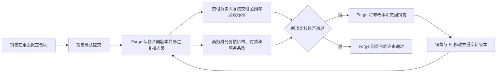

# 销售合同跨员工闭环

这是第一条端到端真人验收场景，用来证明产品主链路，不代表系统只服务销售。

本场景截取自[OTC 业务主流程](../../docs/architecture/otc-business-flow.md)的“SOW、合同与订单”阶段。

## 最小三人流程

| 参与人 | 业务职责 | 桌面助手如何参与 |
| --- | --- | --- |
| 销售小王 | 拟定合同、提交评审、按意见修改和重新提交 | Pi 关联客户、商机、报价和技术协议，整理合同版本及附件；复杂材料工作可交给 Weave 团队 |
| 交付负责人小李 | 复核交付范围、验收标准和交付边界 | 打开本人业务事项后，Pi 读取授权材料并协助对照检查；员工提交正式意见 |
| 商务财务小陈 | 复核价格、付款条件和商务条款 | 打开本人业务事项后，Pi 协助检查付款与商务风险；员工提交正式意见 |

## 账号与进入方式

本场景使用真实账号完成切换，不能让一个管理员账号依次扮演所有参与人。

| 账号 | Forge 业务身份 | Forge 产品权限 | 进入后看到什么 |
| --- | --- | --- | --- |
| 销售小王 | 销售及合同发起人 | 普通员工 | 本人的合同草稿、提交结果和退回事项 |
| 交付负责人小李 | 交付复核人 | 普通员工 | 分配给本人的交付复核事项和授权材料 |
| 商务财务小陈 | 商务财务复核人 | 普通员工 | 分配给本人的商务复核事项和授权材料 |
| 团队开发者小周 | 被授权的团队开发者 | 智能体团队开发 | 开发中心及获准维护的团队，不因开发者身份自动获得合同业务权限 |

四个人都在 Forge 注册独立账号，并分别使用自己的 Forge 账号密码登录桌面。账号第一次登录桌面时，Weave 根据 Forge 身份自动建立绑定。管理员在 Forge 给小周授予“智能体团队开发”权限集；权限生效后，小周仍使用原来的 Forge 账号登录，不增加第二套 Weave 账号或密码。

账号切换通过桌面“设置 / 账号”退出当前账号，退出后回到空白登录首页，再由下一位员工登录。切换后必须重新读取当前账号的待办、业务权限、可用团队和开发入口；上一账号的材料、会话、待办、草稿和权限不能继续显示或被调用。实际员工各自在自己的设备登录时同样遵循这个边界，共用一台设备只是 MVP1 的隔离验收方式。

这是一件持续的业务，不是三份互不相干的待办。Forge 保存合同版本、评审事项、处理人和正式结果；Pi 只在员工打开事项后参与；Weave 只在某位员工需要团队协作时承接一段有明确交付要求的工作。员工离线期间，事项仍保存在 Forge。

## 起点

发起员工像平时工作一样，把合同文件放进桌面后直接说话。员工不需要知道系统模块、智能体名称、工作流或字段名称，也不需要把事情一次讲完整。

例如销售可能只说：

> 客户那份合同我差不多弄好了，你帮我看看还有没有漏的。技术协议就是前两天群里确认的那个，付款好像改成三三四了。没问题的话帮我往下走。

系统应结合当前打开的工作、文件和已有业务记录理解“客户”“那个技术协议”和“往下走”指什么。确实存在多个可能对象时，再用一句短问题让员工选择。

## 执行大纲

这条场景从销售在桌面与 Pi 一起拟定合同开始，不从开发中心、接口调用或 Forge 后台开始。

1. 销售小王使用自己的 Forge 账号登录桌面，打开客户资料、报价、技术协议和合同文件，用日常语言让 Pi 起草和修改合同。此时内容属于员工的工作草稿，尚未进入正式评审。
2. 销售说“好了，可以提交”“这版给他们看吧”或其他含义明确的表达。Pi 将这句话视为本次提交授权，不再要求员工重复确认。
3. Pi 识别当前合同及其关联业务，检查提交所需材料，并查询当前账号可以使用、且能承接合同工作的已发布团队。员工不选择团队、成员、运行位置或流程版本。
4. 对象唯一且材料齐全时，Pi 固定本次材料版本，把工作目标、允许读取的材料和交付要求交给 Weave。存在多个合同版本、缺少关键材料或员工表达互相冲突时，Pi 只询问无法自行确定的部分。
5. Weave 按已发布的团队配置组织智能体工作。合同协调员先整理材料，交付检查员和商务检查员并行检查，合同协调员再汇总问题、依据和建议。缺少材料时，问题回到销售原来的桌面会话，补充后继续原工作。
6. 团队结果满足接单要求后，Pi 以销售身份调用 Forge 明确开放的合同提交动作。Forge 再次检查权限和业务条件，保存不可混淆的合同版本，并根据正式业务规则确定交付负责人和商务财务处理人。
7. 小王退出后，小李和小陈分别使用自己的账号登录桌面并看到本人业务事项。两人打开事项后，各自的 Pi 只获得该事项授权范围内的合同上下文；需要复杂检查时，可以调用已发布的 Weave 团队协助，但正式意见仍由本人提交。
8. 任一复核退回时，Forge 将修改事项和两方意见交回销售。销售与 Pi 修改合同并提交新版本，Forge 按业务规则重新发起需要的复核。
9. 两项复核都通过后，Forge 保存正式评审结果并推进合同状态。销售在桌面看到结果，独立审计者能够在 Forge 中重新打开同一份合同核验版本、处理人和意见。

团队接单成功、智能体检查完成和 Forge 正式提交成功是三个不同状态。桌面必须分别呈现真实结果，不能把其中任何一个写成“合同已提交”或“评审已通过”。

## 合同智能体团队

MVP1 先配置一个可发布的“合同协作团队”，由三个智能体成员组成：

| 成员 | 团队职责 | 交付内容 |
| --- | --- | --- |
| 合同协调员 | 理解员工目标，核对材料，拆分检查工作并汇总结果 | 材料清单、缺少内容、两类检查意见及提交摘要 |
| 交付检查员 | 对照技术协议检查交付范围、工期、验收条件和责任边界 | 带材料依据的问题和修改建议 |
| 商务检查员 | 对照报价检查金额、付款条件、质保及其他商务条款 | 条款差异、风险和修改建议 |

团队流程固定表达为“整理材料 → 交付与商务并行检查 → 汇总结果”。这是智能体如何完成一段协作工作的流程，不是销售、交付负责人和商务财务三名员工之间的正式审批流程，也不是完整 OTC 流程。

## 开发者如何配置

开发者必须从桌面开发中心完成团队配置，不通过手写数据库记录、临时接口调用或场景专用硬编码完成。

### 首次建立合同团队

1. **加入开发者。** 管理员先确认小周已经拥有可用的 Forge 账号，再在 Forge 标准权限集页面给他授予“智能体团队开发”。小周重新登录桌面后看到开发中心；未授权员工仍只看到工作入口。桌面只验证和呈现结果，不提供授予身份的入口。
2. **新建团队。** 小周进入“开发中心 / 智能体团队”，点击“新建团队”，填写团队名称“合同协作团队”和团队目标。保存后进入该团队的配置工作区。
3. **定义接单范围。** 在团队资料中填写这个团队能处理什么工作、必须提供哪些材料、允许缺少哪些材料、最终交付什么结果，以及哪些业务范围可以使用。Pi 根据这些已发布信息判断员工的合同工作能否交给该团队，而不是依赖固定团队编号。
4. **建立成员。** 在“团队分工”中保留并重命名负责人，再新增交付检查员和商务检查员。列表中直接看到成员名称、职责和是否参与；选择成员后进入完整编辑区。
5. **配置职责。** 分别填写成员在团队中的职责、什么时候参与和交付要求。职责回答“负责哪部分工作”，参与时机回答“什么情况下需要他”，交付要求回答“必须返回什么”。这三项不与具体执行指令混写。
6. **配置指令。** 在成员“指令”中填写检查方法、判断依据、遇到缺项时如何返回以及结果格式。指令回答“怎样完成工作”，可以随着实际效果调整，不改变成员在团队中的身份。
7. **装载技能。** 在成员“能力”中手动编写技能，或者上传 `.md`、`.txt` 技能文件。技能可以编辑、停用或移除；MVP1 不接技能市场，也不要求开发者填写技能内部编号。
8. **选择业务能力。** 为成员选择 Forge 已开放的中文业务能力，例如查看合同、查看关联报价和读取授权附件。配置区要显示每项能力可以读取或执行什么。开发者不能填写通用数据写入、数据库语句或任意请求地址，最终调用仍由 Forge 按当前员工身份检查。
9. **确认运行方式。** Weave 团队中的智能体默认使用 Loom 执行。开发者只需看到当前运行服务是否可用以及模型配置是否完整；本场景不要求选择桌面 Pi、CLI 或具体机器作为团队成员。
10. **编排团队流程。** 切换到“工作流程”，形成“合同协调员整理材料 → 交付检查员与商务检查员并行检查 → 合同协调员汇总”的流程。开发者从团队成员中明确选择每个步骤的执行者，并配置材料不足时返回员工原会话，不能由页面按成员顺序自动代入。
11. **保存并检查。** 保存团队资料、每个成员草稿和流程草稿。页面重新读取后，名称、职责、指令、技能、业务能力和步骤关系必须保持一致；缺成员、缺能力或流程未连通时，要指出具体位置。
12. **试运行并发布。** 使用一份获准的样例合同和员工的自然表达进行不回写试运行，查看实际读取的材料、各成员结果、缺项请求和拟执行动作。结果符合要求后发布团队版本，随后销售的新工作才能发现和使用它。

### 调整已经使用的团队

1. 小周从团队切换器进入“合同协作团队”，页面默认显示当前已发布版本和正在编辑的草稿状态。
2. 点击“创建新版本”后再调整团队资料、成员或流程。已经发布的版本保持可用，正在执行的工作继续使用启动时固定的版本。
3. 调整成员职责或指令时，选择对应成员编辑并保存草稿；修改技能时可以直接改正文、重新上传或移除；修改业务能力时重新选择允许使用的 Forge 能力。
4. 新增成员后，在工作流程中明确把他加入相应步骤；成员从团队移出后不再参与新工作，但历史工作仍保留当时的成员名称、版本和结果。负责人如需更换，应先指定新的负责人，不能把团队留在没有负责人、无人汇总的状态。
5. 调整并行关系、条件或交付要求后重新检查流程，并使用同一份样例材料比较调整前后的实际结果。只看到“保存成功”不能证明调整有效。
6. 检查通过后发布新版本。新发起的工作使用新版本，既有工作不被中途替换；新版本出现问题时停止用于新工作，并恢复选择上一个可用版本。
7. 团队停止使用时执行归档。归档后 Pi 不再把新工作交给它，但历史版本、运行、材料范围和开发者操作记录仍可查看。

开发者只能读取获准的测试材料，不能因为能配置团队而查看销售、交付负责人和商务财务的全部业务数据。团队范围授权、Forge 业务权限和试运行的数据范围必须分别检查。

Forge 侧需要向这套配置提供合同、报价、客户、附件等业务读取能力，以及合同提交、复核意见、退回和通过等明确业务动作；组织、岗位、员工任职、正式处理人和业务状态继续由 Forge 与 ObjectStack 管理。开发者在桌面配置团队如何使用这些能力，但不能在团队配置里另建岗位、指定固定员工或改写业务权限。

当前桌面已有 Forge 单次登录、Weave 自动绑定、团队切换、成员增删改、职责与指令、手写和上传技能、流程草稿、检查与发布。本轮把开发中心入口改为读取 Forge 权限集。MVP1 还需补齐团队范围授权、可操作的 Forge 业务能力选择、团队接单材料与交付要求、明确的并行成员选择、自然语言试运行，以及上述配置在真实合同提交中的使用。只有这些配置实际改变团队行为并参与合同闭环，才算完成，不能以页面可编辑或接口可调用代替。

## 真人表达约束

验收人员只表达自己的工作意图，不替系统设计流程。测试对话应主动包含以下真实情况：

- 先说结论，后补背景，或者说到一半改口；
- 使用“这个客户”“上次那版”“还是老规矩”“给小李看一下”等日常说法；
- 忘记附件、金额、日期或版本，等待助手发现后追问；
- 不说团队名称、岗位标识、动作名称、运行方式和内部编号；
- 收到修改意见后只说“按他说的改一下，但付款那条先别动”这类局部要求；
- 同一句话里夹杂聊天、判断和行动要求，观察助手能否分清哪些只是背景，哪些需要真正提交。

如果只有把话说得像表单、接口参数或操作手册，流程才能继续，本场景即判定失败。

## 三个人实际怎么说

销售第一次提交时可以说：

> 这版先给他们看看吧。交付范围我按昨天会议纪要改了，付款条件客户还在磨，你们先看其他的。

交付负责人打开事项后可以说：

> 验收这块不行，写得太虚了。让销售补上现场联调和连续运行三天，别的我没意见。

商务财务可以说：

> 首付款没问题，尾款不能写上线后就付，要验收单签完。还有质保金那句跟报价不一致，退回去改。

销售收到意见后可能只说：

> 验收按小李说的补。尾款改成验收后，质保金还是按报价，帮我出下一版再送一次。

Pi 需要从这些表达中整理出明确改动和提交摘要。员工已经明确要求提交时，Pi 完成必要检查后调用相应业务动作，不再重复确认；只有对象、材料或改动含义无法确定时才追问。Weave 团队拿到的应是整理后的目标、材料和交付要求，不要求员工重新用结构化语言描述一次。

## 如何判断 Pi 和 Weave 能否正常工作

| 现场表现 | 应看到的产品行为 |
| --- | --- |
| 员工说“帮我看看” | Pi 先阅读和整理，不把这句话当成正式提交 |
| 员工说“往下走” | Pi 能根据当前合同判断下一业务环节；存在多个合理去向时才追问 |
| 员工漏说材料或关键条件 | Pi 指出具体缺项，并保留此前已经确认的内容 |
| 一次检查需要多方面专业判断 | Pi 将整理后的工作交给合适的 Weave 团队，员工不选择智能体或编排步骤 |
| Weave 团队发现材料不足 | 问题回到原工作会话，补充后从原进度继续，不重新发起一件工作 |
| 员工中途改口 | Pi 更新尚未提交的内容；已经形成正式结果的部分按业务规则处理，不能静默覆盖 |
| 员工明确说“提交” | Pi 完成提交前检查并直接推进；只有对象不清、材料缺失或内容冲突时才追问，不要求重复确认 |
| 另一名员工接手 | 其桌面只显示分配给本人的业务事项，打开后能看到足够背景，不需要销售重新转述 |

只生成一段看起来合理的文字不算成功。Pi 是否理解了当前工作，要看它选择的材料、提交摘要和业务动作；Weave 是否工作正常，要看团队是否按要求产出、缺项后能否继续，以及结果能否回到原工作。

## Workbench 应完成的工作

1. 保留原始材料并显示递交范围。
2. Pi 关联已有客户、商机、报价和技术协议；需要团队协作时选用已发布的合同团队。
3. 销售明确表达提交后，通过 Forge 业务动作登记合同版本并提交评审，不再增加一次形式确认。
4. Forge 依据项目负责人或 ObjectStack 组织、业务单元、岗位和任职关系解析交付负责人及商务财务处理人。
5. 两名处理员工在各自桌面看到本人事项，打开后由各自 Pi 获得授权范围内的合同上下文。
6. 两名员工可以并行复核，并以本人身份提交正式意见；需要复杂分析时，各自的 Pi 可调用 Weave 团队。
7. 有一项未通过时，Forge 将修改事项交回销售；销售提交新版本后按规则重新复核。
8. 全部通过后，Forge 保存正式结果，发起员工看到进度，独立审计者可从 Forge 重新读取并核验。

## 必测异常

- 材料字段不完整，需要人工确认。
- 条件分支选择不同业务动作。
- 多条明细循环处理，且每次写入可追踪。
- 执行中断后恢复，不重复登记合同。
- 额度不足后停止，调整额度后继续。
- 用户取消后，远程运行环境确认停止。
- 两名用户共享一台 Workbench Host，身份、待办、材料和历史互不串用。
- 新账号首次登录只有普通员工入口；管理员在 Forge 授予“智能体团队开发”后开发入口出现，撤销后入口与写入权限同时消失。
- 开发者只能维护获授权团队；切换回员工账号后不能继续使用开发者会话或未提交草稿。
- 员工表达含糊、遗漏信息或中途改口时，助手能保留已确认内容，只追问真正缺失的部分。
- 员工说“帮我看看”和“就按这个提交”时，系统能区分建议、草稿修改和正式提交，不能把讨论误当成授权。

## 通过条件

桌面中的成功提示、Weave 的完成状态和模型的文字说明都不是单独的通过证据。必须由第二个身份从 Forge 读取到预期业务状态，并能关联到原始工作、材料、执行尝试和处理人。

同时要检查交互负担：员工无需说技术术语，无需重复系统已经知道的内容，也无需把自然工作表达改写成固定模板。助手应把口语整理成可检查的提交摘要；员工明确表达提交后即进入提交前检查，不得用相同内容再次要求确认。
