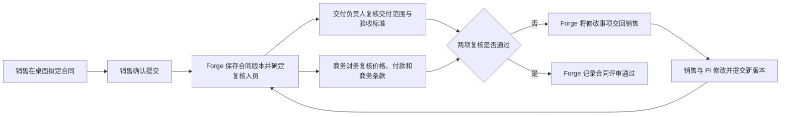

# 销售合同跨员工闭环

这是第一条端到端真人验收场景，用来证明产品主链路，不代表系统只服务销售。

本场景截取自[OTC 业务主流程](../../docs/architecture/otc-business-flow.md)的“SOW、合同与订单”阶段。

## 最小三人流程

| 参与人 | 业务职责 | 桌面助手如何参与 |
| --- | --- | --- |
| 销售小王 | 拟定合同、提交评审、按意见修改和重新提交 | Pi 关联客户、商机、报价和技术协议，整理合同版本及附件；复杂材料工作可交给 Weave 团队 |
| 交付负责人小李 | 复核交付范围、验收标准和交付边界 | 打开本人业务事项后，Pi 读取授权材料并协助对照检查；员工提交正式意见 |
| 商务财务小陈 | 复核价格、付款条件和商务条款 | 打开本人业务事项后，Pi 协助检查付款与商务风险；员工提交正式意见 |

这是一件持续的业务，不是三份互不相干的待办。Forge 保存合同版本、评审事项、处理人和正式结果；Pi 只在员工打开事项后参与；Weave 只在某位员工需要团队协作时承接一段有明确交付要求的工作。员工离线期间，事项仍保存在 Forge。

## 起点

发起员工像平时工作一样，把合同文件放进桌面后直接说话。员工不需要知道系统模块、智能体名称、工作流或字段名称，也不需要把事情一次讲完整。

例如销售可能只说：

> 客户那份合同我差不多弄好了，你帮我看看还有没有漏的。技术协议就是前两天群里确认的那个，付款好像改成三三四了。没问题的话帮我往下走。

系统应结合当前打开的工作、文件和已有业务记录理解“客户”“那个技术协议”和“往下走”指什么。确实存在多个可能对象时，再用一句短问题让员工选择。

## 真人表达约束

验收人员只表达自己的工作意图，不替系统设计流程。测试对话应主动包含以下真实情况：

- 先说结论，后补背景，或者说到一半改口；
- 使用“这个客户”“上次那版”“还是老规矩”“给小李看一下”等日常说法；
- 忘记附件、金额、日期或版本，等待助手发现后追问；
- 不说团队名称、岗位标识、动作名称、运行方式和内部编号；
- 收到修改意见后只说“按他说的改一下，但付款那条先别动”这类局部要求；
- 同一句话里夹杂聊天、判断和行动要求，观察助手能否分清哪些只是背景，哪些需要真正提交。

如果只有把话说得像表单、接口参数或操作手册，流程才能继续，本场景即判定失败。

## 三个人实际怎么说

销售第一次提交时可以说：

> 这版先给他们看看吧。交付范围我按昨天会议纪要改了，付款条件客户还在磨，你们先看其他的。

交付负责人打开事项后可以说：

> 验收这块不行，写得太虚了。让销售补上现场联调和连续运行三天，别的我没意见。

商务财务可以说：

> 首付款没问题，尾款不能写上线后就付，要验收单签完。还有质保金那句跟报价不一致，退回去改。

销售收到意见后可能只说：

> 验收按小李说的补。尾款改成验收后，质保金还是按报价，帮我出下一版再送一次。

Pi 需要从这些表达中整理出明确改动，向员工展示准备提交的内容，并在员工确认后调用相应业务动作。Weave 团队拿到的应是整理后的目标、材料和交付要求，不要求员工重新用结构化语言描述一次。

## 如何判断 Pi 和 Weave 能否正常工作

| 现场表现 | 应看到的产品行为 |
| --- | --- |
| 员工说“帮我看看” | Pi 先阅读和整理，不把这句话当成正式提交 |
| 员工说“往下走” | Pi 能根据当前合同判断下一业务环节；存在多个合理去向时才追问 |
| 员工漏说材料或关键条件 | Pi 指出具体缺项，并保留此前已经确认的内容 |
| 一次检查需要多方面专业判断 | Pi 将整理后的工作交给合适的 Weave 团队，员工不选择智能体或编排步骤 |
| Weave 团队发现材料不足 | 问题回到原工作会话，补充后从原进度继续，不重新发起一件工作 |
| 员工中途改口 | Pi 更新尚未提交的内容；已经形成正式结果的部分按业务规则处理，不能静默覆盖 |
| 员工明确说“提交” | Pi 展示本次提交摘要，员工确认后由 Forge 保存正式结果并进入下一环节 |
| 另一名员工接手 | 其桌面只显示分配给本人的业务事项，打开后能看到足够背景，不需要销售重新转述 |

只生成一段看起来合理的文字不算成功。Pi 是否理解了当前工作，要看它选择的材料、提交摘要和业务动作；Weave 是否工作正常，要看团队是否按要求产出、缺项后能否继续，以及结果能否回到原工作。

## Workbench 应完成的工作

1. 保留原始材料并显示递交范围。
2. Pi 关联已有客户、商机、报价和技术协议；需要团队协作时选用已发布的合同团队。
3. 经销售确认后，通过 Forge 业务动作登记合同版本并提交评审。
4. Forge 依据项目负责人或 ObjectStack 组织、业务单元、岗位和任职关系解析交付负责人及商务财务处理人。
5. 两名处理员工在各自桌面看到本人事项，打开后由各自 Pi 获得授权范围内的合同上下文。
6. 两名员工可以并行复核，并以本人身份提交正式意见；需要复杂分析时，各自的 Pi 可调用 Weave 团队。
7. 有一项未通过时，Forge 将修改事项交回销售；销售提交新版本后按规则重新复核。
8. 全部通过后，Forge 保存正式结果，发起员工看到进度，独立审计者可从 Forge 重新读取并核验。

## 必测异常

- 材料字段不完整，需要人工确认。
- 条件分支选择不同业务动作。
- 多条明细循环处理，且每次写入可追踪。
- 执行中断后恢复，不重复登记合同。
- 额度不足后停止，调整额度后继续。
- 用户取消后，远程运行环境确认停止。
- 两名用户共享一台 Workbench Host，身份、待办、材料和历史互不串用。
- 员工表达含糊、遗漏信息或中途改口时，助手能保留已确认内容，只追问真正缺失的部分。
- 员工说“帮我看看”和“就按这个提交”时，系统能区分建议、草稿修改和正式提交，不能把讨论误当成授权。

## 通过条件

桌面中的成功提示、Weave 的完成状态和模型的文字说明都不是单独的通过证据。必须由第二个身份从 Forge 读取到预期业务状态，并能关联到原始工作、材料、执行尝试和处理人。

同时要检查交互负担：员工无需说技术术语，无需重复系统已经知道的内容，也无需把自然工作表达改写成固定模板。助手应把口语整理成可检查的提交摘要；员工只负责确认业务内容是否正确。
