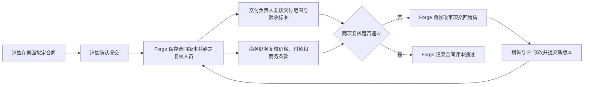

# 销售合同跨员工闭环

## 当前联调

2026-10-02 按用户要求验证 Weave、Loom 与桌面大改后的完整合同链，另建合成测试合同 `TEST-CONTRACT-20261002-001`，名称“十月联调合同·青峦工业·合成测试”，不改此前挂起的 R2。当前组合的实际运行代码核对与桌面包边界见[联调环境](../../docs/environments/开发联调环境.md)。

已由销售本人在新桌面正常登录并与 Pi 起草 DOCX/PDF，在 Forge 正常页面保存二万元草稿后重开读回；开发者小周从同一合同直链未获得记录。两份材料的金额、数量、税费、付款、虚拟地点、验收指标及质保服务已逐项核对；正文20日/24小时与协议15日/72小时保留为复核差异。正确中文渲染下 DOCX 为4页、PDF为2页，Pi“两份均两页”的自述不准确；DOCX签署栏有跨页瑕疵。起草时“不提交审批”的操作限制被写入文档，正式内部提交前须由员工授权修正，不能把它当作已批准。

销售从桌面只附本轮 DOCX，明确只读检查，实际收到合同团队接单卡片，授权范围为“只读分析”。17:10（Asia/Shanghai）工作消息显示该运行失败，原因为步骤输出 `workflow_field_unknown`；平台业务动作记录为0，未提交合同审批。销售从这条失败消息正常交给 Pi 查看，Pi正确说明未形成团队结论、不能推断业务状态，并等待新的材料复用授权，没有重放旧运行。当前阻塞正在定位，尚未进入缺件补齐、正式提交或人工复核；不把接单与失败通知送达记作完整链通过。

本轮原始页面、工作上下文、材料摘要和渲染证据保存在本机私有 `contract-e2e-20261002/` 目录，凭据不写入证据。初次文件起草因文档依赖安装等待而取消，随后使用本机预装文档环境恢复；被遮挡桌面的后台可访问性状态曾长时间未更新，不能据此断言前台取消卡死。独立状态恢复竞态探针另行私下保全，未当作现场根因或混入产品修复。

## 已有联调证据

**2026-10-02 R2实际续批：** 最终桌面修复包完成2261项测试/1既有跳过、65/65Electron及DMG/ZIP完整门禁，随后销售从原返修待办重新打开独立Pi会话，正常选定上述两份R2并发送明确递交原文。实际专用工具返回`resumed`、无错误；没有旧拒绝后的重放或改传文件。独立Chrome在原合同审批tab读回“第2轮/待审批/0÷2组”，交付小李与商务小陈为两个真实待处理账号。销售最后重新登录刷新，原返修待办为0、来源错误0。两人分别以本人桌面登录并读取两份本轮原件，20日/72小时均存在、旧15日/24小时均不存在、来源错误0；均从本人事项进入只读Pi复核。

小李只读复核还列设备验收指标、指定地点、质保服务细则等未给依据；暂未提交同意或退回，不能把限定测试意见当作完整业务通过。用户已被询问本轮是补业务资料后完整复核，还是仅对既有合成材料继续流程功能验证；商务只读复核与工程收尾继续。当前真实业务终点为R2成功递交并回到两人第2轮复核，双方通过及最终业务状态仍待实际验证。

**2026-10-02 新组合续验（进行中）：** 当前服务以总仓版本锁及环境说明为准，新QA沿用原销售账号、原返修事项与原材料。销售从正常“我的工作”读取两份R1办公原件，无来源错误；独立Chrome正常登录并从框架合同列表打开本张合同的审批tab，读回“已退回修改”，原生历史含小李09-30的退回意见（20日历日/72小时、价格付款质保保持不变），没有重放退回。此前本张办公原件的浏览器独立退回读回缺证已补，合同列表仍显示领域状态“待审批”，办理依据保持原生事项。

从该返修待办点击“交给Pi继续”后，实际新轮仅调用`gooeypi_enterprise_current_item_actions`，收到“请从本人我的工作重新打开当前审批事项”；Pi据此误称没有打开绑定。后续源码/回归确认不是会话绑定丢失，而是已绑定的revision用途被仅接受review的目录拒绝。最小修复只读识别返修并指向专用revision_submit路径，不生成复核执行引用；自动开场也不能当作递交授权。桌面修复已形成提交，116项相关回归、类型、静态及构建/体积检查通过，当前完整新包检查进行中；仍不能用提示词伪造授权或直接调用审批接口绕过。新包完成2249项测试/1既有跳过、65/65Electron与DMG/ZIP完整门禁后，正常返修开场实际调用目录成功，无原409。销售正常附两份R2并明确递交；两次专用递交均在上传前因原文比较被拒。安全长度/相等比较确认模型逐字传回257字员工原文，Host却比较1151字附加材料元数据的runtime prompt，属于第二个真实接入阻塞。后续修复由可信桌面保存员工原文/选件、Host复算完整提示并继续核对全文会话证据，修订与续授权比较员工原文；同时修补修订入口未强制当前选件的缺口，未选第三文件、错摘要和元数据均在上传前拒。284项相关回归、类型、静态、构建与原预算检查通过，最终新包完整检查进行中，真实R2仍待重新验证。独立Forge正常详情同时读回条款摘要已为20天/72小时，未重复覆盖。场景再次暂停，R2未上传、未递交、未续批，两份既有R2原件只读核对保留原字节：DOCX37398字节、SHA-256 `554ab8aca4910a8e90e31ee0bfb35262dd8380b0fb892687bd4518d0a2fd98c0`，仅24→72小时；PDF79872字节、SHA-256 `99fcf0da413fff65db95cdf6c3203d53aad6c7d215c9354f1abea7af55030051`，复核说明前仅15→20天，说明更新为授权范围。逐页原生DOCX预览/PDF渲染可读，无价格付款质保改动；bundled LibreOffice首次render缺中文字体，不当作原件损坏或该renderer已通过。失败工具名/原因与私有材料差异在本机0700取证目录及0600文件保存；根docs与组件检查不作为本轮业务通过。

**9/30 本轮验收现场：** 小周通过本人桌面 Pi 保存、试跑、更新合同团队并读回完整材料参数绑定；随后在同一团队调整汇总步骤的实际调用顺序。小王正常页面创建 `MVP1-C-OFFICE-20260930-001`，选择同编号 DOCX/PDF；两份原件固定清单及实际下载摘要一致，只读检查、唯一消息和打开交 Pi 已通过。11:54 原生附件配置错误导致提交失败、事务回滚，修复 `07516ba4` 部署后，13:09 同一合同产生实际成功提交回执；小王正常 Forge 页面读回“待审批”和两份原件。小李本人桌面打开原生事项、读取两份原件，并让 Pi 复核出 20/15 日、24/72 小时差异。没有用桌面审批按钮代替本轮 Pi 验收；Pi 办理原生意见的后续进展见下文。

**当前办理能力：** 修复前，原生审批服务具备同意与退回能力，但小李 MCP `list_actions` 为零，审批辅助会话也只开放读取。系统对象的原生动作被 MCP 默认过滤，单独增加 `ai.exposed` 不足以开放。Forge 原生审批连接已合入 main `eb90f556`，真实 ObjectStack CLI/MCP/PG 验证通过，标准 124 发布通过；桌面通用桥与发布收尾 `6a753781` 已推送并集成，140 定向及默认覆盖率 2123 通过/1 跳过、63/63 E2E、类型/静态/构建与包后校验通过。桌面只按当前事项的允许动作目录调用；不扩大审批人的通用合同权限、不修改 ObjectStack 源码、不把人名或合同规则写入桌面。共享约束见[当前事项办理契约](../../contracts/v1/README.md#审批辅助与当前事项办理范围)。固定IP登录恢复后，小李从当前事项新建只读辅助会话，再在新轮次明确授权退回。Pi读取真实允许动作目录并调用退回；回执判为结果未知，原生历史已有本次意见但缺少动作/版本证明，重新读当前事项已不可由小李处理。未重放。小王固定IP默认桌面登录后，实际收到同一合同一条“需要修改”及准确20天/72小时意见，并从该待办交Pi继续；Forge浏览器独立读回仍待补。Pi已从本人待办基于R1原件生成两份R2办公文件，并修正中文字体和PDF换行。整页检查及全文比对确认正文仅24→72小时、协议仅15→20天及授权复核说明变化；价格、付款、质保等原文保留。当前文件未递交，合同字段摘要同步及Forge浏览器独立读回待完成；尚无R2续批或双方通过。

**当前回执解析修复：** 真实ObjectStack runtime/HTTP MCP/PG隔离fixture单次退回返回 `ActionEnvelope.result` 内层成功回执，原桌面只把text JSON整层交严格回执解析器，误降为unknown后只读历史。已明确最小修复为绑定校验后解出内层result，保留账号、旧事项版本、材料版本及unknown规则；不改Forge、ObjectStack或增加回执库。桌面修复438882bf已推送，88项定向/2130通过1跳过/63E2E及标准QA完成，新包已小王默认登录；尚未通过真人后续审批。本轮小李实际退回与小王收到返修已实测，不重发。

**本轮新增的根因证据：** R2 替换后，首轮正文在 124 文件表为软删除、原绑定清空，blob 仍在磁盘；原生文件持有关系不识别审批快照中的字符串引用，存在历史访问及默认回收风险。124 原生通过通知已保存准确来源对象/记录；原生列表输出与桌面投影尚未把它接回当前业务上下文。已有修复 `4cd8c1a` 解决当前绑定原件的本人读取，`8a8ec48` 纠正状态文案；二者都不等于整个文件生命周期和结果续办已完成。

**权限补证：** 小李通过 Edge 正常登录，当前未分配合同草稿详情未返回记录；销售报价、商机页面均明确无权限且无记录。客户页在“全部”可见范围仍为零，仅证明该页面未显示客户，不将其计为直接记录拒绝。

**本轮接口核对：** 已用主册销售账号只读核对 124：原生 `/api/v1/meta/objects/forge_sales_contract` 返回完整动作声明，`item.actions` 为数组；同员工 MCP `list_actions` 返回其当前获准动作的摘要。当前旧动作仍只有三个字符串参数。已确认原生目录投影会丢弃文件类型/多值语义，调用方将用原生声明补全并取权限交集，不新增 Forge 目录。共享契约已明确 `materials.ids`、事项只读绑定、原件历史持有及唯一新提交动作；这些均是实施依据，不是上线或业务验收证据。

**材料基础检查结果：** Forge `aff5b89` 通过真实 PostgreSQL、ObjectStack 原生文件钩子及本地字节存储的 2 项检查：旧 schema 记录升级不丢数据、不伪造材料清单；文件替换后有效持有阻止回收，移除最后持有后正常回收。`5995e92` 的历史读取新增 PostgreSQL 检查 1 项、既有上下文/owner 检查 21 项及类型检查通过。后续 `b521f28` 已将接口 stub 换成真实 ApprovalService，验证本人/无关/跨组织/override 身份及冻结 payload、动作投影；`dda6a02` 再增加 12 份小文件的上下文读取检查，相关用例共 23/23 通过。该结果仍不证明实际桌面和 124 正常操作通过。未行动且无法证明历史参与关系的账号仍拒绝；当前事项被重提后保持 409。上述尚未部署，也不代表统一提交入口或桌面正常操作已经通过。

**原生接口检查结果：** Forge 源树 `3582c9c` 通过 ObjectStack 17.3 真实 runtime/MCP 探针：单文件 UUID、多文件数组均可调用，错误形状被拒；线索金额/日期和报价数值参数可用。目录摘要丢失类型、原生 metadata 保留声明，已有证据支持调用方补全方案。该探针的合同动作是同等声明 fixture，不能代替新业务动作、正常页面或桌面验收。

**2026-09-30 当前组合调试断点：** Forge 与 Weave 的匹配主线版本已部署，小周用本机 QA 桌面本人账号通过 Pi 读取“合同评审协作团队”，在草稿中把负责人旧提交动作换为 Forge 完整材料“提交审批”，将 `material_file_ids` 映射本轮 `materials.ids`；`primary_file_id` 由 Pi 从本轮冻结文件中选单件，不能将多文件任务错误绑定到 `materials.single.id`。桌面检查器读回草稿绑定，未更新团队。一次合成隔离试跑的模型摘要声称已提交，但活动中业务工具调用为 0；另一次明确“先看看”的合成试跑显示零写入。前一处虚假业务声明是当前发布阻断，正修复 Weave 的权威零回执投递与桌面固定展示，修复前不能以模型文字宣称正式提交。真实 DOCX/PDF 两份材料、审批退回修订与合法读回仍待从员工桌面完成。

**2026-09-29 最新实走结果：** 新合同 `MVP1-C-OFFICE-20260929-001` 已从销售小王在 Forge 页面建草稿、Pi 交两份原件给团队并正式提交审批，走到交付负责人退回、销售 Pi 制作三份 R2 修订件、原审批继续、交付与商务本人桌面复核及 Forge 独立读回。首轮审批只显示正文，没有显示技术协议；小李据此退回并留下缺件和条款差异。Forge 修改后，员工原提交正文已绑定到合同仍可由本人交回 Pi，校验仍要求合同记录属于本人组织、当前原件引用精确匹配；其他账号和失效引用继续拒绝。销售明确递交后，Forge 记录同一审批进入第二轮，合同正文、PDF 技术协议及合成指标附件都出现在小李和小陈各自的桌面待办中，三份文件字节校验和文字提取均通过。两位实际业务参与人分别在本人桌面用 Pi 核对并提交仅适用于 124 合成测试的意见；Forge 页面读回退回、第二轮通过意见、三份附件及合同“执行中”，下单、开票、发货、回款仍为 0。

**本次只证明测试环境审批接力。** 合同无客户签署与接受凭证，地址和指标是合成数据；真实税费、生效、签章、一级故障及复验等仍未确定。Forge 在两位内部复核通过后把合同显示为“执行中”，Flow 节点还写“合同生效”，但销售订单和项目动作源码另要求已登记签署日期及凭证；本轮未实测这些动作，因此只确认页面语义混淆，不能推断已经越过下单门禁。首轮附件不全的原因是 Forge 首次提交动作只绑定正文；ObjectStack 多文件字段和下一轮整包读取已经可用，124 合同团队当前又没有把 Weave 冻结资源绑定到提交动作参数。旧退回事项的最终关闭、销售最终消息交 Pi 和授权使用者的原件下载仍需分别核验。Forge 源码 `4cd8c1a` 与 Weave `b2bafac7` 已部署；总仓集成版本锁已推至 `8dcc1dd2`。定向原件读取测试 6 项、Forge typecheck、validate、build，以及总仓 `make check`、`make component-check` 通过。

**2026-09-29 状态文案补证：** Forge `8a8ec48` 部署后，销售小王在同一张尚未登记客户签署凭证的合同详情页读到“内部复核通过”，审批 Flow 节点也改用该含义；原订单、项目动作仍要求签署日期与凭证。此补证只修正员工看到的内部评审含义，未让首轮缺失的 PDF 自动进入既有审批快照，也未替代真实客户签署。

**起始状态：** 销售小王在 124 Forge 正常“框架销售合同”页面新建并重开草稿 `MVP1-C-OFFICE-20260929-001`，客户青峦工业、设备 20 台、含税总额 ¥20,000、负责人小王；当时未提交审批、未签署或下单。本轮指定的[DOCX 正文](materials/合同办公原件交接测试.docx)和[PDF 技术协议](materials/技术协议办公原件交接测试.pdf)均从原场景样例派生，合同编号与物料编码已对齐这张新草稿；正文 20 日历日/24 小时，技术协议 15 日历日/72 小时，两处差异保留供复核。文件字节与摘要见[办公材料清单](materials/办公材料清单.json)，不把旧编号原件混入新工作。PDF 已通过一页渲染和文字提取，DOCX 在本机文档查看器可读；打包渲染器缺中文字体，本轮不以它的缺字 PNG 作为原件内容依据。

小王从新 macOS QA 桌面包在同一员工轮次只附 DOCX，明确要求团队检查但说明指定 PDF 尚未附；Pi 只读核对草稿与 DOCX 后交给合同团队，运行 `run-54d3800a-a9d9-514a-9a6b-3538f92cb842` 返回有效结构化 `needs_input`、唯一缺项为指定 PDF，正文摘要与原件一致。本人收到一条消息并交 Pi；补 PDF、明确复用原 DOCX 时被拒。根因已核实为 Weave 开发试跑记录器漏转接正式 verified delivery 接口，运行保存了原文却漏存分类元数据，发成普通完成通知。团队已发布流程仍正确声明 `workbench_result_v1`，不是员工缺授权或团队未配置。

Weave 修复 `f2d418a2` 补齐原接口转接，正式交付 PostgreSQL CLI/Loom 矩阵使用同一装配验证，已通过本地检查及 Go CI；标准部署进行中。为恢复原消息，核对冻结流程、原 JSON、无业务动作和无后续输入后，追加与原内容完全一致的分类修复产物，保留原始不可变产物及唯一已发送通知；没有后台改合同、补造材料或重跑模型。实际修复记录与版本见[项目状态](../../docs/项目状态.md)。补件重新接单、后续完整只读检查、正式提交、人工退回及 Office 原件修订仍待验。124 Forge 已运行 `sha-721f2214564c`；QA ZIP 校验通过，DMG 因外部下载超时未完成。旧合同 `MVP1-C-20260925-001` 的通过记录属于此前 Markdown 材料与原审批轮次，不能替代本轮办公原件验收。

**2026-09-29 当前续验：** 小周在本人桌面通过 Pi 沿用草稿修订 11，用新的合成缺正文与技术附件输入隔离试跑；124 新版 Weave 返回完整的逐步输出、工具活动和 `needs_input`，无业务写入。Pi 据此通过正常入口更新团队并读回配置。小王从本人桌面打开当天较新的只读失败消息，在新轮次明确授权复用其中已冻结的《合同样例.docx》和《技术协议样例.pdf》；Pi 不再要求重传，通过原团队接单。124 只读清单核对新运行与失败运行的两份 Forge 文件引用和 SHA-256 各自一致，业务动作范围为空；新运行完成并仅产生一条新结果消息。小王打开消息交 Pi 后，准确读到交付 **20/15 日历日**、连续运行 **24/72 小时**、验收期限、付款及质保待确认项。小王在 Forge 本人合同页面刷新读回 `MVP1-C-20260925-001` 仍为“执行中”、更新时间仍为 2026-09-26 09:43:13；本轮只读检查没有被写成新的合同业务状态。此前旧“需要补充”通知在新运行完成后仍被旧桌面误列为待处理；后续桌面 `0a20c531` 通过 Forge 现有的本人消息来源核对同一工作链，真实 QA 包重开后“待我处理”从 1 变为 0，旧通知保留在历史工作消息中。ObjectStack 原生收件箱仍只承载通知及已读状态，桌面的已办判断是对已核验团队事件的投影。办公原件正式审批、退回修订和多人复核未因这次只读检查而重验。

**2026-09-29 缺材料与续办实走：** 小周在真实桌面通过 Pi 保存了合同团队“理解任务”的最小指令补充，用合成缺项输入完成隔离试跑，输出 `needs_input`；因 Weave 开发试跑活动缺中间步骤输出，Pi 正确保留草稿、未更新团队。此前小周手工配置的“可要求补充材料”已发布版本继续用于员工任务。小王从本人桌面只附《合同样例.docx》，明确指定却未附《技术协议样例.pdf》，Pi 以空业务动作范围交给合同团队。团队完成并形成唯一“需要补充”本人事项，小王打开交 Pi，Pi 准确指出仅缺该 PDF，正文原件已核验、条款待人工判断不作文件缺失，也没有声称已提交审批。小王在续办会话只附 PDF 并明确授权复用原冻结 DOCX 时，Pi 因当前交接工具不能把上轮已冻结文件与新附件安全合成一次新输入而停止；员工随后在同一轮重新附齐 DOCX/PDF，Pi 核对 DOCX 指纹一致并再次只读交接。第二次运行真实创建，但在 Loom 恢复工具消息时失败，桌面收到一条失败消息；**两份原件的完整团队检查、正式审批及修订后多人复核在本轮未通过**。已保留失败现场，不重放该请求；缺口分别归属桌面续办材料选择与 Weave/Loom 运行恢复，详见[项目状态](../../docs/项目状态.md)。

**2026-09-29 办公原件只读交接已实走：** 小王在真实桌面 Pi 附上下面两份 DOCX/PDF 原件，只授权合同团队检查。原 422 已定位为客户端 `If-Match` 未使用带引号的 ETag，以及 Weave 在附件校验拒绝后仍继续登记；桌面与 Weave 均已修复。原冻结输入经同一请求恢复后只产生一条运行，团队实际核验两份原件字节及摘要，结果准确指出 **20 天 / 15 天**、**24 小时 / 72 小时**两处冲突和商务缺项。Forge 事件入口因持久环境缺少现有服务密钥曾返回 503；配置修复后，原 outbox 自动重试成功，原生通知和本人收件箱各一条。小王桌面消息从 24 增至 25，打开该消息交给 Pi 后，Pi 读到已核验原文并整理冲突与待确认事项。本轮未创建或修改 Forge 合同、未提交审批。

**恢复交互已收简：** 撤掉新增的独立检查工具和临时恢复凭据。小王重开简化后的桌面包，在原会话只说“帮我实际核对一次刚才那次交接的接单回执”，Pi 调用一次原交接恢复工具，返回“已接单，回执一致，未另建工作”；服务端仍为同一输入、同一运行和同一条已送达消息。没有重新附文件或上传。源码组合及产物见[环境说明](../../docs/environments/开发联调环境.md)；本结论覆盖办公原件只读交接、重复核对和结果续接，不替代办公原件进入正式审批、修订后多人复核等尚未重验部分。

| 交接位置 | 固定办公文件 | 唯一文本源 |
| --- | --- | --- |
| 正文主件 | [合同样例.docx](materials/合同样例.docx) | [合同样例.md](materials/合同样例.md) |
| 技术附件 | [技术协议样例.pdf](materials/技术协议样例.pdf) | [技术协议样例.md](materials/技术协议样例.md) |

文件名称、长度、MIME、原件与源文 SHA-256 见[办公材料清单](materials/办公材料清单.json)。验收时应指出合同交付期限 **20 天**与技术协议 **15 天**、连续运行 **24 小时**与 **72 小时**的差异；不得把客户字段、签章空缺或测试标记补成真实业务事实。后续修订由员工决定取舍，形成新的固定材料版本。

材料由 [build-scenario-office-materials.py](../../tools/build-scenario-office-materials.py) 从上面两份 Markdown 生成。使用配置好的 Python 文档依赖，传入覆盖中文的 TTF：`python tools/build-scenario-office-materials.py --font <中文字体.ttf>`；重新生成后须重新渲染/核对内容，并使用新清单摘要，不沿用旧文件回执。此处的办公格式是验收输入，场景规则仍只维护在本页及 Markdown 源文。

**2026-09-27 打包桌面与独立账号续验：** 当前 QA 包中，小王本人连接 124 后“待我处理”为 0，已重提并通过的合同不再列作待办；旧退回历史消息保留但不可直接续接。小周从本人桌面读回远端“合同评审协作团队”3 名成员、协调员“提交指定合同版本”业务动作、`deepseek-flash` 模型及交付/商务并行检查后由协调员汇总的流程；小周个人工作列表为 0，未看到销售消息。小周在独立 Forge 浏览器的合同正常页面得到无权限和 0 条合同。小王从同一页面打开技术协议原文；匿名访问其正式文件地址返回 `AUTH_REQUIRED`，小周访问该协议、本轮正文主件及合成指标附件的正式文件地址均返回 `FILE_DOWNLOAD_DENIED`。此结论覆盖正式文件领取地址，临时签发下载链接的转发语义未验。此轮只读，没有再次修改、调试、发布团队或提交合同。现行共享契约首轮仅冻结 UTF-8 文本/Markdown/CSV/JSON；PDF/DOCX 原件直接交团队尚未实现，本轮三份 `.md` 文件的通过不能充当办公原件验收。

**2026-09-26 合同审批续验：** 销售小王、交付负责人小李和商务财务小陈分别在本人 GooeyPi 桌面与 Forge 页面完成本轮操作。小王用 Pi 修改正文、技术协议并新增合成指标附件，通过退回事项绑定的修订能力递交到同一张合同、同一条审批；Forge 第二轮由小李和小陈各自提交测试范围意见，读回“已通过”，合同进入“执行中”。销售桌面收到唯一 Forge 结果消息；小王在 Forge 合同页面打开本次主件、技术协议和指标附件，三份文件正文均可读取。下单笔数仍为 0，未签署、付款、交货或创建订单；两位复核意见明确仅用于 124 测试，不代表真实商务批准。
**旧待办修复及版本边界：** 初测发现销售待办在修订重提后仍显示第一轮退回事项。Workbench 候选现在依据 Forge 原生审批动作历史过滤已 resubmit 的旧返回项；Forge 上下文插件对已重提的过期返回事项返回状态已变化。Forge 修复提交 a2e2748 已部署并健康。桌面 42 项定向测试、类型检查和构建通过；重启本机 GooeyPi 开发窗口后，销售刷新“待我处理”为 0，终态 Forge 消息仍在，旧退回历史消息保留但续接按钮禁用。桌面改动仍是总仓未提交候选，当前窗口运行 localhost 开发服务；团队目录、Weave 运行等读取报告 fetch failed，因此此结果不是已发布桌面版本或完整 Weave 回归证据。
**材料文案遗留：** 本轮绑定三份文件均可读取，但正文与技术协议前言仍写“尚未提交审批/未写入 Forge”；该句是起草阶段状态，进入审批材料后已过期。两位复核意见已记录；应在后续材料生成路径中修正，且真实合同签署前仍须补齐所有未确认业务字段。

**前序续验记录（正式审批前）：** 小王在 Forge 正常页面创建并读回同一测试合同 `MVP1-C-20260925-001` 草稿。列表原先强制读取无权的订单/项目导致整页 403；Forge `93e7abb` 改为辅助信息不可见时仍展示本人合同并明确“不可查看”。小王 Pi 将原合同与技术协议只读交团队，Weave `run-eb3d249a-35e3-5fe5-bdbe-2c071ff7086b` 完成并返回冲突/缺项消息。Pi 曾把真实 SKU 编码与物料编码混同、又自行填未确认日期；经 Forge 规格目录核对后本地修订稿已更正。Forge `a700988` 修复草稿自动填签订/生效/到期日期及原生编辑清空日期时报数据库错误。小王在同一草稿清空三日期、改为 72 小时与双方签署、绑定两份修订附件；本人权限读取的远端文件字节摘要与本地成果一致。随后小王明确授权内部测试审批，Weave `run-83182c50-9d82-56ac-8180-75244b17ab97` 因 Loom 恢复工具历史时丢失 assistant 工具调用而失败，Forge 保持草稿且桌面收到唯一失败消息。Loom `6990bed` 已修复并由 Weave `135fcaa` 锁定，CI 已通过、124 部署尚在进行。当前合同正式审批、人类复核与退回修订仍未通过；124 原生复核岗位/任职缺失，正按原场景处理。

这是第一条端到端真人验收场景，用来证明产品主链路，不代表系统只服务销售。

**前序只读续验记录（正式审批前）：** 现役 Weave 模型凭据恢复后，小王从历史失败消息回到 Pi。第一次在新轮次重附 `合同样例.md` 和 `技术协议样例.md` 时，桌面错误地走“修订上一份最终交付物”，Weave 因旧运行在成员启动前失败而拒绝，未创建新运行。当前本机桌面候选改为对**无业务动作且无最终交付物的失败运行**保留原工作会话/输入版本校验，重新提交本轮获准材料；失败消息不再给 Pi 技术化原始包和旧恢复凭据。小王在重启后的真实桌面重新附加两份原文，Weave 新运行 `run-bbc2b254-89a2-53ce-80be-aade08cbf1d7` 的固定委托清单与原文件名称、字节数及 SHA-256 一致，动作范围为空；合同团队成员完成实际检查，终态事件只送达一条。小王在“我的工作”打开结果交 Pi，读回交付期 20/15 天、连续运行验收 24/72 小时及商务缺项。**本轮只读检查与结果续接通过；正式合同草稿、提交审批、退回修订、两位复核人通过和合法使用者打开最终材料仍未走通。**样例正文有意缺少真实主体、签章和条款取舍，不能将“这版给他们看看”升级为正式审批授权。当前桌面修复尚在总仓未提交工作树，版本状态以[项目状态](../../docs/项目状态.md)为准。

**阶段状态（2026-09-23）：** 已按用户确认，将“真实团队交接、Forge 提交审批、交付负责人桌面查看并退回”归档为[MVP1 第一阶段](../../docs/releases/001-MVP1第一阶段里程碑.md)。本页后续流程图和通过条件仍是完整目标；团队缺项续办、审核者本人 Pi 办理、退回后修订材料递交、双方通过和最终交付未完成，不能因阶段标记而记为已验收。实际观察见[真人路径记录](../../docs/acceptance/015-合同场景真人路径纠偏.md)。

**124 修复组合现场复验（2026-09-24）：** 销售小王能打开合同列表及“新建合同”表单。合同列表上出现“您没有执行此操作的权限，如需访问请联系管理员”提示，结果为 0 条；新建页仍可进入。选择现有客户“青峦工业”并添加一行后，“物料规格”下拉为空。管理员已通过供应链“基础资料 → 物料管理”正常表单创建场景设备主数据 `MVP1-EQUIP-A-20260924`，重开物料列表可读回；它仍未成为可选 SKU。管理员和销售的运行菜单及命令搜索均未找到文档所载“业务设置 → 商品管理 → 规格与价格”入口。合同草稿没有保存或提交，团队运行及人工审批均未启动。此前物料主数据因 `trade_goods/traded` 编码不一致导致的 HTTP 400 已越过；这只证明普通物料可建立，不证明 SKU 规格已维护。来源报价可选。合同表单的协同销售清单还展示“独立核验员”，本场景未选择；实际办理人仍限定销售小王、交付负责人小李与商务财务小陈，不增设核验员业务角色。以上不计为合同闭环，归因与验收见[问题清单](../../docs/plans/问题清单.md#三场景断点的责任归属与处理方案)。

**2026-09-24 新部署后的补验：** Forge `2340e35063e043d9eb8a355036eb202061839e7e` 已健康运行。用户台账确认小王具有“销售合同办理”，小周已具备“智能体团队开发”；管理员为让场景主数据入口可见，给自己分配了既有“供应链业务设置维护”权限集。正常 SKU 设置页已建立并读回 `MVP1-EQA-SKU-20260924`。小周之后以自己的 Forge 账号登录 124 桌面，Pi 读出当前可开发团队；合同协作团队成员职责和交付要求经桌面保存、切换团队后重新读取一致。本机测试账号表已补齐小周登录凭据；销售、交付、商务账号仍需各自登录，不能由管理员代办。本轮没有创建、提交或修改合同，也没有使用“独立核验员”账号。

**2026-09-24 开发者流程编辑复验：** 团队当前已保存流程仍是“理解任务 → 执行成员 → 交付结果”。在桌面画布选中执行成员并添加并行分支后，实际生成了“并行分工 → 商务检查员/交付检查员 → 汇总分支”的未保存草稿；选中并行分工节点后，“在此后添加 → 串行步骤”能够打开步骤配置表单，因此画布不是完全不能在并行区域后加节点。实际缺口是新步骤执行成员下拉只列出交付检查员和商务检查员，没有团队负责人“合同协调员”，无法配置场景要求的“并行检查后由协调员汇总”。本次试改已在桌面放弃，远端团队未保存、未调试、未发布，现行流程仍为线性。Pi 对流程的待应用提案也未能落成工作流步骤。合同团队调整因此未达到可发布状态。

**2026-09-25 桌面开发者流程实机复验：** 小周在重新启动的 GooeyPi 桌面中打开真实 124「合同评审协作团队」，从现有商务检查步骤添加交付检查并行分支，再从并行节点后添加由「合同协调员」执行的「合同结果汇总」。桌面将原商务检查步骤和新增交付检查步骤都保存为并行派发成员，汇合节点之后连接负责人汇总，再连接交付结果。首次读回发现商务分支只接收负责人整理结果，没有原始任务输入；桌面将两支线均补为接收“本次任务输入”和“理解任务的结果”。商务步骤原有交付要求也只有“返回可核验结果”；现改为只读核对价格、币种、付款节点、税费、有效期和商务责任，逐项引用合同原文并列出冲突、缺项与待确认事项，不调用写入能力。合同结果汇总指令要求合并两类检查意见并保留原文依据。保存后切到线索团队再切回合同团队，节点、执行人、商务输入映射、商务要求和汇总指令读回一致。随后开发者在同一桌面以相同两份样例完成真实 124 草稿调试，五个步骤均显示完成，最终结果明确只读并标出交付/验收口径冲突。此段验证了桌面草稿、重开和同材料调试；更新团队的实际生效情况以后续销售 Pi 的目录检索与 Weave 接单复验为准。编辑器的插入位置提示已修正为“并行汇合之后”，对应实际节点位置。

本地已准备两份明确标注“仅流程测试、不构成真实合同”的合成材料：[合同样例](materials/合同样例.md)和[技术协议样例](materials/技术协议样例.md)。两者在交付期限与验收时长上有意存在可核验差异，供团队检查和员工后续退回。2026-09-25 销售 Pi 在原合同会话里以当前材料附件重新查询团队目录，找到了合同评审协作团队及“合同复核流程”；Weave 接受了只读交付任务。本次未创建 Forge 合同、未提交审批、未修改材料或业务记录。

**2026-09-25 销售端运行状态：** Weave“我发起的工作”刷新后先显示“处理中”，再次刷新读回“已完成”；销售待办仍为 0，工作消息仍只有此前 3 条旧消息，没有本次结果。团队接单证明已发布流程可被员工发现并接受，运行完成也不证明结果已交回。正式提交、交付/商务本人 Pi 办理、退回修订及最终读回继续等待可见的团队审阅意见和业务人员对冲突条款的决定；不据此补写客户口径。

**2026-09-25 Weave 部署后材料与执行续验：** 销售小王从桌面新工作分别附加本轮 `合同样例.md` 与 `技术协议样例.md`。Pi 直接读取两份本轮文件，指出交付期 20 日/15 日、稳定运行验收 24 小时/72 小时等差异；这只是 Pi 直接分析，不算团队结果。随后在同一 Pi 会话再次把两份原始附件明确交给已发布的“合同评审协作团队 / 合同复核流程”；Pi 的交接回执列出 Weave 已接单，文件大小分别为 1,283 字节和 962 字节，授权动作为空；没有提交审批或修改 Forge。该回执未由 Weave 固定运行清单独立读回。桌面“我发起的工作”新增 9/25 18:38 的合同运行，但状态为失败，工作消息仍只有 3 条旧消息。Weave 运行记录给出的原因是 `workflow_credential_unavailable`，因此成员未实际审阅，Pi 的分析不能代替团队意见。尚未创建或提交合同，未进入人工审批、退回修订或最终读回；合同完整流程仍未通过。

**2026-09-25 结果投递数据库复核：** 补齐 Weave 事件投递配置后，Weave 与 Forge 数据库独立读回 9 条终态运行事件：7 条 `result`、2 条 `failure`，每个运行恰有一条已送达 outbox；Forge 对应 9 条通知、9 条原生收件箱项及 9 次成功投递。该读回包含此前没有消息的旧失败运行，不会重复造运行或生成重复收件箱项。它只证明服务端持久化与每次运行一条用户消息；销售桌面能否看到、重开后能否交给 Pi 尚待实机核验。Weave 运行凭据已确认同时存在运行环境未加载密钥与镜像密文不可解两处阻塞。

**2026-09-26 凭据恢复部署：** Weave `0d3f954e621b08a68fc3220a1f0bbee55726ab4c` 已通过 CI 与标准部署，容器加载 DeepSeek 服务凭据。以管理员身份通过现有系统模型镜像接口恢复 `system/deepseek`；审计回执为 `credential_rotated`，provider revision 前后均为 1，冻结服务引用未更改。尚未发起新合同材料运行，因此模型实际执行、Weave 固定运行材料清单、桌面结果消息和 Pi 续接仍待验。Mac 当前锁屏，不能把服务端恢复记作桌面闭环。

本场景截取自[OTC 业务主流程](../../docs/architecture/订单到回款业务流程.md)的“SOW、合同与订单”阶段。本批以合同正式评审通过为终点，必须包含团队退回和人工退回各一次；范围以[MVP1](../../docs/plans/MVP1阶段说明.md#当前先交付第一条完整业务流)为准，职责规则以[统一产品架构](../../docs/architecture/系统架构设计.md#运行反馈业务动作与员工续办)为准。

## 最小三人流程

| 参与人 | 业务职责 | 桌面助手如何参与 |
| --- | --- | --- |
| 销售小王 | 拟定合同、提交评审、按意见修改并递交修订材料 | Pi 关联客户、商机、报价和技术协议，整理合同版本及附件；复杂材料工作可交给 Weave 团队 |
| 交付负责人小李 | 复核交付范围、验收标准和交付边界 | 打开本人业务事项后，Pi 读取授权材料并协助对照检查；员工提交正式意见 |
| 商务财务小陈 | 复核价格、付款条件和商务条款 | 打开本人业务事项后，Pi 协助检查付款与商务风险；员工提交正式意见 |

## 账号与进入方式

本场景使用真实账号完成切换，不能让一个管理员账号依次扮演所有参与人。

| 账号 | Forge 业务身份 | Forge 产品权限 | 进入后看到什么 |
| --- | --- | --- | --- |
| 销售小王 | 销售及合同发起人 | 普通员工 | 本人的合同草稿、提交结果和退回事项 |
| 交付负责人小李 | 交付复核人 | 普通员工 | 分配给本人的交付复核事项和授权材料 |
| 商务财务小陈 | 商务财务复核人 | 普通员工 | 分配给本人的商务复核事项和授权材料 |
| 团队开发者小周 | 被授权的团队开发者 | 智能体团队开发 | 开发中心及获准维护的团队，不因开发者身份自动获得合同业务权限 |

四个人都在 Forge 注册独立账号，并分别使用自己的 Forge 账号密码登录桌面。账号第一次登录桌面时，Weave 根据 Forge 身份自动建立绑定。管理员在 Forge 给小周授予“智能体团队开发”权限集；权限生效后，小周仍使用原来的 Forge 账号登录，不增加第二套 Weave 账号或密码。

账号切换通过桌面“设置 / 账号”退出当前账号，退出后回到空白登录首页，再由下一位员工登录。切换后必须重新读取当前账号的待办、业务权限、可用团队和开发入口；上一账号的材料、会话、待办、草稿和权限不能继续显示或被调用。实际员工各自在自己的设备登录时同样遵循这个边界，共用一台设备只是 MVP1 的隔离验收方式。

这是一件持续的业务，不是三份互不相干的待办。Forge 保存合同版本、评审事项、处理人和正式结果；Pi 只在员工打开事项后参与；Weave 只在某位员工需要团队协作时承接一段有明确交付要求的工作。员工离线期间，事项仍保存在 Forge。

## 起点

发起员工像平时工作一样，把合同文件放进桌面后直接说话。员工不需要知道系统模块、智能体名称、工作流或字段名称，也不需要把事情一次讲完整。

例如销售可能只说：

> 客户那份合同我差不多弄好了，你帮我看看还有没有漏的。技术协议就是前两天群里确认的那个，付款好像改成三三四了。没问题的话帮我往下走。

系统应结合当前打开的工作、文件和已有业务记录理解“客户”“那个技术协议”和“往下走”指什么。确实存在多个可能对象时，再用一句短问题让员工选择。

## 执行大纲

这条场景从销售在桌面与 Pi 一起拟定合同开始，不从开发中心、接口调用或 Forge 后台开始。

1. 销售小王使用自己的 Forge 账号登录桌面，打开客户资料、报价、技术协议和合同文件，用日常语言让 Pi 起草和修改合同。此时内容属于员工的工作草稿，尚未进入正式评审。
2. 销售说“好了，可以提交”“这版给他们看吧”或其他含义明确的表达。Pi 将这句话视为本次提交授权，不再要求员工重复确认。
3. Pi 识别当前合同及其关联业务，检查提交所需材料，并查询当前账号可以使用、且能承接合同工作的已发布团队。员工不选择团队、成员、运行位置或流程版本。
4. 对象唯一且材料齐全时，Pi 固定本次材料版本，把工作目标、允许读取的材料和交付要求交给 Weave。存在多个合同版本、缺少关键材料或员工表达互相冲突时，Pi 只询问无法自行确定的部分。
5. Weave 按已发布的团队配置组织智能体工作。合同协调员先整理材料，交付检查员和商务检查员并行检查，合同协调员再汇总问题、依据和建议。缺少材料时，本次运行以“需要补充”结束，系统把结果送入销售的原生收件箱。接单后 Pi 不等待团队结果；销售可离线后从消息继续原工作，桌面把检查意见和本次固定材料交给 Pi，补充新版本后再次递交团队。此时尚未进入正式合同审批，不创建 Forge 修改事项。
6. 团队结果满足要求且销售已明确授权正式提交评审时，获授权的成员通过 Forge MCP 调用合同提交动作；若销售只说“这版给他们看看”，先交付检查结果，不能据此发起正式审批。Forge 再次检查权限和业务条件，保存不可混淆的合同版本，并根据正式业务规则确定交付负责人和商务财务处理人。
7. 小王退出后，小李和小陈分别使用自己的账号登录桌面并看到本人业务事项。两人打开事项后，各自的 Pi 只获得该事项授权范围内的合同上下文；需要复杂检查时，可以调用已发布的 Weave 团队协助，但正式意见仍由本人提交。
8. 任一复核退回时，Forge 将原事项、退回意见和冻结材料交给销售桌面。销售把事项交给自己的 Pi，在对话中一起修改。销售明确要求递交修订材料后，桌面调用 Forge 业务动作；Forge 校验销售身份、完整新版本、材料摘要和当前事项，把修订材料绑定到原审批并继续原流程。员工不打开审批状态表单，不手动选择原生流程节点。本批新版本重新完成交付、商务两项复核，不沿用旧版本通过结果。
9. 两项复核都通过后，Forge 保存正式评审结果并推进合同状态。销售在桌面看到结果，独立审计者能够在 Forge 中重新打开同一份合同核验版本、处理人和意见。

团队接单成功、智能体检查完成和 Forge 正式提交成功是三个不同状态。桌面必须分别呈现真实结果，不能把其中任何一个写成“合同已提交”或“评审已通过”。

## 合同智能体团队

MVP1 先配置一个可发布的“合同协作团队”，由三个智能体成员组成：

| 成员 | 团队职责 | 交付内容 |
| --- | --- | --- |
| 合同协调员 | 理解员工目标，核对材料，拆分检查工作并汇总结果 | 材料清单、缺少内容、两类检查意见及提交摘要 |
| 交付检查员 | 对照技术协议检查交付范围、工期、验收条件和责任边界 | 带材料依据的问题和修改建议 |
| 商务检查员 | 对照报价检查金额、付款条件、质保及其他商务条款 | 条款差异、风险和修改建议 |

团队流程固定表达为“整理材料 → 交付与商务并行检查 → 汇总结果”。这是智能体如何完成一段协作工作的流程，不是销售、交付负责人和商务财务三名员工之间的正式审批流程，也不是完整 OTC 流程。

## 开发者如何配置

开发者必须从桌面开发中心完成团队配置，不通过手写数据库记录、临时接口调用或场景专用硬编码完成。

### 首次建立合同团队

1. **加入开发者。** 管理员先确认小周已经拥有可用的 Forge 账号，再在 Forge 标准权限集页面给他授予“智能体团队开发”。小周重新登录桌面后看到开发中心；未授权员工仍只看到工作入口。桌面只验证和呈现结果，不提供授予身份的入口。
2. **新建团队。** 小周进入“开发中心 / 智能体团队”，点击“新建团队”，填写团队名称“合同协作团队”和团队目标。保存后进入该团队的配置工作区。
3. **定义接单范围。** 在团队资料中填写这个团队能处理什么工作、必须提供哪些材料、允许缺少哪些材料、最终交付什么结果，以及哪些业务范围可以使用。Pi 根据这些已发布信息判断员工的合同工作能否交给该团队，而不是依赖固定团队编号。
4. **建立成员。** 在“团队分工”中保留并重命名负责人，再新增交付检查员和商务检查员。列表中直接看到成员名称、职责和是否参与；选择成员后进入完整编辑区。
5. **配置职责。** 分别填写成员在团队中的职责、什么时候参与和交付要求。职责回答“负责哪部分工作”，参与时机回答“什么情况下需要他”，交付要求回答“必须返回什么”。这三项不与具体执行指令混写。
6. **配置指令。** 在成员“指令”中填写检查方法、判断依据、遇到缺项时如何返回以及结果格式。指令回答“怎样完成工作”，可以随着实际效果调整，不改变成员在团队中的身份。
7. **装载技能。** 在成员“能力”中手动编写技能，或者上传 `.md`、`.txt` 技能文件。技能可以编辑、停用或移除；MVP1 不接技能市场，也不要求开发者填写技能内部编号。
8. **选择业务能力。** 为成员选择 Forge 已开放的中文业务能力，例如查看合同、查看关联报价、读取授权附件和“提交指定合同版本”。正式提交能力只分配给负责最终汇总与提交的成员；交付、商务检查员没有这项写入能力。配置区显示每项能力可以读取或执行什么，开发者不填写通用数据写入、数据库语句或任意请求地址，最终调用仍由 Forge 按当前员工身份检查。
9. **确认运行方式。** Weave 团队中的智能体默认使用 Loom 执行。开发者只需看到当前运行服务是否可用以及模型配置是否完整；本场景不要求选择桌面 Pi、CLI 或具体机器作为团队成员。
10. **编排团队流程。** 切换到“工作流程”，形成“合同协调员整理材料 → 交付检查员与商务检查员并行检查 → 合同协调员汇总”的流程。开发者从团队成员中明确选择每个步骤的执行者；材料不足由汇总结果明确列出并结束本次运行，不需要配置 Forge 请求修改能力，不能由页面按成员顺序自动代入。
11. **保存并检查。** 在一体化工作区完成修改后显式保存；未保存修改只留在本地内存。页面重新读取后，名称、职责、指令、技能、业务能力和步骤关系必须保持一致；缺成员、缺能力或流程未连通时，要指出具体位置。
12. **试运行并发布。** 使用一份获准的样例合同和员工的自然表达进行不回写试运行，查看实际读取的材料、各成员结果、缺项请求和拟执行动作。结果符合要求后从修改详情更新团队版本，随后销售的新工作才能发现和使用它。

### 调整已经使用的团队

1. 小周从团队切换器进入“合同协作团队”，页面默认显示当前已发布版本和正在编辑的草稿状态。
2. 直接在原位调整团队资料、成员或流程，未保存前不存储；不需要先点击编辑或创建版本。已经发布的版本保持可用，正在执行的工作继续使用启动时固定的版本。
3. 调整成员职责或指令时，选择对应成员编辑并保存草稿；修改技能时可以直接改正文、重新上传或移除；修改业务能力时重新选择允许使用的 Forge 能力。
4. 新增成员后，在工作流程中明确把他加入相应步骤；成员从团队移出后不再参与新工作，但历史工作仍保留当时的成员名称、版本和结果。负责人如需更换，应先指定新的负责人，不能把团队留在没有负责人、无人汇总的状态。
5. 调整并行关系、条件或交付要求后重新检查流程，并使用同一份样例材料比较调整前后的实际结果。只看到“保存成功”不能证明调整有效。
6. 检查通过后发布新版本。新发起的工作使用新版本，既有工作不被中途替换；新版本出现问题时停止用于新工作，并恢复选择上一个可用版本。
7. 团队停止使用时执行归档。归档后 Pi 不再把新工作交给它，但历史版本、运行、材料范围和开发者操作记录仍可查看。

开发者只能读取获准的测试材料，不能因为能配置团队而查看销售、交付负责人和商务财务的全部业务数据。团队范围授权、Forge 业务权限和试运行的数据范围必须分别检查。

Forge 侧需要向这套配置提供合同、报价、客户、附件等业务读取能力，以及合同提交、复核意见、退回和通过等明确业务动作；组织、岗位、员工任职、正式处理人和业务状态继续由 Forge 与 ObjectStack 管理。开发者在桌面配置团队如何使用这些能力，但不能在团队配置里另建岗位、指定固定员工或改写业务权限。

本场景的正式提交动作在 Forge 内部标识为 `contract_submit_material_package`，主件必须属于本次提交的完整材料集合，`material_file_ids` 由 Weave 本轮冻结的 `materials.ids` 注入；旧 `contract_submit_frozen_material` 只保留精确旧回执读取，不能再发起新提交。Forge 从员工会话和原件字节核验文件、组织与合同，同一材料重试返回原回执，不同材料竞争提交失败。人工复核由 ObjectStack 岗位 `contract_delivery_reviewer` 与 `contract_commercial_reviewer` 各解析一名有效员工并按组会签；两岗位不能由同一账号兼任。这些标识用于配置和审计，不要求员工在对话或页面中输入。

当前桌面已有 Forge 登录、Weave 自动绑定、团队切换、成员和流程草稿、隔离调试及更新入口，也能从 Forge 目录选择成员业务能力。小周已在真实桌面把完整材料动作及全量文件来源保存为草稿；合成试跑暴露模型文字与真实工具回执不一致，因此未更新生效。要先证明团队实际读取本轮两份获准 Office 原件，准确选择主件并产生权威业务动作回执，再完成员工合同闭环；页面可编辑、草稿已保存或合成试跑成功都不单独算通过。

## 真人表达约束

验收人员只表达自己的工作意图，不替系统设计流程。测试对话应主动包含以下真实情况：

- 先说结论，后补背景，或者说到一半改口；
- 使用“这个客户”“上次那版”“还是老规矩”“给小李看一下”等日常说法；
- 忘记附件、金额、日期或版本，等待助手发现后追问；
- 不说团队名称、岗位标识、动作名称、运行方式和内部编号；
- 收到修改意见后只说“按他说的改一下，但付款那条先别动”这类局部要求；
- 同一句话里夹杂聊天、判断和行动要求，观察助手能否分清哪些只是背景，哪些需要真正提交。

如果只有把话说得像表单、接口参数或操作手册，流程才能继续，本场景即判定失败。

## 三个人实际怎么说

销售第一次提交时可以说：

> 这版先给他们看看吧。交付范围我按昨天会议纪要改了，付款条件客户还在磨，你们先看其他的。

交付负责人打开事项后可以说：

> 验收这块不行，写得太虚了。让销售补上现场联调和连续运行三天，别的我没意见。

商务财务可以说：

> 首付款没问题，尾款不能写上线后就付，要验收单签完。还有质保金那句跟报价不一致，退回去改。

销售收到意见后可能只说：

> 验收按小李说的补。尾款改成验收后，质保金还是按报价，帮我出下一版再送一次。

Pi 需要从这些表达中整理出明确改动和提交摘要。员工已经明确要求提交时，Pi 完成必要检查后调用相应业务动作，不再重复确认；只有对象、材料或改动含义无法确定时才追问。Weave 团队拿到的应是整理后的目标、材料和交付要求，不要求员工重新用结构化语言描述一次。

## 如何判断 Pi 和 Weave 能否正常工作

| 现场表现 | 应看到的产品行为 |
| --- | --- |
| 员工说“帮我看看” | Pi 先阅读和整理，不把这句话当成正式提交 |
| 员工说“往下走” | Pi 能根据当前合同判断下一业务环节；存在多个合理去向时才追问 |
| 员工漏说材料或关键条件 | Pi 指出具体缺项，并保留此前已经确认的内容 |
| 一次检查需要多方面专业判断 | Pi 将整理后的工作交给合适的 Weave 团队，员工不选择智能体或编排步骤 |
| Weave 团队发现材料不足 | Weave 形成“需要补充”的运行结果并自动通知销售；打开后 Pi 取得原工作和固定材料上下文，新版本关联原工作，必要时重跑团队检查 |
| 员工中途改口 | Pi 更新尚未提交的内容；已经形成正式结果的部分按业务规则处理，不能静默覆盖 |
| 员工明确说“提交” | Pi 完成提交前检查并直接推进；只有对象不清、材料缺失或内容冲突时才追问，不要求重复确认 |
| 另一名员工接手 | 其桌面只显示分配给本人的业务事项，打开后能看到足够背景，不需要销售重新转述 |

只生成一段看起来合理的文字不算成功。Pi 是否理解了当前工作，要看它选择的材料、提交摘要和业务动作；Weave 是否工作正常，要看团队是否按要求产出、缺项后能否继续，以及结果能否回到原工作。

## Workbench 应完成的工作

1. 保留原始材料并显示递交范围。
2. Pi 关联已有客户、商机、报价和技术协议；需要团队协作时选用已发布的合同团队。
3. 销售明确表达提交后，通过 Forge 业务动作登记合同版本并提交评审，不再增加一次形式确认。
4. Forge 依据项目负责人或 ObjectStack 组织、业务单元、岗位和任职关系解析交付负责人及商务财务处理人。
5. 两名处理员工在各自桌面看到本人事项，打开后由各自 Pi 获得授权范围内的合同上下文。
6. 两名员工可以并行复核，并以本人身份提交正式意见；需要复杂分析时，各自的 Pi 可调用 Weave 团队。
7. 有一项未通过时，Forge 将修改事项交回销售；销售提交新版本后按规则重新复核。
8. 全部通过后，Forge 保存正式结果，发起员工看到进度，独立审计者可从 Forge 重新读取并核验。

## 本批穿插验证的关键断点

- 团队实际产出一次“需要补充”结果，销售离线后从桌面收件箱接回并修改；不产生 Forge 业务事项。
- 人工复核通过其 Pi 实际退回一次，新材料版本回到人工复核并最终通过。
- 团队运行失败也自动通知原员工，无需给成员配置通知工具。
- 回执丢失后核对原业务结果，重复调用不得重复生成事项或合同。
- 旧事项、过期材料版本和并发旧写入不得覆盖新状态。
- 独立身份在 Forge 页面核对正式结果，交付物使用者下载并打开实际文件。

## 后续完整 MVP1 异常覆盖

- 材料字段不完整，需要人工确认。
- 条件分支选择不同业务动作。
- 多条明细循环处理，且每次写入可追踪。
- 执行中断后恢复，不重复登记合同。
- 额度不足后停止，调整额度后继续。
- 用户取消后，远程运行环境确认停止。
- 两名用户共享一台 Workbench Host，身份、待办、材料和历史互不串用。
- 新账号首次登录只有普通员工入口；管理员在 Forge 授予“智能体团队开发”后开发入口出现，撤销后入口与写入权限同时消失。
- 开发者只能维护获授权团队；切换回员工账号后不能继续使用开发者会话或未提交草稿。
- 员工表达含糊、遗漏信息或中途改口时，助手能保留已确认内容，只追问真正缺失的部分。
- 员工说“帮我看看”和“就按这个提交”时，系统能区分建议、草稿修改和正式提交，不能把讨论误当成授权。

## 通过条件

桌面中的成功提示、Weave 的完成状态和模型的文字说明都不是单独的通过证据。必须由第二个身份从 Forge 读取到预期业务状态，并能关联到原始工作、材料、执行尝试和处理人。

同时要检查交互负担：员工无需说技术术语，无需重复系统已经知道的内容，也无需把自然工作表达改写成固定模板。助手应把口语整理成可检查的提交摘要；员工明确表达提交后即进入提交前检查，不得用相同内容再次要求确认。

## 测试账号

测试账号的岗位与权限见[演示账号主册](../演示账号与ObjectStack配置.md)，密码只在本机被忽略的文件。团队开发与员工办理分别使用对应真实账号，凭据不在对话、命令输出或验收记录中回显。
